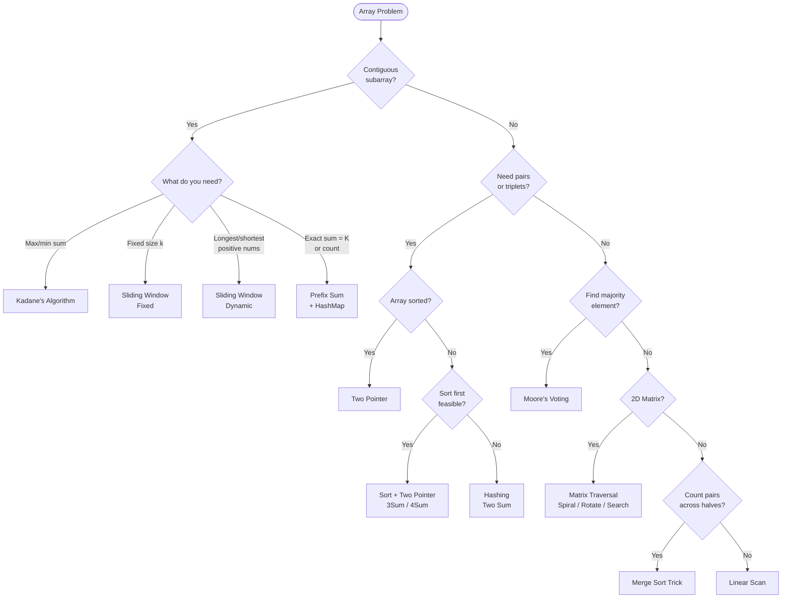

## What is an Array?

Think of an array like a **row of lockers** in a school hallway. Each locker has a number (index) and holds one item. You can jump directly to any locker — that's O(1) access. But if you want to insert a new locker in the middle, everyone has to shift — that's O(n).

```
  Contiguous memory — each slot is the same size:

  addr: 100  104  108  112  116
        ┌────┬────┬────┬────┬────┐
        │  3 │  7 │  1 │  9 │  4 │
        └────┴────┴────┴────┴────┘
  idx:    0    1    2    3    4
          ↑
          arr[0] → jump directly to addr 100 + 0*4 = O(1)
          arr[3] → jump directly to addr 100 + 3*4 = O(1)

  Insert 5 at index 1 → shift everything right:
        ┌────┬────┬────┬────┬────┬────┐
        │  3 │  5 │  7 │  1 │  9 │  4 │   O(n) shift
        └────┴────┴────┴────┴────┴────┘
               ↑ new
```

### Complexity Cheat Sheet

| Operation | Time | Notes |
|-----------|------|-------|
| Access by index | O(1) | Direct memory jump |
| Search (unsorted) | O(n) | Linear scan |
| Search (sorted) | O(log n) | Binary search |
| Insert at end | O(1) amortized | Dynamic array resize |
| Insert at index | O(n) | Shift elements right |
| Delete at index | O(n) | Shift elements left |
| Delete at end | O(1) | No shift needed |

**Space:** O(n) to store n elements.

---

## Pattern 1: Linear Scan

**The idea:** Walk through the array once, tracking a running value (max, min, count, sum).

**Analogy:** You're walking down a street looking for the tallest building. You don't go back — you just update "tallest seen so far" as you walk.

```viz
{
  "title": "Linear Scan — find maximum",
  "description": "arr = [3, 7, 1, 9, 4]. Walk once, keep updating max seen so far.",
  "array": [3, 7, 1, 9, 4],
  "speed": 800,
  "steps": [
    { "pointers": { "i": 0 }, "highlight": [0], "label": "i=0, val=3. max = 3" },
    { "pointers": { "i": 1 }, "highlight": [1], "label": "i=1, val=7. 7 > 3 → max = 7" },
    { "pointers": { "i": 2 }, "highlight": [2], "label": "i=2, val=1. 1 < 7 → max stays 7" },
    { "pointers": { "i": 3 }, "highlight": [3], "label": "i=3, val=9. 9 > 7 → max = 9" },
    { "pointers": { "i": 4 }, "highlight": [4], "label": "i=4, val=4. 4 < 9 → max stays 9", "note": "Answer: max = 9 ✓ One pass, O(n)" }
  ]
}
```

**When to use:**
- Find max/min/count in one pass
- Check if array is sorted
- Consecutive ones, equilibrium point

**Complexity:** Time O(n) · Space O(1)

**Template:**
```python
result = initial_value
for each element:
    update result based on element
return result
```

---

## Pattern 2: Two Pointer

**The idea:** Use two indices — either moving toward each other (opposite direction) or both moving forward (same direction).

**Analogy — Opposite direction:** Two people walking toward each other on a bridge. They meet in the middle. Used for pair-sum problems on sorted arrays.

**Analogy — Same direction:** A fast runner and a slow runner on a track. The fast one skips bad elements, the slow one marks where to write next.

```viz
{
  "title": "Two Pointer — Opposite Direction (pair sum = target)",
  "description": "arr = [1, 3, 5, 7, 9], target = 10. L moves right when sum too small, R moves left when too big.",
  "array": [1, 3, 5, 7, 9],
  "speed": 900,
  "steps": [
    { "pointers": { "L": 0, "R": 4 }, "highlight": [0, 4], "label": "Start: L=0, R=4. sum = 1+9 = 10 == target ✓", "note": "Found pair (1, 9)! But let's see what happens when it's not immediate..." },
    { "pointers": { "L": 0, "R": 4 }, "highlight": [0, 4], "label": "Now target = 8. sum = 1+9 = 10 > 8 → too big, move R left." },
    { "pointers": { "L": 0, "R": 3 }, "highlight": [0, 3], "label": "L=0, R=3. sum = 1+7 = 8 == target ✓", "note": "Found pair (1, 7)!" },
    { "pointers": { "L": 0, "R": 3 }, "highlight": [0, 3], "label": "Now target = 12. Reset: L=0, R=4. sum = 1+9 = 10 < 12 → too small, move L right." },
    { "pointers": { "L": 1, "R": 4 }, "highlight": [1, 4], "label": "L=1, R=4. sum = 3+9 = 12 == target ✓", "note": "Found pair (3, 9)! Rule: sum < target → L++. sum > target → R--. L crosses R → no pair exists." }
  ]
}
```

```viz
{
  "title": "Two Pointer — Same Direction (remove duplicates)",
  "description": "arr = [1, 1, 2, 3, 3]. S=slow writes unique values, F=fast scans ahead.",
  "array": [1, 1, 2, 3, 3],
  "speed": 900,
  "steps": [
    { "pointers": { "S": 0, "F": 0 }, "highlight": [0], "label": "S=0, F=0. Initialize." },
    { "pointers": { "S": 0, "F": 1 }, "highlight": [0, 1], "label": "arr[F]=1 == arr[S]=1 → duplicate, skip. F++" },
    { "pointers": { "S": 0, "F": 2 }, "highlight": [0, 2], "label": "arr[F]=2 != arr[S]=1 → new value! S++, write arr[S]=arr[F]" },
    { "pointers": { "S": 1, "F": 3 }, "highlight": [1, 3], "label": "arr[F]=3 != arr[S]=2 → new value! S++, write arr[S]=arr[F]" },
    { "pointers": { "S": 2, "F": 4 }, "highlight": [2, 4], "label": "arr[F]=3 == arr[S]=3 → duplicate, skip. F++", "note": "Result: first S+1=3 elements = [1, 2, 3] ✓" }
  ]
}
```

**When to use:**
- Sorted array + find pair/triplet with target sum
- Remove duplicates in-place
- Partition array (0s, 1s, 2s)
- Merge two sorted arrays

**Complexity:** Time O(n) · Space O(1)

**Key insight:** Sorting first + two pointers often replaces O(n²) brute force with O(n log n).

**Template:**
```python
# Opposite direction
L, R = 0, len(arr) - 1
while L < R:
    if condition_met:
        # found answer
    elif need_larger:
        L += 1
    else:
        R -= 1

# Same direction (fast/slow)
slow = 0
for fast in range(len(arr)):
    if arr[fast] != arr[slow]:
        slow += 1
        arr[slow] = arr[fast]
```

---

## Pattern 3: Sliding Window

**The idea:** Maintain a window [left, right] over the array. Expand right to include new elements, shrink left when a condition breaks.

**Analogy:** Imagine looking through a train window. As the train moves, new scenery enters from the right and old scenery leaves from the left.

```viz
{
  "title": "Sliding Window — Longest subarray with sum ≤ 7",
  "description": "arr = [2, 1, 5, 2, 3, 2]. Expand R to grow window, shrink L when sum exceeds limit.",
  "array": [2, 1, 5, 2, 3, 2],
  "speed": 900,
  "steps": [
    { "pointers": { "L": 0, "R": 0 }, "highlight": [0], "label": "sum=2 ≤ 7 ✓ expand R" },
    { "pointers": { "L": 0, "R": 1 }, "highlight": [0,1], "label": "sum=3 ≤ 7 ✓ expand R" },
    { "pointers": { "L": 0, "R": 2 }, "highlight": [0,1,2], "label": "sum=8 > 7 ✗ shrink L" },
    { "pointers": { "L": 1, "R": 2 }, "highlight": [1,2], "label": "sum=6 ≤ 7 ✓ expand R" },
    { "pointers": { "L": 1, "R": 3 }, "highlight": [1,2,3], "label": "sum=8 > 7 ✗ shrink L" },
    { "pointers": { "L": 2, "R": 3 }, "highlight": [2,3], "label": "sum=7 ≤ 7 ✓ expand R" },
    { "pointers": { "L": 2, "R": 4 }, "highlight": [2,3,4], "label": "sum=10 > 7 ✗ shrink L" },
    { "pointers": { "L": 3, "R": 4 }, "highlight": [3,4], "label": "sum=5 ≤ 7 ✓ expand R" },
    { "pointers": { "L": 3, "R": 5 }, "highlight": [3,4,5], "label": "sum=7 ≤ 7 ✓ done", "note": "Best window size = 3 (indices 3-5: [2,3,2]) ✓" }
  ]
}
```

**Two types:**
- **Fixed window** — window size is constant (e.g., max sum of subarray of size k)
- **Dynamic window** — window grows/shrinks based on a condition

**When to use:**
- Contiguous subarray/substring problems
- "Longest/shortest subarray with condition X"
- Frequency tracking within a range
- Elements are **non-negative** (negatives break shrinking logic)

**Complexity:** Time O(n) · Space O(1) or O(k) for frequency maps

**Template:**
```python
left = 0
for right in range(n):
    # expand: add arr[right] to window
    window += arr[right]
    while window violates condition:
        # shrink: remove arr[left] from window
        window -= arr[left]
        left += 1
    update result  # e.g. max(result, right - left + 1)
```

---

## Pattern 4: Prefix Sum + Hashing

**The idea:** Compute cumulative sums. Store them in a hashmap to answer "does a subarray with sum K exist?" in O(1).

**Analogy:** Imagine a road with milestones. The distance between milestone 7 and milestone 3 is 4. If you store all milestones in a map, you can instantly check if a stretch of exactly K miles exists.

```viz
{
  "title": "Prefix Sum + Hashing — Subarray sum = K",
  "description": "arr = [3, 1, 2, -2, 4], K=3. prefix[j]-K in map → subarray found. Always seed map with {0:1}.",
  "array": [3, 1, 2, -2, 4],
  "speed": 1000,
  "steps": [
    { "pointers": { "i": 0 }, "highlight": [0], "label": "prefix=3. Need 3-3=0 → 0 IS in map! Subarray arr[0..0]=[3] ✓", "note": "Found subarray [3] at index 0" },
    { "pointers": { "i": 1 }, "highlight": [1], "label": "prefix=4. Need 4-3=1 → not in map. Store {4:1}" },
    { "pointers": { "i": 2 }, "highlight": [0,1,2], "label": "prefix=6. Need 6-3=3 → 3 IS in map! Subarray arr[1..2]=[1,2] ✓", "note": "Found subarray [1,2] ending at index 2" },
    { "pointers": { "i": 3 }, "highlight": [3], "label": "prefix=4. Need 4-3=1 → not in map. Store {4:2}" },
    { "pointers": { "i": 4 }, "highlight": [4], "label": "prefix=8. Need 8-3=5 → not in map. Store {8:1}" }
  ]
}
```

**Key formula:** `sum[i..j] = prefix[j] - prefix[i-1]`  
So if `prefix[j] - K` exists in the map → subarray found.

**When to use:**
- Subarray sum equals K
- Longest subarray with sum K
- Count subarrays with given XOR
- Zero-sum subarray
- Works with **negative numbers** (unlike sliding window)

**Complexity:** Time O(n) · Space O(n)

**Template:**
```python
prefix = 0
mp = {0: 1}          # seed: empty prefix has sum 0
for num in arr:
    prefix += num
    if prefix - K in mp:
        count += mp[prefix - K]
    mp[prefix] = mp.get(prefix, 0) + 1
```

---

## Pattern 5: Hashing (Frequency / Lookup)

**The idea:** Use a HashMap or HashSet to store elements for O(1) lookup.

**Analogy:** Instead of searching a library shelf by shelf (O(n)), you use the catalog system — you know exactly which shelf to go to (O(1)).

```viz
{
  "title": "Hashing — Two Sum",
  "description": "arr = [2, 7, 11, 4], target = 9. For each element, check if complement (target - val) is already in map.",
  "array": [2, 7, 11, 4],
  "speed": 900,
  "steps": [
    { "pointers": { "i": 0 }, "highlight": [0], "label": "val=2. Need 9-2=7. Map={} → not found. Store {2:0}" },
    { "pointers": { "i": 1 }, "highlight": [0,1], "label": "val=7. Need 9-7=2. Map={2:0} → FOUND at index 0!", "note": "Answer: [0, 1] (values 2+7=9) ✓ O(n) vs O(n²) brute force" },
    { "pointers": { "i": 2 }, "highlight": [2], "label": "val=11. Need 9-11=-2. Not found. (Already answered above)" },
    { "pointers": { "i": 3 }, "highlight": [3], "label": "val=4. Need 9-4=5. Not found." }
  ]
}
```

**When to use:**
- Two Sum (find complement)
- Longest consecutive sequence
- Group anagrams
- Find duplicates/missing numbers

**Complexity:** Time O(n) · Space O(n)

**Template:**
```python
seen = {}
for i, num in enumerate(arr):
    complement = target - num
    if complement in seen:
        return [seen[complement], i]
    seen[num] = i
```

---

## Pattern 6: Kadane's Algorithm (Max Subarray)

**The idea:** At each position, decide: extend the current subarray or start fresh from here?

**Analogy:** You're on a road trip tracking net profit. At each city, you decide: keep the running total (if positive) or reset to zero and start fresh. You record the best total seen.

```viz
{
  "title": "Kadane's Algorithm — Maximum Subarray Sum",
  "description": "arr = [-2, 1, -3, 4, -1, 2, 1, -5, 4]. curr = max(arr[i], curr+arr[i]). Track best.",
  "array": [-2, 1, -3, 4, -1, 2, 1, -5, 4],
  "speed": 900,
  "steps": [
    { "pointers": { "i": 0 }, "highlight": [0], "label": "curr = max(-2, 0+(-2)) = -2. best = -2" },
    { "pointers": { "i": 1 }, "highlight": [1], "label": "curr = max(1, -2+1) = 1. best = 1" },
    { "pointers": { "i": 2 }, "highlight": [2], "label": "curr = max(-3, 1+(-3)) = -2. best = 1" },
    { "pointers": { "i": 3 }, "highlight": [3], "label": "curr = max(4, -2+4) = 4. best = 4  ← fresh start!" },
    { "pointers": { "i": 4 }, "highlight": [3, 4], "label": "curr = max(-1, 4+(-1)) = 3. best = 4" },
    { "pointers": { "i": 5 }, "highlight": [3, 4, 5], "label": "curr = max(2, 3+2) = 5. best = 5" },
    { "pointers": { "i": 6 }, "highlight": [3, 4, 5, 6], "label": "curr = max(1, 5+1) = 6. best = 6 ← new best!" },
    { "pointers": { "i": 7 }, "highlight": [3, 4, 5, 6], "label": "curr = max(-5, 6+(-5)) = 1. best = 6" },
    { "pointers": { "i": 8 }, "highlight": [3, 4, 5, 6], "label": "curr = max(4, 1+4) = 5. best = 6", "note": "Max subarray = [4,-1,2,1] (idx 3-6), sum = 6 ✓" }
  ]
}
```

**Rule:** `current = max(arr[i], current + arr[i])`

**When to use:**
- Maximum subarray sum
- Maximum product subarray (track both max and min due to negatives)

**Complexity:** Time O(n) · Space O(1)

**Template:**
```python
curr = best = arr[0]
for num in arr[1:]:
    curr = max(num, curr + num)   # extend or restart
    best = max(best, curr)
return best
```

---

## Pattern 7: Sorting-Based

**The idea:** Sort first, then apply a simpler algorithm.

```viz
{
  "type": "table",
  "title": "Sorting-Based — Merge Overlapping Intervals",
  "description": "intervals sorted by start: [1,3],[2,6],[8,10],[15,18]. Merge if current start ≤ prev end.",
  "speed": 1000,
  "cols": ["", "start", "end", "action"],
  "rows": ["[1,3]", "[2,6]", "[8,10]", "[15,18]"],
  "cells": [
    [1, 3, "?"],
    [2, 6, "?"],
    [8, 10, "?"],
    [15, 18, "?"]
  ],
  "steps": [
    {
      "cells": [[1,3,"?"],[2,6,"?"],[8,10,"?"],[15,18,"?"]],
      "label": "Sorted by start. result=[]"
    },
    {
      "cells": [[1,3,"TAKE"],[2,6,"?"],[8,10,"?"],[15,18,"?"]],
      "active": [0,2],
      "label": "Take [1,3]. result=[[1,3]]. lastEnd=3."
    },
    {
      "cells": [[1,3,"TAKE"],[2,6,"MERGE"],[8,10,"?"],[15,18,"?"]],
      "active": [1,2], "highlight": [[0,1],[1,0]],
      "label": "start=2 ≤ lastEnd=3 → OVERLAP. Merge: end=max(3,6)=6. result=[[1,6]]. lastEnd=6."
    },
    {
      "cells": [[1,3,"TAKE"],[2,6,"MERGE"],[8,10,"TAKE"],[15,18,"?"]],
      "active": [2,2], "highlight": [[1,1],[2,0]],
      "label": "start=8 > lastEnd=6 → NO overlap. Append. result=[[1,6],[8,10]]. lastEnd=10."
    },
    {
      "cells": [[1,3,"TAKE"],[2,6,"MERGE"],[8,10,"TAKE"],[15,18,"TAKE"]],
      "active": [3,2], "highlight": [[2,1],[3,0]],
      "label": "start=15 > lastEnd=10 → NO overlap. Append. result=[[1,6],[8,10],[15,18]].",
      "note": "3 merged intervals ✓. Key: sort by start, merge when start ≤ prev end."
    }
  ]
}
```

**When to use:**
- Merge overlapping intervals (sort by start)
- 3Sum / 4Sum (sort + two pointers)
- Find duplicates

**Complexity:** Time O(n log n) · Space O(n) for output

---

## Pattern 8: Matrix Traversal

**The idea:** Treat a 2D array as a grid. Use index math for rotations, spirals, and searches.

```viz
{
  "type": "table",
  "title": "Matrix Search — Start Top-Right, navigate by comparison",
  "description": "Row+col sorted 3×3 matrix. target=5. Top-right: too big → go left, too small → go down.",
  "speed": 1000,
  "cols": ["", "col0", "col1", "col2"],
  "rows": ["row0", "row1", "row2"],
  "cells": [
    [1, 4, 7],
    [2, 5, 8],
    [3, 6, 9]
  ],
  "steps": [
    {
      "cells": [[1,4,7],[2,5,8],[3,6,9]],
      "active": [0,2],
      "label": "Start at top-right: val=7. 7 > target(5) → move LEFT."
    },
    {
      "cells": [[1,4,7],[2,5,8],[3,6,9]],
      "highlight": [[0,2]],
      "active": [0,1],
      "label": "val=4. 4 < target(5) → move DOWN."
    },
    {
      "cells": [[1,4,7],[2,5,8],[3,6,9]],
      "highlight": [[0,2],[0,1]],
      "active": [1,1],
      "label": "val=5 == target ✓",
      "note": "Found at row=1, col=1 ✓. Each step eliminates a full row or column. O(m+n)."
    }
  ]
}
```

**Key tricks:**
- **Rotate 90°:** Transpose then reverse each row
- **Spiral:** Use four boundary pointers (top, bottom, left, right)
- **Search in sorted matrix:** Start from top-right corner — go left if too big, go down if too small

**Complexity:** Time O(m×n) traversal · O(m+n) for sorted matrix search · Space O(1)

---

## Pattern 9: Merge Sort Trick (Count while Sorting)

**The idea:** During the merge step of merge sort, you can count inversions or reverse pairs across left and right halves.

**Analogy:** While merging two sorted piles of cards, you can count how many cards from the right pile "jumped over" cards from the left pile.

```viz
{
  "title": "Merge Sort Trick — Count Inversions",
  "description": "arr = [3, 1, 2]. An inversion = pair where left > right. Count during merge step.",
  "array": [3, 1, 2],
  "speed": 1100,
  "steps": [
    { "pointers": {}, "highlight": [0,1,2], "label": "Split: left=[3], right=[1,2]. Now merge and count." },
    { "pointers": { "L": 0, "R": 1 }, "highlight": [0,1], "label": "Compare L[0]=3 vs R[0]=1. 3>1 → pick 1 from right. All remaining left (just 3) jumped over 1 → inversions += 1" },
    { "pointers": { "L": 0, "R": 2 }, "highlight": [0,2], "label": "Compare L[0]=3 vs R[1]=2. 3>2 → pick 2 from right. inversions += 1" },
    { "pointers": { "L": 0 }, "highlight": [0], "label": "Pick remaining L[0]=3. Merged: [1,2,3]", "note": "Total inversions = 2. Pairs (3,1) and (3,2) were inverted ✓" }
  ]
}
```

**When to use:**
- Count inversions
- Reverse pairs
- Any "count pairs across two halves" problem

**Complexity:** Time O(n log n) · Space O(n)

---

## Pattern 10: Moore's Voting (Majority Element)

**The idea:** Cancel out different elements. Whatever survives is the majority candidate. Verify it.

**Analogy:** Imagine a vote where every person who disagrees with someone else cancels each other out and both sit down. The last person standing is the majority candidate.

```viz
{
  "title": "Moore's Voting — find majority element (appears > n/2 times)",
  "description": "arr = [2, 2, 1, 1, 2, 2, 2]. candidate=current leader, count=lead margin. Different element → count--. count=0 → new candidate.",
  "array": [2, 2, 1, 1, 2, 2, 2],
  "speed": 900,
  "steps": [
    { "pointers": { "i": 0 }, "highlight": [0], "label": "val=2. count=0 → new candidate=2, count=1" },
    { "pointers": { "i": 1 }, "highlight": [1], "label": "val=2 == candidate → count=2" },
    { "pointers": { "i": 2 }, "highlight": [2], "label": "val=1 != candidate → count=1 (cancel out)" },
    { "pointers": { "i": 3 }, "highlight": [3], "label": "val=1 != candidate → count=0 (cancel out)" },
    { "pointers": { "i": 4 }, "highlight": [4], "label": "val=2. count=0 → new candidate=2, count=1" },
    { "pointers": { "i": 5 }, "highlight": [5], "label": "val=2 == candidate → count=2" },
    { "pointers": { "i": 6 }, "highlight": [6], "label": "val=2 == candidate → count=3", "note": "Candidate = 2 ✓. Verify by counting: 2 appears 5 times > 7/2=3.5 ✓" }
  ]
}
```

**When to use:**
- Majority element appearing > n/2 times
- Majority element appearing > n/3 times (use two candidates)

**Complexity:** Time O(n) · Space O(1)

**Template:**
```python
candidate, count = None, 0
for num in arr:
    if count == 0:
        candidate = num
    count += 1 if num == candidate else -1
# verify: count occurrences of candidate to confirm majority
```

---

## Differentiating Kadane's vs Prefix Hashing vs Sliding Window

All three deal with **subarrays** — the key is the **problem requirement**, not the word "subarray".

| | Kadane's | Prefix + Hashing | Sliding Window |
|---|---|---|---|
| **Goal** | Optimize sum (max/min) | Exact condition on sum | Range constraint |
| **Negatives?** | ✅ Yes | ✅ Yes | ❌ Usually breaks |
| **Counts subarrays?** | ❌ No | ✅ Yes | ❌ No |
| **Dynamic window?** | ❌ No | ❌ No | ✅ Yes |
| **Exact sum K?** | ❌ No | ✅ Yes | ❌ No |
| **Complexity** | O(n) time, O(1) space | O(n) time, O(n) space | O(n) time, O(1) space |

### Decision

- **"maximum / minimum sum subarray"** → Kadane's
- **"sum = K" / "count subarrays" / "divisible by K"** → Prefix + Hashing
- **"longest / shortest" with positive elements** → Sliding Window

### Real Interview Examples

| Problem | Why |
|---------|-----|
| Max subarray sum | Optimize → Kadane |
| Count subarrays with sum = K | Exact count → Prefix + Hash |
| Longest subarray with sum ≤ K (positives) | Range + shrinkable → Sliding Window |
| Longest subarray with sum = K (with negatives) | Exact + negatives → Prefix + Hash |
| Max sum circular subarray | Kadane (modified) |

> **Common trap:** Sliding window for "sum = K with negative numbers" — the window can't shrink correctly when negatives are present. Use Prefix + Hashing instead.

**1-line memory:**  Kadane → optimize &nbsp;·&nbsp; Prefix → exact match &nbsp;·&nbsp; Sliding → flexible window

---

## Quick "When to Use What"

| Situation | Pattern |
|-----------|---------|
| Find max/min in one pass | Linear Scan |
| Pair/triplet sum in sorted array | Two Pointer |
| Contiguous subarray with condition | Sliding Window |
| Subarray sum = K, count subarrays | Prefix Sum + Hash |
| Find complement, duplicates, frequency | Hashing |
| Max/min subarray sum | Kadane's |
| Overlapping intervals, k-sum | Sort first |
| Count pairs across halves | Merge Sort trick |
| Majority element | Moore's Voting |

---

## Decision Flowchart


