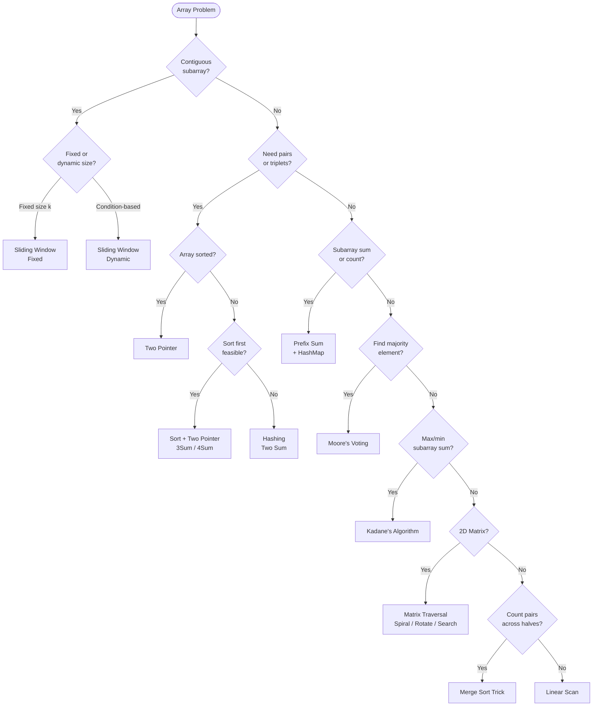

## What is an Array?

Think of an array like a **row of lockers** in a school hallway. Each locker has a number (index) and holds one item. You can jump directly to any locker — that's O(1) access. But if you want to insert a new locker in the middle, everyone has to shift — that's O(n).

---

## Pattern 1: Linear Scan

**The idea:** Walk through the array once, tracking a running value (max, min, count, sum).

**Analogy:** You're walking down a street looking for the tallest building. You don't go back — you just update "tallest seen so far" as you walk.

**When to use:**
- Find max/min/count in one pass
- Check if array is sorted
- Consecutive ones, equilibrium point

**Template:**
```
result = initial_value
for each element:
    update result based on element
return result
```

---

## Pattern 2: Two Pointer

**The idea:** Use two indices — either moving toward each other (opposite direction) or both moving forward (same direction).

**Analogy — Opposite direction:** Two people walking toward each other on a bridge. They meet in the middle. Used for pair-sum problems on sorted arrays.

**Analogy — Same direction:** A fast runner and a slow runner on a track. The fast one skips bad elements, the slow one marks where to write next. Used for removing duplicates, partitioning.

**When to use:**
- Sorted array + find pair/triplet with target sum
- Remove duplicates in-place
- Partition array (0s, 1s, 2s)
- Merge two sorted arrays

**Key insight:** Sorting first + two pointers often replaces O(n²) brute force with O(n log n).

---

## Pattern 3: Sliding Window

**The idea:** Maintain a window [left, right] over the array. Expand right to include new elements, shrink left when a condition breaks.

**Analogy:** Imagine looking through a train window. As the train moves, new scenery enters from the right and old scenery leaves from the left. You're always looking at a fixed "frame" of the world.

**Two types:**
- **Fixed window** — window size is constant (e.g., max sum of subarray of size k)
- **Dynamic window** — window grows/shrinks based on a condition (e.g., longest substring without repeating characters)

**When to use:**
- Contiguous subarray/substring problems
- "Longest/shortest subarray with condition X"
- Frequency tracking within a range

**Template:**
```
left = 0
for right in range(n):
    add arr[right] to window
    while window violates condition:
        remove arr[left] from window
        left++
    update result
```

---

## Pattern 4: Prefix Sum + Hashing

**The idea:** Compute cumulative sums. Store them in a hashmap to answer "does a subarray with sum K exist?" in O(1).

**Analogy:** Imagine a road with milestones. The distance between milestone 7 and milestone 3 is 4. If you store all milestones in a map, you can instantly check if a stretch of exactly K miles exists.

**When to use:**
- Subarray sum equals K
- Longest subarray with sum K
- Count subarrays with given XOR
- Zero-sum subarray

**Key formula:** `sum[i..j] = prefix[j] - prefix[i-1]`  
So if `prefix[j] - K` exists in the map → subarray found.

---

## Pattern 5: Hashing (Frequency / Lookup)

**The idea:** Use a HashMap or HashSet to store elements for O(1) lookup.

**Analogy:** Instead of searching a library shelf by shelf (O(n)), you use the catalog system — you know exactly which shelf to go to (O(1)).

**When to use:**
- Two Sum (find complement)
- Longest consecutive sequence
- Group anagrams
- Find duplicates/missing numbers

---

## Pattern 6: Kadane's Algorithm (Max Subarray)

**The idea:** At each position, decide: extend the current subarray or start fresh from here?

**Analogy:** You're on a road trip tracking net profit. At each city, you decide: keep the running total (if positive) or reset to zero and start fresh. You record the best total seen.

**Rule:** `current = max(arr[i], current + arr[i])`

**When to use:**
- Maximum subarray sum
- Maximum product subarray (track both max and min due to negatives)

---

## Pattern 7: Sorting-Based

**The idea:** Sort first, then apply a simpler algorithm.

**When to use:**
- Merge overlapping intervals (sort by start)
- 3Sum / 4Sum (sort + two pointers)
- Find duplicates

---

## Pattern 8: Matrix Traversal

**The idea:** Treat a 2D array as a grid. Use index math for rotations, spirals, and searches.

**Key tricks:**
- **Rotate 90°:** Transpose then reverse each row
- **Spiral:** Use four boundary pointers (top, bottom, left, right)
- **Search in sorted matrix:** Start from top-right corner — go left if too big, go down if too small

---

## Pattern 9: Merge Sort Trick (Count while Sorting)

**The idea:** During the merge step of merge sort, you can count inversions or reverse pairs across left and right halves — things that are hard to count otherwise.

**Analogy:** While merging two sorted piles of cards, you can count how many cards from the right pile "jumped over" cards from the left pile.

**When to use:**
- Count inversions
- Reverse pairs
- Any "count pairs across two halves" problem

---

## Pattern 10: Moore's Voting (Majority Element)

**The idea:** Cancel out different elements. Whatever survives is the majority candidate. Verify it.

**Analogy:** Imagine a vote where every person who disagrees with someone else cancels each other out and both sit down. The last person standing is the majority candidate.

**When to use:**
- Majority element appearing > n/2 times
- Majority element appearing > n/3 times (use two candidates)

---

## Quick "When to Use What"

| Situation | Pattern |
|-----------|---------|
| Find max/min in one pass | Linear Scan |
| Pair/triplet sum in sorted array | Two Pointer |
| Contiguous subarray with condition | Sliding Window |
| Subarray sum = K, count subarrays | Prefix Sum + Hash |
| Find complement, duplicates, frequency | Hashing |
| Max/min subarray sum | Kadane's |
| Overlapping intervals, k-sum | Sort first |
| Count pairs across halves | Merge Sort trick |
| Majority element | Moore's Voting |

---

## Decision Flowchart


