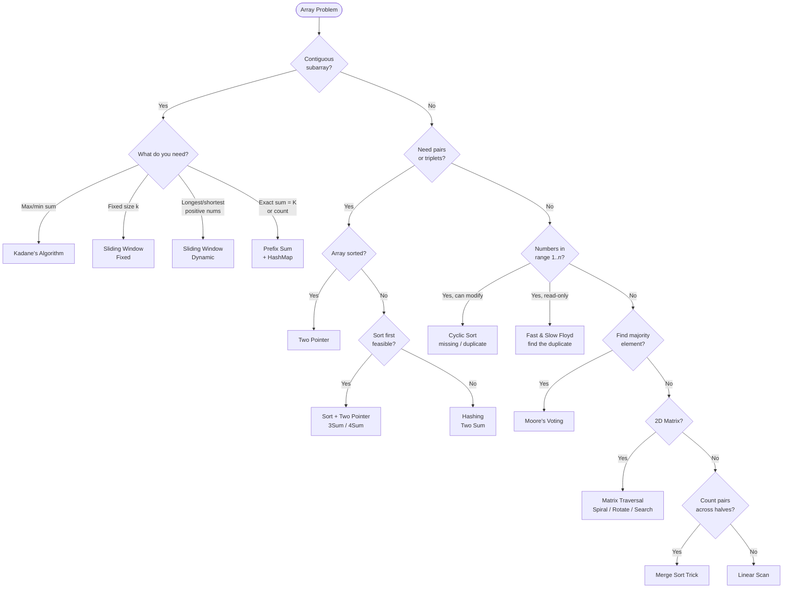

## What is an Array?

Think of an array like a **row of lockers** in a school hallway. Each locker has a number (index) and holds one item. You can jump directly to any locker — that's O(1) access. But if you want to insert a new locker in the middle, everyone has to shift — that's O(n).

```
  Contiguous memory — each slot is the same size:

  addr: 100  104  108  112  116
        ┌────┬────┬────┬────┬────┐
        │  3 │  7 │  1 │  9 │  4 │
        └────┴────┴────┴────┴────┘
  idx:    0    1    2    3    4
          ↑
          arr[0] → jump directly to addr 100 + 0*4 = O(1)
          arr[3] → jump directly to addr 100 + 3*4 = O(1)

  Insert 5 at index 1 → shift everything right:
        ┌────┬────┬────┬────┬────┬────┐
        │  3 │  5 │  7 │  1 │  9 │  4 │   O(n) shift
        └────┴────┴────┴────┴────┴────┘
               ↑ new
```

### Complexity Cheat Sheet

| Operation | Time | Notes |
|-----------|------|-------|
| Access by index | O(1) | Direct memory jump |
| Search (unsorted) | O(n) | Linear scan |
| Search (sorted) | O(log n) | Binary search |
| Insert at end | O(1) amortized | Dynamic array resize |
| Insert at index | O(n) | Shift elements right |
| Delete at index | O(n) | Shift elements left |
| Delete at end | O(1) | No shift needed |

**Space:** O(n) to store n elements.

---

## Pattern 1: Linear Scan

**The idea:** Walk through the array once, tracking a running value (max, min, count, sum).

**Analogy:** You're walking down a street looking for the tallest building. You don't go back — you just update "tallest seen so far" as you walk.

```viz
{
  "title": "Linear Scan — find maximum",
  "description": "arr = [3, 7, 1, 9, 4]. The 'max' badge + lit cell show the best so far; 'i' scans across. The lit cell only moves when a bigger value appears.",
  "array": [3, 7, 1, 9, 4],
  "speed": 800,
  "steps": [
    { "pointers": { "i": 0, "max": 0 }, "highlight": [0], "label": "i=0, val=3. First element → max = 3 (at index 0)." },
    { "pointers": { "i": 1, "max": 1 }, "highlight": [1], "label": "i=1, val=7. 7 > 3 → new max = 7 (lit cell moves here)." },
    { "pointers": { "i": 2, "max": 1 }, "highlight": [1], "label": "i=2, val=1. 1 < 7 → max stays 7. i keeps scanning." },
    { "pointers": { "i": 3, "max": 3 }, "highlight": [3], "label": "i=3, val=9. 9 > 7 → new max = 9 (lit cell moves here)." },
    { "pointers": { "i": 4, "max": 3 }, "highlight": [3], "label": "i=4, val=4. 4 < 9 → max stays 9.", "note": "Answer: max = 9 ✓ One pass, O(n). The lit cell only ever moves forward to a bigger value." }
  ]
}
```

**When to use:**
- Find max/min/count in one pass
- Check if array is sorted
- Consecutive ones, equilibrium point

**Complexity:** Time O(n) · Space O(1)

**Template:**
```python
result = initial_value
for each element:
    update result based on element
return result
```

> **In an interview:** trigger words are *"find the max / min / count / best so far"* in a single pass.
> **Remember:** one variable, one walk — never look back.

---

## Pattern 2: Two Pointer

**The idea:** Use two indices — either moving toward each other (opposite direction) or both moving forward (same direction).

**Analogy — Opposite direction:** Two people walking toward each other on a bridge. They meet in the middle. Used for pair-sum problems on sorted arrays.

**Analogy — Same direction:** A fast runner and a slow runner on a track. The fast one skips bad elements, the slow one marks where to write next.

```viz
{
  "title": "Two Pointer — Opposite Direction (pair sum = target)",
  "description": "arr = [2, 4, 5, 7, 11], target = 11. Start at both ends. sum too big → R moves left; too small → L moves right.",
  "array": [2, 4, 5, 7, 11],
  "speed": 900,
  "steps": [
    { "pointers": { "L": 0, "R": 4 }, "highlight": [0, 4], "label": "L=0, R=4: sum = 2 + 11 = 13 > 11 → too big, move R left." },
    { "pointers": { "L": 0, "R": 3 }, "highlight": [0, 3], "label": "L=0, R=3: sum = 2 + 7 = 9 < 11 → too small, move L right." },
    { "pointers": { "L": 1, "R": 3 }, "highlight": [1, 3], "label": "L=1, R=3: sum = 4 + 7 = 11 == target ✓", "note": "Found pair (4, 7). Rule: sum < target → L++, sum > target → R--, L crosses R → no pair exists." }
  ]
}
```

```viz
{
  "type": "table",
  "title": "Two Pointer — Same Direction (remove duplicates in-place)",
  "description": "arr = [1, 1, 2, 3, 3]. Bright = F (scanner). Blue = S (last unique slot). When F finds a new value, S advances and F's value is written there.",
  "speed": 950,
  "cols": ["idx", "0", "1", "2", "3", "4"],
  "rows": ["val"],
  "cells": [[1, 1, 2, 3, 3]],
  "steps": [
    { "cells": [[1,1,2,3,3]], "active": [0,1], "highlight": [[0,0]], "label": "S=0, F=1: arr[F]=1 == arr[S]=1 → duplicate, skip. F++" },
    { "cells": [[1,2,2,3,3]], "active": [0,2], "highlight": [[0,1]], "label": "F=2: arr[F]=2 != arr[S]=1 → new value. S++ (=1), write arr[1]=2." },
    { "cells": [[1,2,3,3,3]], "active": [0,3], "highlight": [[0,2]], "label": "F=3: arr[F]=3 != arr[S]=2 → new value. S++ (=2), write arr[2]=3." },
    { "cells": [[1,2,3,3,3]], "active": [0,4], "highlight": [[0,2]], "label": "F=4: arr[F]=3 == arr[S]=3 → duplicate, skip. F++", "note": "First S+1 = 3 cells hold the unique values [1, 2, 3] ✓" }
  ]
}
```

**When to use:**
- Sorted array + find pair/triplet with target sum
- Remove duplicates in-place
- Partition array (0s, 1s, 2s)
- Merge two sorted arrays

**Complexity:** Time O(n) · Space O(1)

**Key insight:** Sorting first + two pointers often replaces O(n²) brute force with O(n log n).

**Template:**
```python
# Opposite direction
L, R = 0, len(arr) - 1
while L < R:
    if condition_met:
        # found answer
    elif need_larger:
        L += 1
    else:
        R -= 1

# Same direction (fast/slow)
slow = 0
for fast in range(len(arr)):
    if arr[fast] != arr[slow]:
        slow += 1
        arr[slow] = arr[fast]
```

> **In an interview:** trigger words are *"sorted array"* + *"pair / triplet / partition / in-place"*. First question to ask: is the input sorted (or can I sort it)?
> **Remember:** opposite ends for pair-sums, same-direction slow/fast for in-place rewrites.

---

## Pattern 3: Sliding Window

**The idea:** Maintain a window [left, right] over the array. Expand right to include new elements, shrink left when a condition breaks.

**Analogy:** Imagine looking through a train window. As the train moves, new scenery enters from the right and old scenery leaves from the left.

```viz
{
  "title": "Sliding Window — Longest subarray with sum ≤ 7",
  "description": "arr = [2, 1, 5, 2, 3, 2]. Expand R to grow window, shrink L when sum exceeds limit.",
  "array": [2, 1, 5, 2, 3, 2],
  "speed": 900,
  "steps": [
    { "pointers": { "L": 0, "R": 0 }, "highlight": [0], "label": "sum=2 ≤ 7 ✓ expand R" },
    { "pointers": { "L": 0, "R": 1 }, "highlight": [0,1], "label": "sum=3 ≤ 7 ✓ expand R" },
    { "pointers": { "L": 0, "R": 2 }, "highlight": [0,1,2], "label": "sum=8 > 7 ✗ shrink L" },
    { "pointers": { "L": 1, "R": 2 }, "highlight": [1,2], "label": "sum=6 ≤ 7 ✓ expand R" },
    { "pointers": { "L": 1, "R": 3 }, "highlight": [1,2,3], "label": "sum=8 > 7 ✗ shrink L" },
    { "pointers": { "L": 2, "R": 3 }, "highlight": [2,3], "label": "sum=7 ≤ 7 ✓ expand R" },
    { "pointers": { "L": 2, "R": 4 }, "highlight": [2,3,4], "label": "sum=10 > 7 ✗ shrink L" },
    { "pointers": { "L": 3, "R": 4 }, "highlight": [3,4], "label": "sum=5 ≤ 7 ✓ expand R" },
    { "pointers": { "L": 3, "R": 5 }, "highlight": [3,4,5], "label": "sum=7 ≤ 7 ✓ done", "note": "Best window size = 3 (indices 3-5: [2,3,2]) ✓" }
  ]
}
```

**Two types:**
- **Fixed window** — window size is constant (e.g., max sum of subarray of size k)
- **Dynamic window** — window grows/shrinks based on a condition

**When to use:**
- Contiguous subarray/substring problems
- "Longest/shortest subarray with condition X"
- Frequency tracking within a range
- Elements are **non-negative** (negatives break shrinking logic)

**Complexity:** Time O(n) · Space O(1) or O(k) for frequency maps

**Template:**
```python
left = 0
for right in range(n):
    # expand: add arr[right] to window
    window += arr[right]
    while window violates condition:
        # shrink: remove arr[left] from window
        window -= arr[left]
        left += 1
    update result  # e.g. max(result, right - left + 1)
```

> **In an interview:** trigger words are *"longest / shortest contiguous subarray/substring"* with **non-negative** values. Ask: can values be negative? If yes, this breaks — reach for prefix+hashing.
> **Remember:** expand right always, shrink left only when the window breaks the rule.

---

## Pattern 4: Prefix Sum + Hashing

**The idea:** Compute cumulative sums. Store them in a hashmap to answer "does a subarray with sum K exist?" in O(1).

**Analogy:** Imagine a road with milestones. The distance between milestone 7 and milestone 3 is 4. If you store all milestones in a map, you can instantly check if a stretch of exactly K miles exists.

```viz
{
  "title": "Prefix Sum + Hashing — Subarray sum = K",
  "description": "arr = [3, 1, 2, -2, 4], K=3. prefix[j]-K in map → subarray found. Always seed map with {0:1}.",
  "array": [3, 1, 2, -2, 4],
  "speed": 1000,
  "steps": [
    { "pointers": { "i": 0 }, "highlight": [0], "label": "prefix=3. Need 3-3=0 → 0 is in map! Subarray arr[0..0]=[3] ✓. Store {3:1}." },
    { "pointers": { "i": 1 }, "highlight": [1], "label": "prefix=4. Need 4-3=1 → not in map. Store {4:1}." },
    { "pointers": { "i": 2 }, "highlight": [1,2], "label": "prefix=6. Need 6-3=3 → 3 is in map! Subarray arr[1..2]=[1,2] ✓. Store {6:1}." },
    { "pointers": { "i": 3 }, "highlight": [3], "label": "prefix=4. Need 4-3=1 → not in map. Store {4:2}." },
    { "pointers": { "i": 4 }, "highlight": [4], "label": "prefix=8. Need 8-3=5 → not in map. Store {8:1}.", "note": "2 subarrays sum to K=3: [3] and [1,2]. Works even with the negative (-2) ✓" }
  ]
}
```

**Key formula:** `sum[i..j] = prefix[j] - prefix[i-1]`  
So if `prefix[j] - K` exists in the map → subarray found.

**When to use:**
- Subarray sum equals K
- Longest subarray with sum K
- Count subarrays with given XOR
- Zero-sum subarray
- Works with **negative numbers** (unlike sliding window)

**Complexity:** Time O(n) · Space O(n)

**Template:**
```python
prefix = 0
mp = {0: 1}          # seed: empty prefix has sum 0
for num in arr:
    prefix += num
    if prefix - K in mp:
        count += mp[prefix - K]
    mp[prefix] = mp.get(prefix, 0) + 1
```

> **In an interview:** trigger words are *"count / exact sum = K / XOR = K / zero-sum"*, especially **with negatives**. Always seed the map with `{0: 1}`.
> **Remember:** if `prefix - K` was seen before, a subarray summing to K ends here.

---

## Pattern 5: Hashing (Frequency / Lookup)

**The idea:** Use a HashMap or HashSet to store elements for O(1) lookup.

**Analogy:** Instead of searching a library shelf by shelf (O(n)), you use the catalog system — you know exactly which shelf to go to (O(1)).

```viz
{
  "title": "Hashing — Two Sum",
  "description": "arr = [2, 7, 11, 4], target = 9. For each element, check if complement (target - val) is already in map.",
  "array": [2, 7, 11, 4],
  "speed": 900,
  "steps": [
    { "pointers": { "i": 0 }, "highlight": [0], "label": "val=2. Need 9-2=7. Map={} → not found. Store {2:0}." },
    { "pointers": { "i": 1 }, "highlight": [0,1], "label": "val=7. Need 9-7=2. Map={2:0} → FOUND at index 0! Return and stop.", "note": "Answer: [0, 1] (2 + 7 = 9) ✓. One pass, O(n) vs O(n²) brute force." }
  ]
}
```

**When to use:**
- Two Sum (find complement)
- Longest consecutive sequence
- Group anagrams
- Find duplicates/missing numbers

**Complexity:** Time O(n) · Space O(n)

**Template:**
```python
seen = {}
for i, num in enumerate(arr):
    complement = target - num
    if complement in seen:
        return [seen[complement], i]
    seen[num] = i
```

> **In an interview:** trigger words are *"has it appeared before / complement / frequency / duplicate"*. Trade O(1) space for O(n) time.
> **Remember:** the map turns "search the rest of the array" into a single lookup.

---

## Pattern 6: Kadane's Algorithm (Max Subarray)

**The idea:** At each position, decide: extend the current subarray or start fresh from here?

**Analogy:** You're on a road trip tracking net profit. At each city, you decide: keep the running total (if positive) or reset to zero and start fresh. You record the best total seen.

```viz
{
  "title": "Kadane's Algorithm — Maximum Subarray Sum",
  "description": "arr = [-2, 1, -3, 4, -1, 2, 1, -5, 4]. curr = max(arr[i], curr+arr[i]). Track best.",
  "array": [-2, 1, -3, 4, -1, 2, 1, -5, 4],
  "speed": 900,
  "steps": [
    { "pointers": { "i": 0 }, "highlight": [0], "label": "curr = max(-2, 0+(-2)) = -2. best = -2" },
    { "pointers": { "i": 1 }, "highlight": [1], "label": "curr = max(1, -2+1) = 1. best = 1" },
    { "pointers": { "i": 2 }, "highlight": [2], "label": "curr = max(-3, 1+(-3)) = -2. best = 1" },
    { "pointers": { "i": 3 }, "highlight": [3], "label": "curr = max(4, -2+4) = 4. best = 4  ← fresh start!" },
    { "pointers": { "i": 4 }, "highlight": [3, 4], "label": "curr = max(-1, 4+(-1)) = 3. best = 4" },
    { "pointers": { "i": 5 }, "highlight": [3, 4, 5], "label": "curr = max(2, 3+2) = 5. best = 5" },
    { "pointers": { "i": 6 }, "highlight": [3, 4, 5, 6], "label": "curr = max(1, 5+1) = 6. best = 6 ← new best!" },
    { "pointers": { "i": 7 }, "highlight": [3, 4, 5, 6], "label": "curr = max(-5, 6+(-5)) = 1. best = 6" },
    { "pointers": { "i": 8 }, "highlight": [3, 4, 5, 6], "label": "curr = max(4, 1+4) = 5. best = 6", "note": "Max subarray = [4,-1,2,1] (idx 3-6), sum = 6 ✓" }
  ]
}
```

**Rule:** `current = max(arr[i], current + arr[i])`

**When to use:**
- Maximum subarray sum
- Maximum product subarray (track both max and min due to negatives)

**Complexity:** Time O(n) · Space O(1)

**Template:**
```python
curr = best = arr[0]
for num in arr[1:]:
    curr = max(num, curr + num)   # extend or restart
    best = max(best, curr)
return best
```

> **In an interview:** trigger words are *"maximum / minimum sum (or product) subarray"*. Follow-up is often "return the indices" — track where curr restarts.
> **Remember:** at each step, extend or restart — keep the running best.

---

## Pattern 7: Sorting-Based

**The idea:** Sort first, then apply a simpler algorithm.

```viz
{
  "type": "table",
  "title": "Sorting-Based — Merge Overlapping Intervals",
  "description": "intervals sorted by start: [1,3],[2,6],[8,10],[15,18]. Merge if current start ≤ prev end.",
  "speed": 1000,
  "cols": ["", "start", "end", "action"],
  "rows": ["[1,3]", "[2,6]", "[8,10]", "[15,18]"],
  "cells": [
    [1, 3, "?"],
    [2, 6, "?"],
    [8, 10, "?"],
    [15, 18, "?"]
  ],
  "steps": [
    {
      "cells": [[1,3,"?"],[2,6,"?"],[8,10,"?"],[15,18,"?"]],
      "label": "Sorted by start. result=[]"
    },
    {
      "cells": [[1,3,"TAKE"],[2,6,"?"],[8,10,"?"],[15,18,"?"]],
      "active": [0,2],
      "label": "Take [1,3]. result=[[1,3]]. lastEnd=3."
    },
    {
      "cells": [[1,3,"TAKE"],[2,6,"MERGE"],[8,10,"?"],[15,18,"?"]],
      "active": [1,2], "highlight": [[0,1],[1,0]],
      "label": "start=2 ≤ lastEnd=3 → OVERLAP. Merge: end=max(3,6)=6. result=[[1,6]]. lastEnd=6."
    },
    {
      "cells": [[1,3,"TAKE"],[2,6,"MERGE"],[8,10,"TAKE"],[15,18,"?"]],
      "active": [2,2], "highlight": [[1,1],[2,0]],
      "label": "start=8 > lastEnd=6 → NO overlap. Append. result=[[1,6],[8,10]]. lastEnd=10."
    },
    {
      "cells": [[1,3,"TAKE"],[2,6,"MERGE"],[8,10,"TAKE"],[15,18,"TAKE"]],
      "active": [3,2], "highlight": [[2,1],[3,0]],
      "label": "start=15 > lastEnd=10 → NO overlap. Append. result=[[1,6],[8,10],[15,18]].",
      "note": "3 merged intervals ✓. Key: sort by start, merge when start ≤ prev end."
    }
  ]
}
```

**When to use:**
- Merge overlapping intervals (sort by start)
- 3Sum / 4Sum (sort + two pointers)
- Find duplicates

**Complexity:** Time O(n log n) · Space O(n) for output

> **In an interview:** if brute force is O(n²) and order doesn't matter, ask *"does sorting first make this easier?"* — it often unlocks two pointers or a greedy sweep.
> **Remember:** sort turns chaos into structure you can exploit in one pass.

---

## Pattern 8: Matrix Traversal

**The idea:** Treat a 2D array as a grid. Use index math for rotations, spirals, and searches.

```viz
{
  "type": "table",
  "title": "Matrix Search — Start Top-Right, navigate by comparison",
  "description": "Row+col sorted 3×3 matrix. target=5. Top-right: too big → go left, too small → go down.",
  "speed": 1000,
  "cols": ["", "col0", "col1", "col2"],
  "rows": ["row0", "row1", "row2"],
  "cells": [
    [1, 4, 7],
    [2, 5, 8],
    [3, 6, 9]
  ],
  "steps": [
    {
      "cells": [[1,4,7],[2,5,8],[3,6,9]],
      "active": [0,2],
      "label": "Start at top-right: val=7. 7 > target(5) → move LEFT."
    },
    {
      "cells": [[1,4,7],[2,5,8],[3,6,9]],
      "highlight": [[0,2]],
      "active": [0,1],
      "label": "val=4. 4 < target(5) → move DOWN."
    },
    {
      "cells": [[1,4,7],[2,5,8],[3,6,9]],
      "highlight": [[0,2],[0,1]],
      "active": [1,1],
      "label": "val=5 == target ✓",
      "note": "Found at row=1, col=1 ✓. Each step eliminates a full row or column. O(m+n)."
    }
  ]
}
```

**Key tricks:**
- **Rotate 90°:** Transpose then reverse each row
- **Spiral:** Use four boundary pointers (top, bottom, left, right)
- **Search in sorted matrix:** Start from top-right corner — go left if too big, go down if too small

**Complexity:** Time O(m×n) traversal · O(m+n) for sorted matrix search · Space O(1)

> **In an interview:** clarify the index math out loud (row/col bounds) before coding — off-by-one on boundaries is the usual bug. For rotate/spiral, state the boundary-shrinking plan first.
> **Remember:** rotate = transpose + reverse rows; sorted-matrix search = start top-right.

---

## Pattern 9: Merge Sort Trick (Count while Sorting)

**The idea:** During the merge step of merge sort, you can count inversions or reverse pairs across left and right halves.

**Analogy:** While merging two sorted piles of cards, you can count how many cards from the right pile "jumped over" cards from the left pile.

```viz
{
  "type": "table",
  "title": "Merge Sort Trick — Count Inversions during merge",
  "description": "arr = [2, 4, 1, 3] → two sorted halves Left=[2,4], Right=[1,3]. When a Right value is picked, every remaining Left value is an inversion — count them all at once.",
  "speed": 1100,
  "cols": ["half", "•", "•", "•", "•"],
  "rows": ["Left", "Right", "Merged"],
  "cells": [
    [2, 4, "", ""],
    [1, 3, "", ""],
    ["", "", "", ""]
  ],
  "steps": [
    {
      "cells": [[2,4,"",""],[1,3,"",""],["","","",""]],
      "label": "Two already-sorted halves: Left=[2,4], Right=[1,3]. Merge them left-to-right, counting inversions. total=0"
    },
    {
      "cells": [[2,4,"",""],["",3,"",""],[1,"","",""]],
      "active": [2,0], "highlight": [[0,0],[0,1]],
      "label": "Compare Left 2 vs Right 1 → 1 smaller, output it. Both remaining Left values (2,4) are > 1 → inversions += 2. total=2"
    },
    {
      "cells": [["",4,"",""],["",3,"",""],[1,2,"",""]],
      "active": [2,1],
      "label": "Compare Left 2 vs Right 3 → 2 smaller, output it. 2 < 3 → no inversion. total=2"
    },
    {
      "cells": [["",4,"",""],["","","",""],[1,2,3,""]],
      "active": [2,2], "highlight": [[0,1]],
      "label": "Compare Left 4 vs Right 3 → 3 smaller, output it. Remaining Left (4) is > 3 → inversions += 1. total=3"
    },
    {
      "cells": [["","","",""],["","","",""],[1,2,3,4]],
      "active": [2,3],
      "label": "Right half empty → append remaining Left (4). Merged = [1,2,3,4].",
      "note": "Total inversions = 3: (2,1), (4,1), (4,3) ✓. The trick: when a Right value wins, ALL remaining Left values count at once — O(n log n), not O(n²)."
    }
  ]
}
```

**When to use:**
- Count inversions
- Reverse pairs
- Any "count pairs across two halves" problem

**Complexity:** Time O(n log n) · Space O(n)

> **In an interview:** trigger words are *"count pairs where i < j and (some order condition)"* and the naive O(n²) is too slow. The count happens during the merge step.
> **Remember:** while merging two sorted halves, count how many left elements "jump over" each right element.

---

## Pattern 10: Moore's Voting (Majority Element)

**The idea:** Cancel out different elements. Whatever survives is the majority candidate. Verify it.

**Analogy:** Imagine a vote where every person who disagrees with someone else cancels each other out and both sit down. The last person standing is the majority candidate.

```viz
{
  "title": "Moore's Voting — find majority element (appears > n/2 times)",
  "description": "arr = [2, 2, 1, 1, 2, 2, 2]. candidate=current leader, count=lead margin. Different element → count--. count=0 → new candidate.",
  "array": [2, 2, 1, 1, 2, 2, 2],
  "speed": 900,
  "steps": [
    { "pointers": { "i": 0 }, "highlight": [0], "label": "val=2. count=0 → new candidate=2, count=1" },
    { "pointers": { "i": 1 }, "highlight": [1], "label": "val=2 == candidate → count=2" },
    { "pointers": { "i": 2 }, "highlight": [2], "label": "val=1 != candidate → count=1 (cancel out)" },
    { "pointers": { "i": 3 }, "highlight": [3], "label": "val=1 != candidate → count=0 (cancel out)" },
    { "pointers": { "i": 4 }, "highlight": [4], "label": "val=2. count=0 → new candidate=2, count=1" },
    { "pointers": { "i": 5 }, "highlight": [5], "label": "val=2 == candidate → count=2" },
    { "pointers": { "i": 6 }, "highlight": [6], "label": "val=2 == candidate → count=3", "note": "Candidate = 2 ✓. Verify by counting: 2 appears 5 times > 7/2=3.5 ✓" }
  ]
}
```

**When to use:**
- Majority element appearing > n/2 times
- Majority element appearing > n/3 times (use two candidates)

**Complexity:** Time O(n) · Space O(1)

**Template:**
```python
candidate, count = None, 0
for num in arr:
    if count == 0:
        candidate = num
    count += 1 if num == candidate else -1
# verify: count occurrences of candidate to confirm majority
```

> **In an interview:** trigger words are *"element appearing more than n/2 (or n/3) times"* with an O(1)-space requirement. Always add the verification pass — the candidate isn't guaranteed to be a true majority.
> **Remember:** opposite votes cancel; whoever survives is the candidate.

---

## Pattern 11: Cyclic Sort

**The idea:** When an array holds `n` numbers from a known range (usually `1..n` or `0..n-1`), each value has a "correct" index. Walk the array and keep swapping each number to its correct slot. After one pass, whatever is out of place reveals the missing / duplicate number — all in O(n) time and O(1) space.

**Analogy:** Numbered lockers 1..n and numbered bags scattered on the floor. You pick up a bag, walk it to its matching locker, and swap out whatever was sitting there. Repeat until every bag is home. Any empty locker = a missing number.

```viz
{
  "type": "table",
  "title": "Cyclic Sort — send each value home to index (value-1)",
  "description": "arr = [3, 1, 5, 4, 2]. Bright = index i being processed; blue = the slot its value belongs in. Watch values swap into place.",
  "speed": 1000,
  "cols": ["idx", "0", "1", "2", "3", "4"],
  "rows": ["val"],
  "cells": [[3, 1, 5, 4, 2]],
  "steps": [
    { "cells": [[3,1,5,4,2]], "active": [0,0], "highlight": [[0,2]], "label": "i=0: arr[0]=3 belongs at index 2. Swap arr[0] ↔ arr[2]." },
    { "cells": [[5,1,3,4,2]], "active": [0,0], "highlight": [[0,4]], "label": "arr[0]=5 belongs at index 4. Swap arr[0] ↔ arr[4]." },
    { "cells": [[2,1,3,4,5]], "active": [0,0], "highlight": [[0,1]], "label": "arr[0]=2 belongs at index 1. Swap arr[0] ↔ arr[1]." },
    { "cells": [[1,2,3,4,5]], "active": [0,0], "label": "arr[0]=1 is already correct (index 0). Advance i." },
    { "cells": [[1,2,3,4,5]], "highlight": [[0,0],[0,1],[0,2],[0,3],[0,4]], "label": "Every arr[i] == i+1. Sorted in O(n).", "note": "If any slot ended with arr[i] != i+1 → i+1 is missing and arr[i] is the duplicate ✓" }
  ]
}
```

**Template:**
```python
i = 0
while i < n:
    correct = arr[i] - 1        # target index for arr[i] (range 1..n)
    if arr[i] != arr[correct]:
        arr[i], arr[correct] = arr[correct], arr[i]   # swap into place
    else:
        i += 1
# Second pass: any i where arr[i] != i+1 → missing/duplicate found
```

**When to use:**
- Numbers in range `1..n` (or `0..n-1`)
- Missing number, all missing numbers
- Find the duplicate, all duplicates
- Set mismatch (the missing + repeated pair)
- First missing positive (range trick: ignore values outside `1..n`)

**Complexity:** Time O(n) · Space O(1)

**Key insight:** Each swap puts at least one number in its final place, so the total work is linear despite the nested-looking swap.

> **In an interview:** trigger words are *"array of n numbers in range 1..n"* + *"missing / duplicate"* with O(1) space. If the array is read-only, switch to Floyd (Pattern 12).
> **Remember:** every value belongs at index value-1 — put it home, then the odd slot out is your answer.

---

## Pattern 12: Fast & Slow on an Array (Floyd on Index Chains)

**The idea:** When values in `1..n` can be read as "next index" pointers, the array becomes a linked list with a guaranteed cycle. Floyd's tortoise-and-hare finds the cycle entrance — which is the duplicate value — in O(1) space without modifying the array.

**Analogy:** Same tortoise-and-hare as the linked-list cycle problem, but the "next node" is `arr[current]` instead of `node.next`.

```viz
{
  "title": "Find the Duplicate — Floyd on arr[i] as a pointer",
  "description": "arr = [3, 1, 3, 4, 2]. Follow i → arr[i]. A repeated value creates a cycle; its entrance is the duplicate.",
  "array": [3, 1, 3, 4, 2],
  "speed": 1000,
  "steps": [
    { "pointers": { "S": 0, "F": 0 }, "highlight": [0], "label": "Phase 1 start: slow and fast both at index 0." },
    { "pointers": { "S": 3, "F": 4 }, "highlight": [3, 4], "label": "slow = arr[0] = 3 (1 step). fast = arr[arr[0]] = arr[3] = 4 (2 steps)." },
    { "pointers": { "S": 4, "F": 3 }, "highlight": [3, 4], "label": "slow = arr[3] = 4. fast = arr[arr[4]] = arr[2] = 3." },
    { "pointers": { "S": 2, "F": 2 }, "highlight": [2], "label": "slow = arr[4] = 2. fast = arr[arr[3]] = arr[4] = 2 → they MEET at index 2." },
    { "pointers": { "S": 0, "F": 2 }, "highlight": [0, 2], "label": "Phase 2: reset slow to index 0. Now move BOTH one step at a time." },
    { "pointers": { "S": 3, "F": 3 }, "highlight": [3], "label": "slow = arr[0] = 3. fast = arr[2] = 3 → MEET at index 3 = cycle entrance.", "note": "Duplicate value = 3 ✓. O(n) time, O(1) space, array untouched." }
  ]
}
```

**When to use:**
- Find the Duplicate Number (values `1..n`, exactly one repeated, read-only array)
- Any problem where `arr[i]` can be treated as an edge to another index

**Complexity:** Time O(n) · Space O(1)

> **In an interview:** trigger words are *"find the duplicate, don't modify the array, use O(1) space"* — the constraints are the giveaway. Reframe `arr[i]` as a pointer to index `arr[i]`.
> **Remember:** duplicate value = the entrance of the cycle the pointers form.

> **Cyclic Sort vs Floyd:** both solve range-`1..n` problems. Use **cyclic sort** when you're allowed to modify the array and may need *all* missing/duplicate values. Use **Floyd** when the array is read-only and you need the single duplicate without mutation.

---

## Differentiating Kadane's vs Prefix Hashing vs Sliding Window

All three deal with **subarrays** — the key is the **problem requirement**, not the word "subarray".

| | Kadane's | Prefix + Hashing | Sliding Window |
|---|---|---|---|
| **Goal** | Optimize sum (max/min) | Exact condition on sum | Range constraint |
| **Negatives?** | ✅ Yes | ✅ Yes | ❌ Usually breaks |
| **Counts subarrays?** | ❌ No | ✅ Yes | ❌ No |
| **Dynamic window?** | ❌ No | ❌ No | ✅ Yes |
| **Exact sum K?** | ❌ No | ✅ Yes | ❌ No |
| **Complexity** | O(n) time, O(1) space | O(n) time, O(n) space | O(n) time, O(1) space |

### Decision

- **"maximum / minimum sum subarray"** → Kadane's
- **"sum = K" / "count subarrays" / "divisible by K"** → Prefix + Hashing
- **"longest / shortest" with positive elements** → Sliding Window

### Real Interview Examples

| Problem | Why |
|---------|-----|
| Max subarray sum | Optimize → Kadane |
| Count subarrays with sum = K | Exact count → Prefix + Hash |
| Longest subarray with sum ≤ K (positives) | Range + shrinkable → Sliding Window |
| Longest subarray with sum = K (with negatives) | Exact + negatives → Prefix + Hash |
| Max sum circular subarray | Kadane (modified) |

> **Common trap:** Sliding window for "sum = K with negative numbers" — the window can't shrink correctly when negatives are present. Use Prefix + Hashing instead.

**1-line memory:**  Kadane → optimize &nbsp;·&nbsp; Prefix → exact match &nbsp;·&nbsp; Sliding → flexible window

---

## Quick "When to Use What"

| Situation | Pattern |
|-----------|---------|
| Find max/min in one pass | Linear Scan |
| Pair/triplet sum in sorted array | Two Pointer |
| Contiguous subarray with condition | Sliding Window |
| Subarray sum = K, count subarrays | Prefix Sum + Hash |
| Find complement, duplicates, frequency | Hashing |
| Max/min subarray sum | Kadane's |
| Overlapping intervals, k-sum | Sort first |
| Count pairs across halves | Merge Sort trick |
| Majority element | Moore's Voting |
| Numbers in range 1..n, missing/duplicate | Cyclic Sort |
| Find duplicate, read-only array | Fast & Slow (Floyd) |

---

## Decision Flowchart



---

## Problem → Pattern Cross-References

Some problems could plausibly sit under two patterns. Each lives in exactly **one** section of the problems list (its interview-default approach). The notes below capture the connections so nothing is lost.

**Problems whose home isn't obvious:**

| Problem | Home pattern | Why (and what else it touches) |
|---------|--------------|-------------------------------|
| Replace Elements with Greatest on Right | Linear Scan | Suffix-max scan, right to left |
| Leaders in an Array | Linear Scan | Suffix-max scan right to left — *not* a stack problem despite the name |
| Product of Array Except Self | Linear Scan | Prefix/suffix product in two passes, no hashing needed |
| Is Subsequence | Two Pointer | Same-direction pointers over two strings |
| Remove Element | Two Pointer | Same-direction slow/fast write |
| Trapping Rain Water | Two Pointer | Opposite pointers tracking left/right max (also solvable with a stack) |
| Sort Colors (0s/1s/2s) | Two Pointer | Dutch National Flag, three pointers |
| Best Time to Buy/Sell Stock | Sliding Window | Track min-so-far while scanning (also framed as Kadane-style) |
| Equilibrium Point / Find Pivot Index | Prefix Sum + Hashing | Compare prefix sum to total minus prefix |
| Subarray sum = K, XOR = K, 0-sum, sum-K | Prefix Sum + Hashing | Prefix + map — the pattern that handles **negatives**, unlike sliding window |
| Longest Consecutive Sequence | Hashing | Set membership to find sequence starts |
| Maximum Product Subarray | Kadane's | Kadane variant tracking both max and min (negatives flip sign) |
| 3-Sum / 4-Sum | Sorting-Based | Sort first, then two-pointer sweep |
| Merge Overlapping Intervals | Sorting-Based | Sort by start, merge when overlap — *not* the merge-sort counting trick |
| Sliding Window Maximum | Sliding Window | Monotonic deque (also appears in Stack/Queue topic as a deque problem) |

**Moved out of the Array list entirely (their true home):**

- **Unique Paths** → `dp.md` (2D grid DP) — it's the worked example in the DP concept notes.
- **Single Number** → `bits.md` (XOR trick).
- **Pow(x, n)** → `bits.md` / `recursion.md` (binary exponentiation).
- **Encode and Decode Strings** → `string.md` (serialization design).
- **Search a 2D Matrix** → `binarySearch.md` (fully-sorted matrix treated as 1D binary search).
- **Sliding Window Maximum** → `stackAndQueue.md` (monotonic deque is the defining O(n) technique).
- **Top K Frequent Elements** → `heaps.md` (Top K pattern — min-heap of size K is the interview default).
- **Valid Anagram** and **Isomorphic Strings** → `string.md` (Hashing/frequency on characters — the string concept's Pattern 3).

**Range-`1..n` problems (now under their pattern, moved out of "Math Tricks"):**

- **Missing Number, All Disappeared, All Duplicates, Set Mismatch, Repeating & Missing** → *Cyclic Sort* (place each value at index `value-1`; leftovers reveal missing/duplicate).
- **First Missing Positive** → *Cyclic Sort* with the range trick (ignore values outside `1..n`).
- **Find the Duplicate Number** → *Fast & Slow (Floyd)* when the array is read-only and must stay unmodified.

> **Reading the split of the three "subarray" patterns:** *Kadane's* optimizes a sum (max/min). *Prefix + Hashing* answers exact-sum / counting questions and survives negatives. *Sliding Window* handles range constraints on non-negative data. See the differentiation table above.
