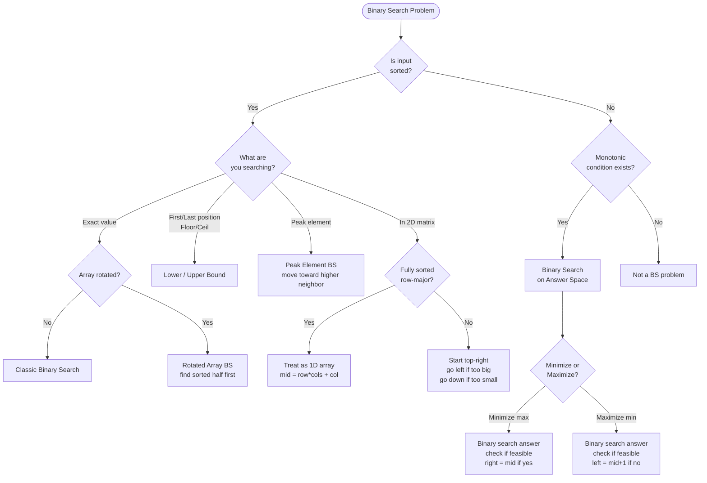

## What is Binary Search?

Think of a **dictionary**. You don't read every word from page 1. You open the middle, decide "too early" or "too late", and cut the search space in half each time. That's binary search — O(log n) instead of O(n).

```
  Linear search O(n):          Binary search O(log n):
  target = 7                   target = 7

  [1][2][3][4][5][6][7][8]     [1][2][3][4][5][6][7][8]
   ↑ no                         L               R
      ↑ no                          mid=4 → 4<7, go right
         ↑ no                               L       R
            ↑ no                               mid=6 → 6<7
               ↑ no                                  LR
                  ↑ no                               mid=7 ✓
                     ↑ yes!
  6 comparisons                3 comparisons
```

**The golden rule:** Binary search works whenever you can answer the question *"is the answer in the left half or the right half?"* — i.e., the search space has a **monotonic property**.

---

## Pattern 1: Classic Binary Search

**The idea:** Find a target in a sorted array by repeatedly halving the search space.

```viz
{
  "title": "Classic Binary Search — find target = 11",
  "description": "L=left, R=right, M=mid. Each step cuts the search space in half.",
  "array": [1, 3, 5, 7, 9, 11, 13],
  "speed": 900,
  "steps": [
    { "pointers": { "L": 0, "R": 6 }, "label": "Start: L=0, R=6. Compute mid = (0+6)//2 = 3" },
    { "pointers": { "L": 0, "R": 6, "M": 3 }, "highlight": [3], "label": "arr[M]=7 < target(11) → move L to M+1" },
    { "pointers": { "L": 4, "R": 6 }, "label": "L=4, R=6. Compute mid = (4+6)//2 = 5" },
    { "pointers": { "L": 4, "R": 6, "M": 5 }, "highlight": [5], "label": "arr[M]=11 == target ✓", "note": "Found at index 5! Only 2 comparisons vs 6 for linear search." }
  ]
}
```

**Template:**
```
left, right = 0, n - 1
while left <= right:
    mid = left + (right - left) // 2   # avoids overflow
    if arr[mid] == target: return mid
    elif arr[mid] < target: left = mid + 1
    else: right = mid - 1
return -1
```

**When to use:** Direct search in a sorted array.

---

## Pattern 2: Lower Bound / Upper Bound

**The idea:** Find the first position where a condition becomes true.

**Analogy:** You're looking for the first seat in a row that's available. You don't check every seat — you binary search for the boundary.

```viz
{
  "title": "Lower Bound — first index where arr[i] >= 3",
  "description": "arr = [1, 3, 3, 3, 5, 7], target = 3. Key: when arr[M] >= target, save M and go LEFT (might be earlier).",
  "array": [1, 3, 3, 3, 5, 7],
  "speed": 1000,
  "steps": [
    { "pointers": { "L": 0, "R": 5 }, "label": "Start: L=0, R=5" },
    { "pointers": { "L": 0, "R": 5, "M": 2 }, "highlight": [2], "label": "arr[M]=3 >= target(3) → possible answer, go LEFT: R=M=2" },
    { "pointers": { "L": 0, "R": 2, "M": 1 }, "highlight": [1], "label": "arr[M]=3 >= target(3) → possible answer, go LEFT: R=M=1" },
    { "pointers": { "L": 0, "R": 1, "M": 0 }, "highlight": [0], "label": "arr[M]=1 < target(3) → go RIGHT: L=M+1=1" },
    { "pointers": { "L": 1, "R": 1 }, "highlight": [1], "label": "L == R → done", "note": "Lower bound = 1. Count of 3s = upper(4) - lower(1) = 3 ✓" }
  ]
}
```

- **Lower bound:** First index where `arr[i] >= target`
- **Upper bound:** First index where `arr[i] > target`

**When to use:**
- Find first/last occurrence of a number
- Count occurrences
- Floor and ceil in sorted array
- Search insert position

---

## Pattern 3: Binary Search on Rotated Array

**The idea:** A rotated sorted array still has one half that is fully sorted. Use that to decide which half to search.

**Analogy:** Imagine a clock face cut and rotated. One arc is still in order — use that to navigate.

```viz
{
  "title": "Rotated Array Binary Search — find target = 4",
  "description": "arr = [6, 7, 9, 1, 2, 4, 5]. One half is always sorted — use it to decide where target lies.",
  "array": [6, 7, 9, 1, 2, 4, 5],
  "speed": 1100,
  "steps": [
    { "pointers": { "L": 0, "R": 6 }, "label": "Start: L=0, R=6. mid=3" },
    { "pointers": { "L": 0, "R": 6, "M": 3 }, "highlight": [3], "label": "arr[M]=1. Left half [6,7,9,1] — is arr[L]=6 <= arr[M]=1? No → RIGHT half [1,2,4,5] is sorted" },
    { "pointers": { "L": 0, "R": 6, "M": 3 }, "highlight": [3,4,5,6], "label": "Right half sorted [1,2,4,5]. Is target(4) in [1..5]? Yes → go RIGHT: L=M+1=4" },
    { "pointers": { "L": 4, "R": 6, "M": 5 }, "highlight": [5], "label": "arr[M]=4 == target ✓", "note": "Found at index 5!" }
  ]
}
```

**Key insight:** At any `mid`, one of `[left..mid]` or `[mid..right]` is always sorted. Check which one, then decide where target lies.

**When to use:**
- Search in rotated sorted array
- Find minimum in rotated sorted array
- Count rotations

---

## Pattern 4: Binary Search on Answer (Most Powerful)

**The idea:** Instead of searching for a value in an array, you binary search on the **answer space** itself.

**Analogy:** You're guessing someone's age. You know it's between 1 and 100. You guess 50 — "too high". Guess 25 — "too low". You're not searching an array, you're searching the space of possible answers.

```viz
{
  "title": "BS on Answer — Koko Eating Bananas",
  "description": "Piles=[3,6,7,11], h=8 hours. Find minimum eating speed k. Search the answer space [1..11].",
  "array": [1, 2, 3, 4, 5, 6, 7, 8, 9, 10, 11],
  "speed": 1000,
  "steps": [
    { "pointers": { "L": 0, "R": 10 }, "label": "Answer space: speeds 1 to 11. L=0(speed=1), R=10(speed=11)" },
    { "pointers": { "L": 0, "R": 10, "M": 5 }, "highlight": [5], "label": "Try speed=6: hours = ⌈3/6⌉+⌈6/6⌉+⌈7/6⌉+⌈11/6⌉ = 1+1+2+2 = 6 ≤ 8 ✓ → feasible, try smaller: R=M=5" },
    { "pointers": { "L": 0, "R": 5, "M": 2 }, "highlight": [2], "label": "Try speed=3: hours = 1+2+3+4 = 10 > 8 ✗ → too slow, go right: L=M+1=3" },
    { "pointers": { "L": 3, "R": 5, "M": 4 }, "highlight": [4], "label": "Try speed=5: hours = 1+2+2+3 = 8 ≤ 8 ✓ → feasible, try smaller: R=M=4" },
    { "pointers": { "L": 3, "R": 4, "M": 3 }, "highlight": [3], "label": "Try speed=4: hours = 1+2+2+3 = 8 ≤ 8 ✓ → feasible, try smaller: R=M=3" },
    { "pointers": { "L": 3, "R": 3 }, "highlight": [3], "label": "L == R → done", "note": "Minimum speed = 4 ✓" }
  ]
}
```

**Template:**
```
left, right = min_possible_answer, max_possible_answer
while left < right:
    mid = (left + right) // 2
    if canAchieve(mid):
        right = mid        # try smaller
    else:
        left = mid + 1     # need bigger
return left
```

**When to use:**
- "Minimize the maximum" or "Maximize the minimum" problems
- Koko eating bananas, Capacity to ship packages
- Aggressive cows, Book allocation

**The trick:** Write a `canAchieve(x)` function that checks if answer `x` is feasible. If it's monotonic (once true, always true), binary search works.

---

## Pattern 5: Peak Element

**The idea:** A peak is where `arr[mid] > arr[mid+1]`. Move toward the higher neighbor — a peak always exists in that direction.

**Analogy:** You're hiking in fog. You can only see one step ahead. Always walk uphill — you'll reach a peak.

```viz
{
  "title": "Peak Element — always walk uphill",
  "description": "arr = [1, 3, 5, 4, 2]. A peak is where arr[i] > arr[i+1]. Move toward the higher side.",
  "array": [1, 3, 5, 4, 2],
  "speed": 1000,
  "steps": [
    { "pointers": { "L": 0, "R": 4 }, "label": "Start: L=0, R=4. mid=2" },
    { "pointers": { "L": 0, "R": 4, "M": 2 }, "highlight": [2, 3], "label": "arr[M]=5 > arr[M+1]=4 → peak is at M or LEFT. R=M=2" },
    { "pointers": { "L": 0, "R": 2, "M": 1 }, "highlight": [1, 2], "label": "arr[M]=3 < arr[M+1]=5 → peak is to the RIGHT. L=M+1=2" },
    { "pointers": { "L": 2, "R": 2 }, "highlight": [2], "label": "L == R → done", "note": "Peak at index 2, value=5 ✓" }
  ]
}
```

**When to use:**
- Find peak element in unsorted array
- Find peak in 2D matrix

---

## Pattern 6: Binary Search in 2D Matrix

**Two types:**

```viz
{
  "title": "2D Matrix Binary Search — Fully Sorted (row-major)",
  "description": "matrix = [[1,3,5],[7,9,11],[13,15,17]], target=9. Treat as 1D: row=mid//cols, col=mid%cols.",
  "array": [1, 3, 5, 7, 9, 11, 13, 15, 17],
  "speed": 1000,
  "steps": [
    { "pointers": { "L": 0, "R": 8 }, "label": "L=0, R=8 (9 elements). mid=4" },
    { "pointers": { "L": 0, "R": 8, "M": 4 }, "highlight": [4], "label": "mid=4 → row=4//3=1, col=4%3=1 → matrix[1][1]=9 == target ✓", "note": "Found at row=1, col=1 ✓. O(log(m*n))" }
  ]
}
```

1. **Fully sorted matrix** (row-major order): Treat it as a 1D array. `row = mid // cols`, `col = mid % cols`.

2. **Row and column sorted matrix**: Start from top-right corner. Go left if too big, go down if too small.

---

## Common Mistakes

- Using `(left + right) / 2` — can overflow. Use `left + (right - left) / 2`.
- Off-by-one errors: know when to use `left <= right` vs `left < right`.
- Forgetting to check which half is sorted in rotated array problems.

---

## Quick "When to Use What"

| Situation | Pattern |
|-----------|---------|
| Find value in sorted array | Classic BS |
| First/last occurrence, floor/ceil | Lower/Upper Bound |
| Search in rotated array | Rotated Array BS |
| Minimize/maximize under constraints | BS on Answer |
| Find local peak | Peak Element BS |
| Search in 2D grid | 2D BS |

---

## Decision Flowchart


