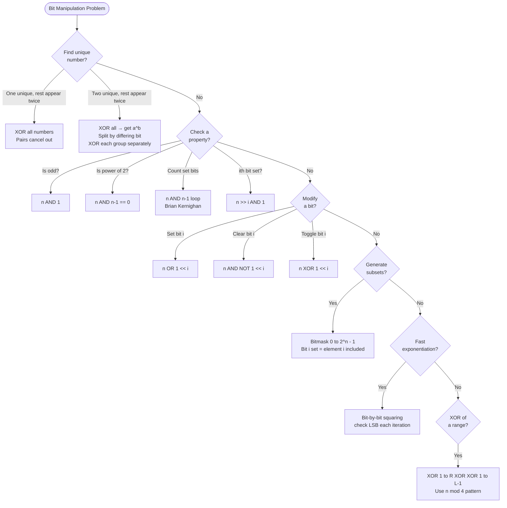

## What is Bit Manipulation?

**Analogy:** Think of a number as a row of light switches — each switch is either ON (1) or OFF (0). Bit manipulation lets you flip, check, or combine switches directly, which is much faster than arithmetic.

**Why use it?** Operations run at hardware speed. Many problems that seem to need O(n) space can be solved in O(1) using bits.

---

## Core Bit Operations

| Operation | Symbol | Example | Result |
|-----------|--------|---------|--------|
| AND | `&` | `5 & 3` = `101 & 011` | `001` = 1 |
| OR | `\|` | `5 \| 3` = `101 \| 011` | `111` = 7 |
| XOR | `^` | `5 ^ 3` = `101 ^ 011` | `110` = 6 |
| NOT | `~` | `~5` | `-6` (flip all bits) |
| Left Shift | `<<` | `5 << 1` | `10` (multiply by 2) |
| Right Shift | `>>` | `5 >> 1` | `2` (divide by 2) |

---

## Pattern 1: XOR Magic

**XOR properties (memorize these):**
- `a ^ a = 0` — a number XORed with itself is 0
- `a ^ 0 = a` — XOR with 0 changes nothing
- XOR is commutative and associative

**Analogy:** XOR is like a toggle switch. Flip the same switch twice → back to original. Flip once → changed.

**When to use:**
- Find the single number that appears once (all others appear twice) → XOR all numbers, pairs cancel out
- Find two numbers appearing once (all others twice) → XOR all, then split by a differing bit
- Swap two numbers without temp: `a ^= b; b ^= a; a ^= b`
- Find XOR of range [L, R] using prefix XOR

---

## Pattern 2: Check / Set / Clear / Toggle a Bit

```
# Check if ith bit is set
(n >> i) & 1 == 1

# Set ith bit (turn ON)
n | (1 << i)

# Clear ith bit (turn OFF)
n & ~(1 << i)

# Toggle ith bit
n ^ (1 << i)
```

**When to use:**
- Check if number is odd: `n & 1 == 1`
- Check if power of 2: `n & (n-1) == 0` (only one bit set)
- Count set bits (Brian Kernighan): `while n: n &= n-1; count++`

---

## Pattern 3: Power of 2 Trick

`n & (n-1)` removes the lowest set bit.

**Analogy:** Imagine a binary number like `1000`. Subtracting 1 gives `0111`. AND them → `0000`. If result is 0, only one bit was set → power of 2.

**Uses:**
- Check power of 2: `n > 0 and (n & (n-1)) == 0`
- Count set bits: repeatedly do `n &= n-1` until n = 0
- Find lowest set bit: `n & (-n)`

---

## Pattern 4: Bitmask for Subsets

**The idea:** Represent a subset of n elements as an n-bit integer. Bit i is 1 if element i is in the subset.

**Analogy:** Each bit is a yes/no decision for one item. All possible subsets = all numbers from 0 to 2^n - 1.

```
# Enumerate all subsets of array of size n
for mask in range(1 << n):
    subset = []
    for i in range(n):
        if mask & (1 << i):
            subset.append(arr[i])
```

**When to use:**
- Generate all subsets (Power Set)
- DP on subsets (Travelling Salesman, matching problems)
- Check if subset has a property

---

## Pattern 5: Bit Tricks for Math

- `n >> 1` = n / 2 (integer division)
- `n << 1` = n * 2
- `n & 1` = n % 2 (odd/even check)
- `-n = ~n + 1` (two's complement)
- `n ^ (n-1)` = sets all bits from lowest set bit downward

**Fast power (Exponentiation by squaring):**
```
def power(base, exp):
    result = 1
    while exp > 0:
        if exp & 1:          # if current bit is set
            result *= base
        base *= base
        exp >>= 1
    return result
```

---

## Pattern 6: XOR in Arrays

**Find XOR of range [1, n]:**
```
# XOR from 1 to n follows a pattern based on n % 4:
# n%4==0: n
# n%4==1: 1
# n%4==2: n+1
# n%4==3: 0
```

**XOR of range [L, R]:** `xor(1, R) ^ xor(1, L-1)`

---

## Quick Reference

| Situation | Bit Trick |
|-----------|-----------|
| Find single number (others appear twice) | XOR all |
| Check if odd | `n & 1` |
| Check if power of 2 | `n & (n-1) == 0` |
| Count set bits | `n &= n-1` loop |
| Set / clear / toggle bit i | `\|`, `& ~`, `^` with `1 << i` |
| Generate all subsets | Bitmask 0 to 2^n - 1 |
| Fast exponentiation | Bit-by-bit squaring |
| Swap without temp | XOR swap |

---

## Decision Flowchart


