## What is Bit Manipulation?

**Analogy:** Think of a number as a row of light switches — each switch is either ON (1) or OFF (0). Bit manipulation lets you flip, check, or combine switches directly, which is much faster than arithmetic.

**Why use it?** Operations run at hardware speed. Many problems that seem to need O(n) space can be solved in O(1) using bits.

---

## Core Bit Operations

| Operation | Symbol | Example | Result |
|-----------|--------|---------|--------|
| AND | `&` | `5 & 3` = `101 & 011` | `001` = 1 |
| OR | `\|` | `5 \| 3` = `101 \| 011` | `111` = 7 |
| XOR | `^` | `5 ^ 3` = `101 ^ 011` | `110` = 6 |
| NOT | `~` | `~5` | `-6` (flip all bits) |
| Left Shift | `<<` | `5 << 1` | `10` (multiply by 2) |
| Right Shift | `>>` | `5 >> 1` | `2` (divide by 2) |

---

## Pattern 1: XOR Magic

**XOR properties (memorize these):**
- `a ^ a = 0` — a number XORed with itself is 0
- `a ^ 0 = a` — XOR with 0 changes nothing
- XOR is commutative and associative

```viz
{
  "title": "XOR Magic — Find the Single Number",
  "description": "arr = [4, 1, 2, 1, 2]. All except one appear twice. XOR all → pairs cancel to 0, single survives.",
  "array": [4, 1, 2, 1, 2],
  "speed": 900,
  "steps": [
    { "pointers": { "i": 0 }, "highlight": [0], "label": "result = 0 ^ 4 = 4" },
    { "pointers": { "i": 1 }, "highlight": [1], "label": "result = 4 ^ 1 = 5" },
    { "pointers": { "i": 2 }, "highlight": [2], "label": "result = 5 ^ 2 = 7" },
    { "pointers": { "i": 3 }, "highlight": [1,3], "label": "result = 7 ^ 1 = 6  (1^1 cancels out)" },
    { "pointers": { "i": 4 }, "highlight": [2,4], "label": "result = 6 ^ 2 = 4  (2^2 cancels out)", "note": "Single number = 4 ✓. Pairs cancelled: 1^1=0, 2^2=0. Only 4 remains." }
  ]
}
```

**When to use:**
- Find the single number that appears once (all others appear twice) → XOR all numbers, pairs cancel out
- Swap two numbers without temp: `a ^= b; b ^= a; a ^= b`

> **In an interview:** trigger words are *"every element appears twice except..."* or *"without extra space"*. If two singles exist, XOR-all then split by a set bit.
> **Remember:** a^a=0, a^0=a — duplicates annihilate, the loner survives.

---

## Pattern 2: Check / Set / Clear / Toggle a Bit

```viz
{
  "title": "Bit Operations on n=13 (binary: 1101)",
  "description": "n=13=1101. Demonstrate check, set, clear, toggle on bit position i=1.",
  "array": [1, 1, 0, 1],
  "speed": 1000,
  "steps": [
    { "pointers": {}, "highlight": [0,1,2,3], "label": "n=13=1101 in binary. Bits indexed right to left: bit0=1, bit1=0, bit2=1, bit3=1" },
    { "pointers": { "i": 2 }, "highlight": [2], "label": "CHECK bit1: (13>>1)&1 = 6&1 = 0. Bit 1 is OFF." },
    { "pointers": { "i": 2 }, "highlight": [2], "label": "SET bit1: 13|(1<<1) = 13|2 = 15 = 1111. Bit 1 turned ON." },
    { "pointers": { "i": 1 }, "highlight": [1], "label": "CLEAR bit2: 13&~(1<<2) = 13&~4 = 13&11111011 = 9 = 1001. Bit 2 turned OFF." },
    { "pointers": { "i": 3 }, "highlight": [3], "label": "TOGGLE bit3: 13^(1<<3) = 13^8 = 5 = 0101. Bit 3 flipped from 1 to 0.", "note": "All bit ops are O(1) ✓" }
  ]
}
```

**When to use:**
- Check if number is odd: `n & 1 == 1`
- Check if power of 2: `n & (n-1) == 0`
- Count set bits (Brian Kernighan): `while n: n &= n-1; count++`

> **In an interview:** trigger words are *"the i-th bit"*, *"turn on/off a flag"*, or bitmask state. Say the mask `1 << i` out loud and whether you AND, OR, or XOR.
> **Remember:** check `>>i & 1`, set `| 1<<i`, clear `& ~(1<<i)`, toggle `^ 1<<i`.

---

## Pattern 3: Power of 2 Trick

`n & (n-1)` removes the lowest set bit.

**Analogy:** Imagine a binary number like `1000`. Subtracting 1 gives `0111`. AND them → `0000`. If result is 0, only one bit was set → power of 2.

```viz
{
  "title": "n & (n-1) — Count Set Bits (Brian Kernighan)",
  "description": "n=13=1101. Each n&(n-1) removes the lowest set bit. Count iterations until n=0.",
  "array": [1, 1, 0, 1],
  "speed": 1000,
  "steps": [
    { "pointers": {}, "highlight": [0,1,2,3], "label": "n=13=1101. count=0" },
    { "pointers": { "i": 3 }, "highlight": [3], "label": "n&(n-1)=13&12=1101&1100=1100=12. Removed bit0. count=1" },
    { "pointers": { "i": 2 }, "highlight": [2], "label": "n&(n-1)=12&11=1100&1011=1000=8. Removed bit2. count=2" },
    { "pointers": { "i": 0 }, "highlight": [0], "label": "n&(n-1)=8&7=1000&0111=0000=0. Removed bit3. count=3" },
    { "pointers": {}, "label": "n=0 → stop.", "note": "13=1101 has 3 set bits ✓. Each iteration removes exactly one set bit." }
  ]
}
```

**Uses:**
- Check power of 2: `n > 0 and (n & (n-1)) == 0`
- Count set bits: repeatedly do `n &= n-1` until n = 0
- Find lowest set bit: `n & (-n)`

> **In an interview:** trigger words are *"power of two"*, *"count 1-bits"*, *"lowest set bit"*. These are one-liners the interviewer expects instantly.
> **Remember:** `n & (n-1)` drops the lowest set bit; `n & -n` isolates it.

---

## Pattern 4: Bitmask for Subsets

**The idea:** Represent a subset of n elements as an n-bit integer. Bit i is 1 if element i is in the subset.

**Analogy:** Each bit is a yes/no decision for one item. All possible subsets = all numbers from 0 to 2^n - 1.

```viz
{
  "title": "Bitmask Subsets — arr=[A,B,C], n=3",
  "description": "Each number 0..7 represents a subset. Bit i=1 means element i is included.",
  "array": ["A", "B", "C"],
  "speed": 800,
  "steps": [
    { "pointers": {}, "highlight": [], "label": "mask=000=0: {} empty subset" },
    { "pointers": { "i": 0 }, "highlight": [0], "label": "mask=001=1: {A} (bit0 set)" },
    { "pointers": { "i": 1 }, "highlight": [1], "label": "mask=010=2: {B} (bit1 set)" },
    { "pointers": { "i": 0, "j": 1 }, "highlight": [0,1], "label": "mask=011=3: {A,B} (bit0,bit1 set)" },
    { "pointers": { "i": 2 }, "highlight": [2], "label": "mask=100=4: {C} (bit2 set)" },
    { "pointers": { "i": 0, "curr": 2 }, "highlight": [0,2], "label": "mask=101=5: {A,C}" },
    { "pointers": { "i": 1, "j": 2 }, "highlight": [1,2], "label": "mask=110=6: {B,C}" },
    { "pointers": { "i": 0, "j": 1, "curr": 2 }, "highlight": [0,1,2], "label": "mask=111=7: {A,B,C}", "note": "2³=8 subsets total ✓. Check if element i in mask: (mask>>i)&1==1" }
  ]
}
```

**When to use:**
- Generate all subsets (Power Set)
- DP on subsets (Travelling Salesman, matching problems)

> **In an interview:** trigger is small **n (≤ ~20)** plus *"try all subsets / assignments"*. The bitmask becomes your loop variable or DP state key.
> **Remember:** integers 0…2ⁿ−1 enumerate every subset; bit i set means item i is in.

---

## Pattern 5: Bit Tricks for Math

```viz
{
  "title": "Fast Exponentiation — base=2, exp=10",
  "description": "exp=10=1010 in binary. Square base each step. Multiply result when bit is set.",
  "array": [0, 1, 0, 1],
  "speed": 1000,
  "steps": [
    { "pointers": { "i": 3 }, "highlight": [3], "label": "exp=10=1010. bit0=0: skip. base=2²=4, exp>>=1 → exp=5=101" },
    { "pointers": { "i": 2 }, "highlight": [2], "label": "bit0=1: result*=4=4. base=4²=16, exp>>=1 → exp=2=10" },
    { "pointers": { "i": 1 }, "highlight": [1], "label": "bit0=0: skip. base=16²=256, exp>>=1 → exp=1=1" },
    { "pointers": { "i": 0 }, "highlight": [0], "label": "bit0=1: result*=256=1024. base=256²=65536, exp>>=1 → exp=0", "note": "2^10 = 1024 ✓. Only 4 multiplications instead of 10. O(log n)." }
  ]
}
```

- `n >> 1` = n / 2,  `n << 1` = n * 2,  `n & 1` = n % 2 (odd/even)

**When to use:**
- Fast power/exponentiation
- Multiply/divide by powers of 2

> **In an interview:** trigger words are *"compute x^n"*, *"without the multiply/divide operator"*, or huge exponents needing O(log n).
> **Remember:** square the base, halve the exponent; multiply into the result on each set bit.

---

## Pattern 6: XOR in Arrays

**Find XOR of range [1, n]:**
```
# XOR from 1 to n follows a pattern based on n % 4:
# n%4==0: n
# n%4==1: 1
# n%4==2: n+1
# n%4==3: 0
```

**XOR of range [L, R]:** `xor(1, R) ^ xor(1, L-1)`

> **In an interview:** trigger is *"XOR of a large range [L, R]"* where looping would TLE. The `n % 4` pattern gives xor(1..n) in O(1).
> **Remember:** range XOR = prefixXor(R) ^ prefixXor(L-1), same telescoping idea as prefix sums.

---

## Quick Reference

| Situation | Bit Trick |
|-----------|-----------|
| Find single number (others appear twice) | XOR all |
| Check if odd | `n & 1` |
| Check if power of 2 | `n & (n-1) == 0` |
| Count set bits | `n &= n-1` loop |
| Set / clear / toggle bit i | `\|`, `& ~`, `^` with `1 << i` |
| Generate all subsets | Bitmask 0 to 2^n - 1 |
| Fast exponentiation | Bit-by-bit squaring |
| Swap without temp | XOR swap |

---

## Decision Flowchart

```mermaid
flowchart TD
    A([Bit Manipulation Problem]) --> B{Find unique\nnumber?}
    B -->|One unique, rest appear twice| C[XOR all numbers\nPairs cancel out]
    B -->|Two unique, rest appear twice| D[XOR all → get a^b\nSplit by differing bit\nXOR each group separately]
    B -->|No| E{Check a\nproperty?}
    E -->|Is odd?| F[n AND 1]
    E -->|Is power of 2?| G[n AND n-1 == 0]
    E -->|Count set bits| H[n AND n-1 loop\nBrian Kernighan]
    E -->|ith bit set?| I[n >> i AND 1]
    E -->|No| J{Modify\na bit?}
    J -->|Set bit i| K[n OR 1 << i]
    J -->|Clear bit i| L[n AND NOT 1 << i]
    J -->|Toggle bit i| M[n XOR 1 << i]
    J -->|No| N{Generate\nsubsets?}
    N -->|Yes| O[Bitmask 0 to 2^n - 1\nBit i set = element i included]
    N -->|No| P{Fast\nexponentiation?}
    P -->|Yes| Q[Bit-by-bit squaring\ncheck LSB each iteration]
    P -->|No| R{XOR of\na range?}
    R -->|Yes| S[XOR 1 to R XOR XOR 1 to L-1\nUse n mod 4 pattern]
```



---

## Problem → Pattern Cross-References

The problems list now mirrors the patterns above (section names match the concept patterns). Notes:

| Problem | Home pattern | Why (and what else it touches) |
|---------|--------------|-------------------------------|
| Single Number II (rest thrice) | XOR Magic | Count bits mod 3, or use two accumulator masks |
| Single Number III (two singles) | XOR Magic | XOR all → split by a differing bit, XOR each group (see flowchart) |
| Minimum Bit Flips | Power of 2 / Count Set Bits | Count set bits of `A ^ B` |
| Divide Two Integers | Bit Math | Repeated subtraction using shifts (bit-by-bit quotient) |

**Cross-topic homes:**

- **Power Set / Subsets** (LeetCode 78) → home is `recursion.md` (Subsets, pick/no-pick). The bitmask 0…2ⁿ−1 iteration (Pattern 4 above) is the same problem through a different lens — practice it there, no duplicate entry here.
- **Pow(x, n)** → home is `recursion.md` (fast exponentiation). The bit-by-bit squaring shown in Pattern 5 above is the same algorithm viewed through bits.

**On the Number Theory section:** prime factors, divisors, and the Sieve aren't bit tricks — they're kept here only because there's no dedicated math topic. If a `math` topic is ever added, that's their real home.

> **The two highest-value bit skills:** XOR cancellation (pairs vanish) and `n & (n-1)` (drops the lowest set bit). A large share of interview bit problems are one of these two in disguise.
