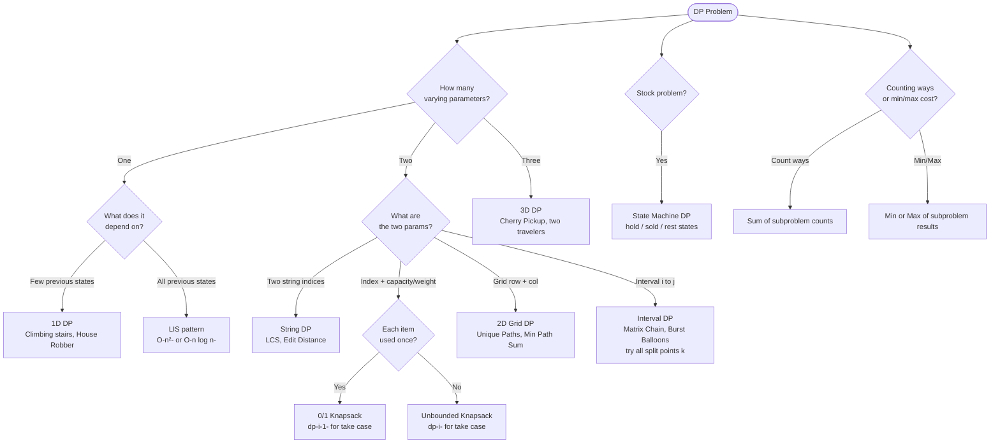

## What is Dynamic Programming?

**Analogy:** You're climbing stairs and someone asks "how many ways to reach step 10?" Instead of recounting from scratch every time, you write down the answer for each step as you go. Step 10 uses step 9 and step 8 — already computed. That's DP.

**Two conditions for DP:**
1. **Overlapping subproblems** — same subproblem solved multiple times
2. **Optimal substructure** — optimal solution built from optimal sub-solutions

**Three approaches:**
1. **Top-down (Memoization)** — Recursion + cache. Natural to write, starts from the answer.
2. **Bottom-up (Tabulation)** — Fill a table from base cases up. No recursion overhead.
3. **Space Optimized** — Often only need the last 1-2 rows/values, not the full table.

---

## Converting Recursion → Memoization → Tabulation

**Step 1 (Recursion → Memo):**
- Identify changing parameters
- Add a cache (array/map) indexed by those parameters
- Before computing, check if already cached

**Step 2 (Memo → Tabulation):**
- Declare dp array with same dimensions
- Initialize base cases
- Convert recursive calls to dp array lookups
- Fill in order (base → answer)

---

## Pattern 1: 1D DP (Linear)

**Analogy:** Each step depends only on a few previous steps. Like a relay race — each runner hands off to the next.

**Classic problems:**
- **Climbing Stairs:** `dp[i] = dp[i-1] + dp[i-2]`
- **House Robber:** `dp[i] = max(dp[i-1], dp[i-2] + nums[i])` — can't rob adjacent houses
- **Fibonacci, Frog Jump**

**When to use:** Linear sequence, each state depends on a few previous states.

---

## Pattern 2: 2D DP (Grid)

**Analogy:** You're navigating a grid from top-left to bottom-right. Each cell's answer depends on the cell above and the cell to the left.

**Classic problems:**
- **Unique Paths:** `dp[i][j] = dp[i-1][j] + dp[i][j-1]`
- **Minimum Path Sum:** `dp[i][j] = grid[i][j] + min(dp[i-1][j], dp[i][j-1])`
- **Triangle, Falling Path Sum**

**When to use:** 2D grid traversal, two-sequence problems (LCS, Edit Distance).

---

## Pattern 3: 0/1 Knapsack

**The idea:** For each item, decide: take it or leave it. Each item can be used at most once.

**Analogy:** You have a backpack with limited weight. For each item, you either pack it or don't. You want maximum value without exceeding weight.

**Formula:** `dp[i][w] = max(dp[i-1][w], dp[i-1][w-wt[i]] + val[i])`

**When to use:**
- 0/1 Knapsack
- Subset sum, partition equal subset sum
- Count subsets with given sum
- Target sum

---

## Pattern 4: Unbounded Knapsack

**The idea:** Same as 0/1 knapsack but each item can be used unlimited times.

**Analogy:** A vending machine — you can buy the same snack as many times as you want.

**Formula:** `dp[i][w] = max(dp[i-1][w], dp[i][w-wt[i]] + val[i])` (note: `dp[i]` not `dp[i-1]` for the take case)

**When to use:**
- Coin change (minimum coins)
- Coin change 2 (count ways)
- Rod cutting

---

## Pattern 5: Longest Common Subsequence (LCS) Family

**The idea:** Compare two strings character by character. Build a 2D table.

**Analogy:** Two people describing their day. LCS finds the longest sequence of events they both experienced in the same order.

**Formula:**
```
if s1[i] == s2[j]: dp[i][j] = 1 + dp[i-1][j-1]
else: dp[i][j] = max(dp[i-1][j], dp[i][j-1])
```

**LCS family:**
- LCS → base problem
- Longest Common Substring → reset to 0 when chars don't match
- Edit Distance → cost of insert/delete/replace
- Shortest Common Supersequence → LCS + extras
- Longest Palindromic Subsequence → LCS(s, reverse(s))

---

## Pattern 6: Longest Increasing Subsequence (LIS)

**The idea:** Find the longest subsequence where each element is strictly greater than the previous.

**Analogy:** You're collecting stamps by year. LIS finds the longest chain of stamps where years are strictly increasing.

**O(n²) DP:** `dp[i] = max(dp[j] + 1)` for all j < i where `arr[j] < arr[i]`

**O(n log n):** Use patience sorting with binary search.

**When to use:**
- LIS, Longest Bitonic Subsequence
- Largest Divisible Subset
- Russian Doll Envelopes

---

## Pattern 7: Stock Buy/Sell DP

**The idea:** State machine — at each day, you're in one of: holding stock, not holding, cooldown.

**Analogy:** A trader who can only hold one stock at a time. Each day: buy, sell, or do nothing. Some variants add cooldown or transaction fees.

**States:** `hold[i]`, `sold[i]`, `rest[i]`

**When to use:** All "best time to buy and sell stock" variants.

---

## Pattern 8: Interval DP

**The idea:** Solve problems on intervals [i, j] by trying all split points k.

**Analogy:** Matrix chain multiplication — to multiply a chain of matrices, try every possible split point and pick the cheapest.

**Formula:** `dp[i][j] = min(dp[i][k] + dp[k+1][j] + cost(i,j,k))` for all k in [i, j-1]

**When to use:**
- Matrix chain multiplication
- Burst balloons
- Palindrome partitioning II
- Minimum cost to cut a stick

---

## Quick Reference

| Situation | Pattern |
|-----------|---------|
| Linear sequence, few prev states | 1D DP |
| Grid traversal, two sequences | 2D DP |
| Pick items with weight limit (once) | 0/1 Knapsack |
| Pick items unlimited times | Unbounded Knapsack |
| Compare two strings | LCS family |
| Increasing subsequence | LIS |
| Buy/sell with constraints | Stock DP |
| Split interval at best point | Interval DP |

---

## Decision Flowchart


