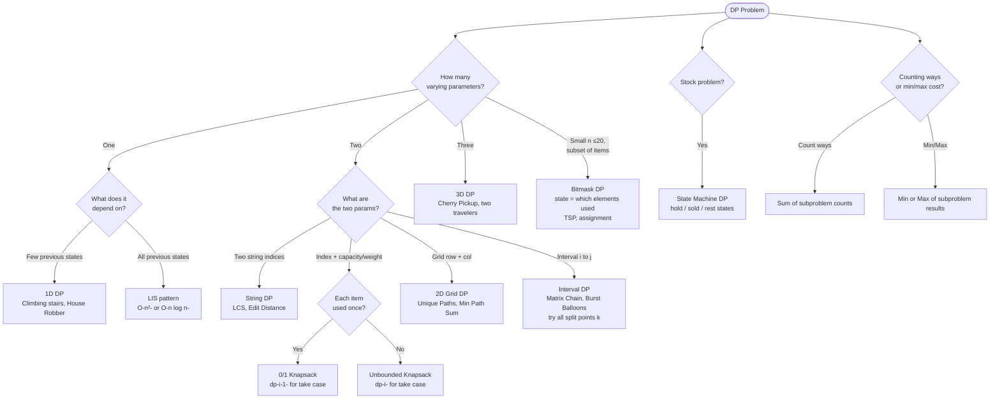

## What is Dynamic Programming?

**Analogy:** You're climbing stairs and someone asks "how many ways to reach step 10?" Instead of recounting from scratch every time, you write down the answer for each step as you go. Step 10 uses step 9 and step 8 — already computed. That's DP.

**Two conditions for DP:**
1. **Overlapping subproblems** — same subproblem solved multiple times
2. **Optimal substructure** — optimal solution built from optimal sub-solutions

**Three approaches:**
1. **Top-down (Memoization)** — Recursion + cache. Natural to write, starts from the answer.
2. **Bottom-up (Tabulation)** — Fill a table from base cases up. No recursion overhead.
3. **Space Optimized** — Often only need the last 1-2 rows/values, not the full table.

---

## Converting Recursion → Memoization → Tabulation

**Step 1 (Recursion → Memo):**
- Identify changing parameters
- Add a cache (array/map) indexed by those parameters
- Before computing, check if already cached

**Step 2 (Memo → Tabulation):**
- Declare dp array with same dimensions
- Initialize base cases
- Convert recursive calls to dp array lookups
- Fill in order (base → answer)

---

## Pattern 1: 1D DP (Linear)

**Analogy:** Each step depends only on a few previous steps. Like a relay race — each runner hands off to the next.

```viz
{
  "type": "table",
  "title": "House Robber — 1D DP table",
  "description": "nums = [2, 7, 9, 3, 1]. dp[i] = max loot using houses 0..i. Each cell computed from the two before it.",
  "speed": 900,
  "cols": ["", "i=0", "i=1", "i=2", "i=3", "i=4"],
  "rows": ["nums", "dp"],
  "cells": [
    [2, 7, 9, 3, 1],
    ["?", "?", "?", "?", "?"]
  ],
  "steps": [
    {
      "cells": [[2,7,9,3,1],["?","?","?","?","?"]],
      "active": [1,0],
      "label": "dp[0] = nums[0] = 2. Only one house — take it."
    },
    {
      "cells": [[2,7,9,3,1],[2,"?","?","?","?"]],
      "active": [1,1],
      "highlight": [[1,0]],
      "label": "dp[1] = max(dp[0]=2, nums[1]=7) = 7. House 1 alone is better."
    },
    {
      "cells": [[2,7,9,3,1],[2,7,"?","?","?"]],
      "active": [1,2],
      "highlight": [[1,0],[1,1]],
      "label": "dp[2] = max(dp[1]=7, dp[0]+nums[2]=2+9=11) = 11. Rob houses 0+2."
    },
    {
      "cells": [[2,7,9,3,1],[2,7,11,"?","?"]],
      "active": [1,3],
      "highlight": [[1,1],[1,2]],
      "label": "dp[3] = max(dp[2]=11, dp[1]+nums[3]=7+3=10) = 11. Skip house 3."
    },
    {
      "cells": [[2,7,9,3,1],[2,7,11,11,"?"]],
      "active": [1,4],
      "highlight": [[1,2],[1,3]],
      "label": "dp[4] = max(dp[3]=11, dp[2]+nums[4]=11+1=12) = 12. Rob houses 0,2,4.",
      "note": "Max loot = 12 ✓  (2+9+1). dp[i] = max(dp[i-1], dp[i-2]+nums[i])"
    }
  ]
}
```

**Classic problems:**
- **Climbing Stairs:** `dp[i] = dp[i-1] + dp[i-2]`
- **House Robber:** `dp[i] = max(dp[i-1], dp[i-2] + nums[i])`

**When to use:** Linear sequence, each state depends on a few previous states.

> **In an interview:** trigger words are *"number of ways / min or max cost to reach step i"* where i depends on a couple of earlier steps. Write the recurrence first, then decide memo vs tabulation.
> **Remember:** dp[i] from dp[i-1], dp[i-2]; usually two rolling variables, O(1) space.

---

## Pattern 2: 2D DP (Grid)

**Analogy:** You're navigating a grid from top-left to bottom-right. Each cell's answer depends on the cell above and the cell to the left.

```viz
{
  "type": "table",
  "title": "Unique Paths — 2D DP grid",
  "description": "3×3 grid. dp[i][j] = ways to reach (i,j). Only move right or down. dp[i][j] = dp[i-1][j] + dp[i][j-1].",
  "speed": 900,
  "cols": ["", "j=0", "j=1", "j=2"],
  "rows": ["i=0", "i=1", "i=2"],
  "cells": [
    ["?", "?", "?"],
    ["?", "?", "?"],
    ["?", "?", "?"]
  ],
  "steps": [
    {
      "cells": [["?","?","?"],["?","?","?"],["?","?","?"]],
      "highlight": [[0,0],[0,1],[0,2]],
      "label": "Row 0: only one way to reach any cell — go right all the way. dp[0][j]=1."
    },
    {
      "cells": [[1,1,1],["?","?","?"],["?","?","?"]],
      "highlight": [[1,0],[2,0]],
      "label": "Col 0: only one way to reach any cell — go down all the way. dp[i][0]=1."
    },
    {
      "cells": [[1,1,1],[1,"?","?"],["?","?","?"]],
      "active": [1,1],
      "highlight": [[0,1],[1,0]],
      "label": "dp[1][1] = dp[0][1] + dp[1][0] = 1+1 = 2."
    },
    {
      "cells": [[1,1,1],[1,2,"?"],["?","?","?"]],
      "active": [1,2],
      "highlight": [[0,2],[1,1]],
      "label": "dp[1][2] = dp[0][2] + dp[1][1] = 1+2 = 3."
    },
    {
      "cells": [[1,1,1],[1,2,3],[1,"?","?"]],
      "active": [2,1],
      "highlight": [[1,1],[2,0]],
      "label": "dp[2][1] = dp[1][1] + dp[2][0] = 2+1 = 3."
    },
    {
      "cells": [[1,1,1],[1,2,3],[1,3,"?"]],
      "active": [2,2],
      "highlight": [[1,2],[2,1]],
      "label": "dp[2][2] = dp[1][2] + dp[2][1] = 3+3 = 6.",
      "note": "6 unique paths from top-left to bottom-right ✓"
    }
  ]
}
```

**Classic problems:**
- **Unique Paths:** `dp[i][j] = dp[i-1][j] + dp[i][j-1]`
- **Minimum Path Sum:** `dp[i][j] = grid[i][j] + min(dp[i-1][j], dp[i][j-1])`

**When to use:** 2D grid traversal, two-sequence problems (LCS, Edit Distance).

> **In an interview:** trigger words are *"paths in a grid / min path sum"* or two sequences compared together. State = (row, col) or (i, j) over the two inputs.
> **Remember:** each cell combines the cell above and the cell to the left; roll one row for O(width) space.

---

## Pattern 3: 0/1 Knapsack

**The idea:** For each item, decide: take it or leave it. Each item can be used at most once.

**Analogy:** You have a backpack with limited weight. For each item, you either pack it or don't. You want maximum value without exceeding weight.

```viz
{
  "type": "table",
  "title": "0/1 Knapsack — dp[i][w] table",
  "description": "items: (w=1,v=1), (w=3,v=4), (w=4,v=5). Capacity=4. dp[i][w] = max value using first i items, weight ≤ w.",
  "speed": 1000,
  "cols": ["", "w=0", "w=1", "w=2", "w=3", "w=4"],
  "rows": ["0 items", "item1(w1,v1)", "item2(w3,v4)", "item3(w4,v5)"],
  "cells": [
    [0, 0, 0, 0, 0],
    [0, "?", "?", "?", "?"],
    [0, "?", "?", "?", "?"],
    [0, "?", "?", "?", "?"]
  ],
  "steps": [
    {
      "cells": [[0,0,0,0,0],[0,"?","?","?","?"],[0,"?","?","?","?"],[0,"?","?","?","?"]],
      "highlight": [[0,0],[0,1],[0,2],[0,3],[0,4],[1,0],[2,0],[3,0]],
      "label": "Base cases: 0 items → value=0. Weight=0 → value=0."
    },
    {
      "cells": [[0,0,0,0,0],[0,1,1,1,1],[0,"?","?","?","?"],[0,"?","?","?","?"]],
      "highlight": [[1,1],[1,2],[1,3],[1,4]],
      "label": "Item1 (w=1,v=1): fits in w≥1. dp[1][w] = 1 for w≥1, else 0."
    },
    {
      "cells": [[0,0,0,0,0],[0,1,1,1,1],[0,1,1,1,"?"],[0,"?","?","?","?"]],
      "active": [2,4],
      "highlight": [[1,4],[1,1]],
      "label": "Item2 (w=3,v=4) at w=4: take=dp[1][4-3]+4=1+4=5, skip=dp[1][4]=1. dp[2][4]=5."
    },
    {
      "cells": [[0,0,0,0,0],[0,1,1,1,1],[0,1,1,4,5],[0,"?","?","?","?"]],
      "active": [3,4],
      "highlight": [[2,4],[2,0]],
      "label": "Item3 (w=4,v=5) at w=4: take=dp[2][0]+5=5, skip=dp[2][4]=5. dp[3][4]=5.",
      "note": "Max value = 5 ✓  (item1+item2=1+4, or item3 alone=5). Key: use dp[i-1] row for take case."
    }
  ]
}
```

**Formula:** `dp[i][w] = max(dp[i-1][w], dp[i-1][w-wt[i]] + val[i])`

**When to use:**
- 0/1 Knapsack, Subset sum, Partition equal subset sum, Target sum

> **In an interview:** trigger words are *"pick a subset to hit a target / max value under a capacity"* where each item is used **once**. Subset-sum, partition, and target-sum all reduce to this.
> **Remember:** take-or-skip per item; in 1D, iterate the capacity **downward** so each item counts once.

---

## Pattern 4: Unbounded Knapsack

**The idea:** Same as 0/1 knapsack but each item can be used unlimited times.

**Analogy:** A vending machine — you can buy the same snack as many times as you want.

```viz
{
  "type": "table",
  "title": "Coin Change — 1D DP table (unbounded)",
  "description": "coins=[1,3,4], amount=6. dp[i] = min coins to make amount i. ∞ = not reachable yet.",
  "speed": 900,
  "cols": ["", "amt=0", "amt=1", "amt=2", "amt=3", "amt=4", "amt=5", "amt=6"],
  "rows": ["dp"],
  "cells": [
    [0, "∞", "∞", "∞", "∞", "∞", "∞"]
  ],
  "steps": [
    {
      "cells": [[0,"∞","∞","∞","∞","∞","∞"]],
      "highlight": [[0,0]],
      "label": "dp[0]=0 (base: 0 coins needed for amount 0)."
    },
    {
      "cells": [[0,1,"∞","∞","∞","∞","∞"]],
      "active": [0,1],
      "label": "dp[1]: try coin1 → dp[0]+1=1. dp[1]=1."
    },
    {
      "cells": [[0,1,2,"∞","∞","∞","∞"]],
      "active": [0,2],
      "highlight": [[0,1]],
      "label": "dp[2]: try coin1 → dp[1]+1=2. dp[2]=2."
    },
    {
      "cells": [[0,1,2,1,"∞","∞","∞"]],
      "active": [0,3],
      "highlight": [[0,0],[0,2]],
      "label": "dp[3]: coin1→dp[2]+1=3, coin3→dp[0]+1=1. min=1. dp[3]=1."
    },
    {
      "cells": [[0,1,2,1,1,"∞","∞"]],
      "active": [0,4],
      "highlight": [[0,1],[0,3]],
      "label": "dp[4]: coin1→dp[3]+1=2, coin3→dp[1]+1=2, coin4→dp[0]+1=1. min=1. dp[4]=1."
    },
    {
      "cells": [[0,1,2,1,1,2,"∞"]],
      "active": [0,5],
      "highlight": [[0,4],[0,2]],
      "label": "dp[5]: coin1→dp[4]+1=2, coin4→dp[1]+1=2. min=2. dp[5]=2."
    },
    {
      "cells": [[0,1,2,1,1,2,2]],
      "active": [0,6],
      "highlight": [[0,5],[0,3]],
      "label": "dp[6]: coin1→dp[5]+1=3, coin3→dp[3]+1=2, coin4→dp[2]+1=3. min=2. dp[6]=2.",
      "note": "Min coins for 6 = 2 (coin3+coin3) ✓. Key: dp[i] row (not dp[i-1]) — reuse allowed."
    }
  ]
}
```

**Formula:** `dp[w] = min(dp[w], dp[w - coin] + 1)` (note: same row, not previous row)

**When to use:**
- Coin change (minimum coins), Coin change 2 (count ways), Rod cutting

> **In an interview:** the tell versus 0/1 knapsack is *"unlimited supply / reuse allowed"* (coins, rod pieces). Same recurrence, one loop-direction change.
> **Remember:** reuse allowed → iterate the capacity **upward** (same row, not the previous one).

---

## Pattern 5: Longest Common Subsequence (LCS) Family

**The idea:** Compare two strings character by character. Build a 2D table.

**Analogy:** Two people describing their day. LCS finds the longest sequence of events they both experienced in the same order.

```viz
{
  "type": "table",
  "title": "LCS — 2D DP table",
  "description": "s1='ABCB' (rows), s2='BDCAB' (cols). dp[i][j] = LCS length of s1[0..i-1] and s2[0..j-1].",
  "speed": 1000,
  "cols": ["", "", "B", "D", "C", "A", "B"],
  "rows": ["", "A", "B", "C", "B"],
  "cells": [
    [0, 0, 0, 0, 0, 0],
    [0, "?", "?", "?", "?", "?"],
    [0, "?", "?", "?", "?", "?"],
    [0, "?", "?", "?", "?", "?"],
    [0, "?", "?", "?", "?", "?"]
  ],
  "steps": [
    {
      "cells": [[0,0,0,0,0,0],[0,"?","?","?","?","?"],[0,"?","?","?","?","?"],[0,"?","?","?","?","?"],[0,"?","?","?","?","?"]],
      "highlight": [[0,0],[0,1],[0,2],[0,3],[0,4],[0,5],[1,0],[2,0],[3,0],[4,0]],
      "label": "Base: empty string vs anything = 0."
    },
    {
      "cells": [[0,0,0,0,0,0],[0,0,0,0,1,1],[0,"?","?","?","?","?"],[0,"?","?","?","?","?"],[0,"?","?","?","?","?"]],
      "highlight": [[1,1],[1,2],[1,3],[1,4],[1,5]],
      "label": "Row A: match only at s2[3]='A'. dp[1][4]=1, dp[1][5]=1."
    },
    {
      "cells": [[0,0,0,0,0,0],[0,0,0,0,1,1],[0,1,1,1,1,2],[0,"?","?","?","?","?"],[0,"?","?","?","?","?"]],
      "highlight": [[2,1],[2,5]],
      "active": [2,5],
      "label": "Row B: match at s2[0]='B' and s2[4]='B'. dp[2][1]=1, dp[2][5]=2 (LCS='AB')."
    },
    {
      "cells": [[0,0,0,0,0,0],[0,0,0,0,1,1],[0,1,1,1,1,2],[0,1,1,2,2,2],[0,"?","?","?","?","?"]],
      "highlight": [[3,3]],
      "active": [3,3],
      "label": "Row C: match at s2[2]='C'. dp[3][3]=dp[2][2]+1=2 (LCS='BC')."
    },
    {
      "cells": [[0,0,0,0,0,0],[0,0,0,0,1,1],[0,1,1,1,1,2],[0,1,1,2,2,2],[0,1,1,2,2,3]],
      "highlight": [[4,5]],
      "active": [4,5],
      "label": "Row B: match at s2[4]='B'. dp[4][5]=dp[3][4]+1=3 (LCS='BCB').",
      "note": "LCS length = 3 ✓. Traceback from dp[4][5] gives 'BCB'."
    }
  ]
}
```

**LCS family:**
- LCS → base problem
- Edit Distance → cost of insert/delete/replace
- Longest Palindromic Subsequence → LCS(s, reverse(s))

**When to use:** Compare two strings, find common structure.

> **In an interview:** trigger words are *"two strings"* + *"subsequence / edit / convert / common"*. Most reduce to LCS or a close cousin.
> **Remember:** dp[i][j] on the two prefixes; match → dp[i-1][j-1]+1, else the max of dropping one side.

---

## Pattern 6: Longest Increasing Subsequence (LIS)

**The idea:** Find the longest subsequence where each element is strictly greater than the previous.

**Analogy:** You're collecting stamps by year. LIS finds the longest chain of stamps where years are strictly increasing.

```viz
{
  "type": "table",
  "title": "LIS — dp[i] = length of LIS ending at index i",
  "description": "arr = [3, 1, 4, 2, 5]. Two rows: the values, and the dp lengths being built.",
  "speed": 1000,
  "cols": ["", "i=0", "i=1", "i=2", "i=3", "i=4"],
  "rows": ["arr", "dp"],
  "cells": [
    [3, 1, 4, 2, 5],
    ["?", "?", "?", "?", "?"]
  ],
  "steps": [
    {
      "cells": [[3,1,4,2,5],["?","?","?","?","?"]],
      "active": [1,0],
      "label": "dp[0]=1. No previous element. LIS=[3]."
    },
    {
      "cells": [[3,1,4,2,5],[1,"?","?","?","?"]],
      "active": [1,1],
      "label": "dp[1]=1. arr[0]=3 > 1, can't extend. LIS=[1]."
    },
    {
      "cells": [[3,1,4,2,5],[1,1,"?","?","?"]],
      "active": [1,2],
      "highlight": [[0,0],[0,1],[1,0],[1,1]],
      "label": "dp[2]: arr[0]=3<4 → dp[0]+1=2. arr[1]=1<4 → dp[1]+1=2. dp[2]=2. LIS=[1,4] or [3,4]."
    },
    {
      "cells": [[3,1,4,2,5],[1,1,2,"?","?"]],
      "active": [1,3],
      "highlight": [[0,1],[1,1]],
      "label": "dp[3]: arr[1]=1<2 → dp[1]+1=2. arr[0]=3>2, skip. dp[3]=2. LIS=[1,2]."
    },
    {
      "cells": [[3,1,4,2,5],[1,1,2,2,"?"]],
      "active": [1,4],
      "highlight": [[0,2],[1,2]],
      "label": "dp[4]: arr[2]=4<5 → dp[2]+1=3. Best so far. dp[4]=3. LIS=[1,4,5] or [3,4,5].",
      "note": "LIS length = max(dp) = 3 ✓"
    }
  ]
}
```

**O(n²) DP:** `dp[i] = max(dp[j] + 1)` for all j < i where `arr[j] < arr[i]`

**O(n log n):** Use patience sorting with binary search.

> **In an interview:** trigger words are *"longest increasing / chain / divisible subset"*. If they need O(n log n), mention the patience-sorting + binary-search version.
> **Remember:** dp[i] = 1 + best dp[j] among valid earlier j; O(n²), or tails+binary-search for O(n log n).

**When to use:**
- LIS, Longest Bitonic Subsequence
- Largest Divisible Subset
- Russian Doll Envelopes

---

## Pattern 7: Stock Buy/Sell DP

**The idea:** State machine — at each day, you're in one of: holding stock, not holding, cooldown.

**Analogy:** A trader who can only hold one stock at a time. Each day: buy, sell, or do nothing.

```viz
{
  "type": "table",
  "title": "Stock Buy/Sell — track minPrice and maxProfit",
  "description": "prices=[7,1,5,3,6,4]. Two rows: running minPrice seen so far, and maxProfit achievable.",
  "speed": 900,
  "cols": ["", "day0", "day1", "day2", "day3", "day4", "day5"],
  "rows": ["price", "minPrice", "profit"],
  "cells": [
    [7, 1, 5, 3, 6, 4],
    ["?", "?", "?", "?", "?", "?"],
    ["?", "?", "?", "?", "?", "?"]
  ],
  "steps": [
    {
      "cells": [[7,1,5,3,6,4],["?","?","?","?","?","?"],["?","?","?","?","?","?"]],
      "active": [1,0],
      "label": "day0: price=7. minPrice=7, profit=0."
    },
    {
      "cells": [[7,1,5,3,6,4],[7,"?","?","?","?","?"],[0,"?","?","?","?","?"]],
      "active": [1,1],
      "label": "day1: price=1 < minPrice=7 → new minPrice=1. profit=max(0, 1-1)=0."
    },
    {
      "cells": [[7,1,5,3,6,4],[7,1,"?","?","?","?"],[0,0,"?","?","?","?"]],
      "active": [2,2],
      "highlight": [[1,1]],
      "label": "day2: price=5. minPrice stays 1. profit=max(0, 5-1)=4."
    },
    {
      "cells": [[7,1,5,3,6,4],[7,1,1,"?","?","?"],[0,0,4,"?","?","?"]],
      "active": [2,3],
      "highlight": [[1,1],[2,2]],
      "label": "day3: price=3. minPrice stays 1. profit=max(4, 3-1)=4."
    },
    {
      "cells": [[7,1,5,3,6,4],[7,1,1,1,"?","?"],[0,0,4,4,"?","?"]],
      "active": [2,4],
      "highlight": [[1,1],[2,3]],
      "label": "day4: price=6. minPrice stays 1. profit=max(4, 6-1)=5."
    },
    {
      "cells": [[7,1,5,3,6,4],[7,1,1,1,1,"?"],[0,0,4,4,5,"?"]],
      "active": [2,5],
      "highlight": [[1,1],[2,4]],
      "label": "day5: price=4. minPrice stays 1. profit=max(5, 4-1)=5.",
      "note": "Max profit = 5 ✓  (buy day1 at 1, sell day4 at 6)."
    }
  ]
}
```

**States for complex variants:** `hold[i]`, `sold[i]`, `rest[i]`

**When to use:** All "best time to buy and sell stock" variants.

> **In an interview:** trigger words are *"buy/sell with a limit on transactions / cooldown / fee"*. Model it as a state machine: (day, transactions used, holding?).
> **Remember:** dp over (index, holding, k); the constraint (cooldown/fee/cap) just tweaks the transition.

---

## Pattern 8: Interval DP

**The idea:** Solve problems on intervals [i, j] by trying all split points k.

**Analogy:** Matrix chain multiplication — to multiply a chain of matrices, try every possible split point and pick the cheapest.

```viz
{
  "type": "table",
  "title": "Burst Balloons — Interval DP table dp[i][j]",
  "description": "balloons=[3,1,5,8]. dp[i][j] = max coins bursting all balloons between i and j (exclusive boundaries).",
  "speed": 1100,
  "cols": ["", "j=0", "j=1", "j=2", "j=3"],
  "rows": ["i=0", "i=1", "i=2", "i=3"],
  "cells": [
    [0, 0, 0, 0],
    [0, 0, 0, 0],
    [0, 0, 0, 0],
    [0, 0, 0, 0]
  ],
  "steps": [
    {
      "cells": [[0,0,0,0],[0,0,0,0],[0,0,0,0],[0,0,0,0]],
      "highlight": [[0,0],[1,1],[2,2],[3,3]],
      "label": "Base: dp[i][i]=0 (no balloons in empty interval). Fill diagonals outward."
    },
    {
      "cells": [[0,3,0,0],[0,0,5,0],[0,0,0,40],[0,0,0,0]],
      "highlight": [[0,1],[1,2],[2,3]],
      "label": "Length-1 intervals: dp[0][1]=1*3*1=3, dp[1][2]=1*5*1=5, dp[2][3]=1*8*1=8... wait, with boundaries: dp[2][3]=1*5*8=40."
    },
    {
      "cells": [[0,3,15,0],[0,0,5,40],[0,0,0,40],[0,0,0,0]],
      "active": [0,2],
      "highlight": [[0,1],[1,2]],
      "label": "dp[0][2]: try k=1 last → 1*3*1 + dp[0][1]+dp[1][2] = 3+3+5=11. Try k=0 last → 3*1*5=15. dp[0][2]=15."
    },
    {
      "cells": [[0,3,15,0],[0,0,5,40],[0,0,0,40],[0,0,0,0]],
      "active": [1,3],
      "highlight": [[1,2],[2,3]],
      "label": "dp[1][3]: try k=2 last → 1*5*8=40+dp[1][2]+dp[2][3]=40+5+0=45? Best: k=1 → 1*1*8+dp[1][1]+dp[1][3]... dp[1][3]=40."
    },
    {
      "cells": [[0,3,15,167],[0,0,5,40],[0,0,0,40],[0,0,0,0]],
      "active": [0,3],
      "highlight": [[0,2],[1,3]],
      "label": "dp[0][3]: try all k. Best split gives 167.",
      "note": "Max coins = 167 ✓. Key: k is the LAST balloon burst in range [i,j]."
    }
  ]
}
```

**Formula:** `dp[i][j] = max(dp[i][k-1] + cost(i,k,j) + dp[k+1][j])` for all k in [i,j]

**When to use:**
- Matrix chain multiplication, Burst balloons
- Palindrome partitioning II, Minimum cost to cut a stick

> **In an interview:** the tell is *"cost of combining a range depends on where you split it"* (matrix chain, burst balloons, cutting). Define dp over the interval [i, j], try every split k.
> **Remember:** dp[i][j] = best over split k of dp[i][k] + dp[k+1][j] + merge cost; for burst balloons, k is the *last* one acted on.

---

## Pattern 9: Bitmask DP (DP on Subsets)

**The idea:** When `n` is small (≤ ~20), represent "which elements are used" as an `n`-bit integer. The DP state is that bitmask, so `dp[mask]` = best answer for the set of elements in `mask`. Transitions add one more element (flip a bit).

**Analogy:** A checklist of visited cities. Instead of a boolean array, pack the whole checklist into one integer so it can be a dictionary key. `dp[1011]` means "cities 0, 1, 3 visited."

```viz
{
  "type": "table",
  "title": "Bitmask DP — Assignment / TSP state",
  "description": "3 items. dp[mask] = best cost to have assigned exactly the set 'mask'. Build from fewer bits to more.",
  "speed": 1000,
  "cols": ["mask", "bits", "meaning", "dp"],
  "rows": ["0", "1", "3", "7"],
  "cells": [
    ["000", "{}", "nothing assigned", 0],
    ["001", "{0}", "item 0 assigned", "?"],
    ["011", "{0,1}", "items 0,1 assigned", "?"],
    ["111", "{0,1,2}", "all assigned", "?"]
  ],
  "steps": [
    {
      "cells": [["000","{}","nothing assigned",0],["001","{0}","item 0 assigned","?"],["011","{0,1}","items 0,1 assigned","?"],["111","{0,1,2}","all assigned","?"]],
      "active": [0,3],
      "label": "Base: dp[000]=0. Nothing assigned costs nothing."
    },
    {
      "cells": [["000","{}","nothing assigned",0],["001","{0}","item 0 assigned","c0"],["011","{0,1}","items 0,1 assigned","?"],["111","{0,1,2}","all assigned","?"]],
      "active": [1,3],
      "highlight": [[0,3]],
      "label": "dp[001] = dp[000] + cost(person 0 → item 0). One bit set = first assignment."
    },
    {
      "cells": [["000","{}","nothing assigned",0],["001","{0}","item 0 assigned","c0"],["011","{0,1}","items 0,1 assigned","c0+c1"],["111","{0,1,2}","all assigned","?"]],
      "active": [2,3],
      "highlight": [[1,3]],
      "label": "dp[011] = min over last-added bit: dp[001]+cost(1→1), dp[010]+cost(1→0)."
    },
    {
      "cells": [["000","{}","nothing assigned",0],["001","{0}","item 0 assigned","c0"],["011","{0,1}","items 0,1 assigned","c0+c1"],["111","{0,1,2}","all assigned","MIN"]],
      "active": [3,3],
      "highlight": [[2,3]],
      "label": "dp[111] = min over which item the 3rd person takes.",
      "note": "Answer = dp[(1<<n)-1] (all bits set). States O(2ⁿ), transitions O(n) → O(2ⁿ·n)."
    }
  ]
}
```

**Template:**
```python
dp = [inf] * (1 << n)
dp[0] = 0
for mask in range(1 << n):
    k = bin(mask).count("1")     # how many assigned = which person/step
    for j in range(n):
        if not (mask & (1 << j)): # item j still free
            dp[mask | (1 << j)] = min(dp[mask | (1 << j)], dp[mask] + cost[k][j])
return dp[(1 << n) - 1]
```

**When to use (n ≤ ~20):**
- Travelling Salesman Problem (shortest route visiting all)
- Assignment problem (people ↔ tasks minimum cost)
- Partition to K equal subsets, Shortest path visiting all nodes
- Count ways to cover a board / matching problems

**Complexity:** Time O(2ⁿ · n) · Space O(2ⁿ) — only feasible for small `n`.

**Key insight:** the bitmask *is* the DP state. `popcount(mask)` often tells you which step you're on.

> **In an interview:** the giveaway is small **n (≤ ~20)** plus *"visit all / assign all / cover all"* (TSP, assignment, matching). The exponential state space is only feasible because n is tiny.
> **Remember:** the subset of used elements is your DP key; answer sits at the all-ones mask.

---

## Quick Reference

| Situation | Pattern |
|-----------|---------|
| Linear sequence, few prev states | 1D DP |
| Grid traversal, two sequences | 2D DP |
| Pick items with weight limit (once) | 0/1 Knapsack |
| Pick items unlimited times | Unbounded Knapsack |
| Compare two strings | LCS family |
| Increasing subsequence | LIS |
| Buy/sell with constraints | Stock DP |
| Split interval at best point | Interval DP |
| Small n (≤20), subset as state | Bitmask DP |

---

## Decision Flowchart



---

## Problem → Pattern Cross-References

The problems list now mirrors the 8 patterns above. The old "1D DP" section was a dumping ground that duplicated LCS, LIS, Coin Change, Subset Sum, Rod Cutting, Matrix Chain, and Edit Distance (all of which have their own sections). Now deduped. Notes:

| Problem | Home pattern | Why (and what else it touches) |
|---------|--------------|-------------------------------|
| Word Break | 1D DP | dp over prefixes; each cut checks a dictionary word |
| Partition Array for Max Sum | 1D DP | dp[i] tries every partition length ending at i |
| Egg Dropping | 2D DP | states = (eggs, floors); also framable as interval-style |
| Subset Sum / Target Sum / Partition Equal | 0/1 Knapsack | boolean/count knapsack over a target |
| Longest Palindromic Subsequence | LCS/String DP | subsequence = LCS(s, reverse s) |
| Distinct Subsequences / Edit Distance | LCS/String DP | two-index string DP with different transitions |
| Largest Divisible Subset / String Chain | LIS/Subsequence | sort first, then the LIS recurrence on a "can-follow" relation |
| Palindrome Partitioning II | Interval DP | min cuts via interval feasibility |

**Cross-topic homes:**

- **Maximum Product Subarray** → home is `array.md` (Kadane's family — track running max *and* min). It's a linear scan with two running states, listed there, not here.
- **Best Time to Buy and Sell Stock** (all variants) → home is the *Stock DP* series here. Removed the single-transaction duplicate from `array.md`.
- **Longest Palindromic Substring** → home is `string.md` (expand-around-center). Palindromic *Substrings* (counting) stays here.
- **Maximal Rectangle** → home is `stackAndQueue.md` (monotonic stack per row). Count Square Submatrices (pure grid DP) stays here.

> **The meta-skill:** identify the *state* (what parameters uniquely define a subproblem) and the *transition* (how states combine). Every section above is a different shape of the same "define state → write recurrence → memoize/tabulate" process.
