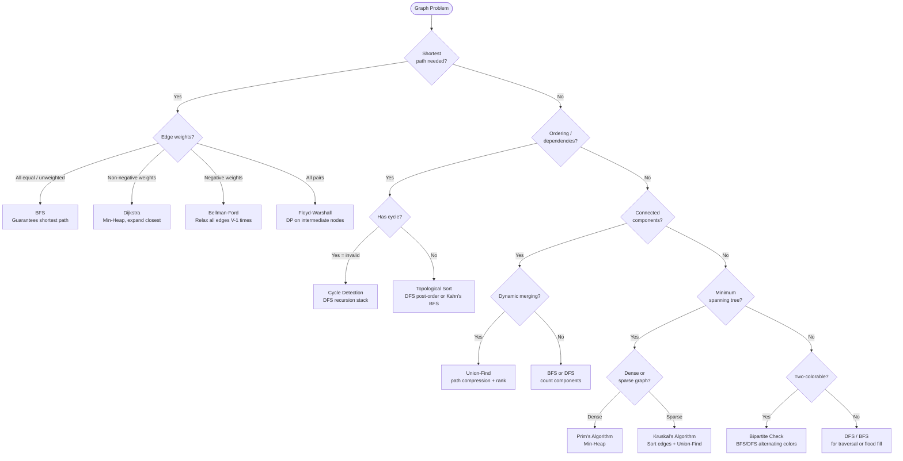

## What is a Graph?

**Analogy:** A map of cities connected by roads. Cities are nodes (vertices), roads are edges. Some roads are one-way (directed), some have tolls (weighted).

**Types:**
- **Undirected** — edges go both ways (friendship)
- **Directed (Digraph)** — edges have direction (Twitter follow)
- **Weighted** — edges have costs (road distances)
- **DAG** — Directed Acyclic Graph (no cycles, like task dependencies)

**Representations:**
- **Adjacency List** — `graph[u] = [v1, v2, ...]` — space efficient, preferred
- **Adjacency Matrix** — `matrix[u][v] = 1` — fast edge lookup, expensive space

---

## Pattern 1: BFS (Breadth-First Search)

**The idea:** Explore level by level using a queue. Guarantees shortest path in unweighted graphs.

**Analogy:** Ripples in a pond. Drop a stone — ripples spread outward one ring at a time.

```viz
{
  "type": "graph",
  "title": "BFS — Level by Level Exploration",
  "description": "Graph: 0→[1,2], 1→[3,4], 2→[5]. BFS from node 0.",
  "nodes": [
    {"id": 0, "label": "0", "x": 50, "y": 15},
    {"id": 1, "label": "1", "x": 25, "y": 50},
    {"id": 2, "label": "2", "x": 75, "y": 50},
    {"id": 3, "label": "3", "x": 10, "y": 85},
    {"id": 4, "label": "4", "x": 40, "y": 85},
    {"id": 5, "label": "5", "x": 90, "y": 85}
  ],
  "edges": [
    {"from": 0, "to": 1}, {"from": 0, "to": 2},
    {"from": 1, "to": 3}, {"from": 1, "to": 4},
    {"from": 2, "to": 5}
  ],
  "speed": 900,
  "steps": [
    {"active": 0, "label": "Start: queue=[0], visited={0}."},
    {"highlight": [0,1,2], "highlightEdges": [[0,1],[0,2]], "label": "Process 0. Neighbors 1,2 added. Level 1 discovered."},
    {"highlight": [1,3,4], "highlightEdges": [[1,3],[1,4]], "label": "Process 1. Neighbors 3,4 added."},
    {"highlight": [2,5], "highlightEdges": [[2,5]], "label": "Process 2. Neighbor 5 added."},
    {"highlight": [3,4,5], "label": "Process 3,4,5 — no new neighbors.", "note": "BFS order: 0→1→2→3→4→5. Shortest path guaranteed ✓"}
  ]
}
```

**When to use:**
- Shortest path in unweighted graph
- Level-order traversal
- Rotten oranges, 0/1 matrix, word ladder

---

## Pattern 2: DFS (Depth-First Search)

**The idea:** Go as deep as possible before backtracking. Uses recursion or an explicit stack.

**Analogy:** Exploring a cave system. You pick one tunnel and go as far as you can. When you hit a dead end, you backtrack and try the next tunnel.

```viz
{
  "type": "graph",
  "title": "DFS — Depth-First Exploration",
  "description": "Graph: 0→[1,2], 1→[3], 2→[4]. DFS from 0. Goes deep before backtracking.",
  "nodes": [
    {"id": 0, "label": "0", "x": 50, "y": 15},
    {"id": 1, "label": "1", "x": 25, "y": 50},
    {"id": 2, "label": "2", "x": 75, "y": 50},
    {"id": 3, "label": "3", "x": 25, "y": 85},
    {"id": 4, "label": "4", "x": 75, "y": 85}
  ],
  "edges": [
    {"from": 0, "to": 1}, {"from": 0, "to": 2},
    {"from": 1, "to": 3}, {"from": 2, "to": 4}
  ],
  "speed": 900,
  "steps": [
    {"active": 0, "label": "Visit 0. Go deep: visit 1."},
    {"active": 1, "highlight": [0], "highlightEdges": [[0,1]], "label": "Visit 1. Go deep: visit 3."},
    {"active": 3, "highlight": [0,1], "highlightEdges": [[0,1],[1,3]], "label": "Visit 3. Dead end. Backtrack."},
    {"active": 2, "highlight": [0,1,3], "highlightEdges": [[0,2]], "label": "Back at 0. Visit 2."},
    {"active": 4, "highlight": [0,1,2,3], "highlightEdges": [[2,4]], "label": "Visit 4.", "note": "DFS order: 0→1→3→2→4 ✓. Goes deep first, unlike BFS."}
  ]
}
```

**When to use:**
- Connected components, Cycle detection
- Topological sort, Flood fill, Path finding

---

## Pattern 3: Cycle Detection

**Undirected graph:** During DFS, if you visit a neighbor that's already visited and it's not your parent → cycle.

**Directed graph:** Track nodes in the current DFS path (recursion stack). If you visit a node already in the stack → cycle.

```viz
{
  "type": "graph",
  "title": "Cycle Detection — Directed Graph (Recursion Stack)",
  "description": "Graph: 0→1→2→0 (cycle!). Track visited + inStack. If we reach a node already inStack → cycle.",
  "nodes": [
    {"id": 0, "label": "0", "x": 20, "y": 50},
    {"id": 1, "label": "1", "x": 50, "y": 15},
    {"id": 2, "label": "2", "x": 80, "y": 50}
  ],
  "edges": [
    {"from": 0, "to": 1}, {"from": 1, "to": 2}, {"from": 2, "to": 0}
  ],
  "speed": 1000,
  "steps": [
    {"active": 0, "label": "DFS from 0. visited={0}, inStack={0}"},
    {"active": 1, "highlight": [0], "highlightEdges": [[0,1]], "label": "Visit 1. inStack={0,1}"},
    {"active": 2, "highlight": [0,1], "highlightEdges": [[1,2]], "label": "Visit 2. inStack={0,1,2}"},
    {"highlight": [0,1,2], "highlightEdges": [[2,0]], "label": "2's neighbor=0. 0 in inStack → CYCLE DETECTED!", "note": "Cycle: 0→1→2→0 ✓. Key: inStack tracks current DFS path, not just visited."}
  ]
}
```

---

## Pattern 4: Topological Sort

**The idea:** Order tasks so that all dependencies come before the task itself. Only works on DAGs.

```viz
{
  "type": "graph",
  "title": "Kahn's Algorithm — Topological Sort (BFS)",
  "description": "Tasks: 0→2, 1→2, 2→3. In-degree = number of prerequisites. Start with in-degree 0.",
  "nodes": [
    {"id": 0, "label": "0", "x": 15, "y": 30},
    {"id": 1, "label": "1", "x": 15, "y": 70},
    {"id": 2, "label": "2", "x": 50, "y": 50},
    {"id": 3, "label": "3", "x": 85, "y": 50}
  ],
  "edges": [
    {"from": 0, "to": 2}, {"from": 1, "to": 2}, {"from": 2, "to": 3}
  ],
  "speed": 1000,
  "steps": [
    {"highlight": [0,1], "label": "In-degrees: 0→0, 1→0, 2→2, 3→1. Queue=[0,1] (in-degree 0)"},
    {"active": 0, "highlightEdges": [[0,2]], "label": "Process 0 → reduce in-degree of 2: now 1."},
    {"active": 1, "highlightEdges": [[1,2]], "label": "Process 1 → reduce in-degree of 2: now 0 → add 2."},
    {"active": 2, "highlightEdges": [[2,3]], "label": "Process 2 → reduce in-degree of 3: now 0 → add 3."},
    {"active": 3, "label": "Process 3. Queue empty.", "note": "Topological order: [0, 1, 2, 3] ✓ All dependencies satisfied."}
  ]
}
```

**Two approaches:**
- **DFS-based:** Post-order DFS, push to stack when done. Reverse the stack.
- **Kahn's Algorithm (BFS):** Start with nodes that have no incoming edges (in-degree 0).

**When to use:**
- Course schedule (detect cycle + order)
- Build systems, task dependencies
- Alien dictionary

---

## Pattern 5: Shortest Path

**Unweighted graph → BFS** (each edge has weight 1)

**Weighted graph with non-negative weights → Dijkstra's**

```viz
{
  "type": "graph",
  "title": "Bellman-Ford — Handles Negative Weights",
  "description": "Graph: 0→1(w=4), 0→2(w=5), 1→3(w=3), 2→1(w=-6). Relax all edges V-1=3 times.",
  "nodes": [
    {"id": 0, "label": "0", "x": 10, "y": 50},
    {"id": 1, "label": "1", "x": 50, "y": 20},
    {"id": 2, "label": "2", "x": 50, "y": 80},
    {"id": 3, "label": "3", "x": 90, "y": 50}
  ],
  "edges": [
    {"from": 0, "to": 1, "weight": 4},
    {"from": 0, "to": 2, "weight": 5},
    {"from": 1, "to": 3, "weight": 3},
    {"from": 2, "to": 1, "weight": -6}
  ],
  "speed": 1000,
  "steps": [
    {"highlight": [0], "nodeLabels": {"0":"0","1":"∞","2":"∞","3":"∞"}, "label": "Init: dist=[0,∞,∞,∞]. Start from node 0."},
    {"highlight": [0,1,2], "highlightEdges": [[0,1],[0,2]], "nodeLabels": {"0":"0","1":"4","2":"5","3":"∞"}, "label": "Pass 1: Relax 0→1: dist[1]=4. Relax 0→2: dist[2]=5."},
    {"highlight": [1,2,3], "highlightEdges": [[1,3],[2,1]], "nodeLabels": {"0":"0","1":"-1","2":"5","3":"7"}, "label": "Pass 1 cont: Relax 1→3: dist[3]=7. Relax 2→1: dist[1]=min(4,-1)=-1."},
    {"highlight": [0,1,2,3], "nodeLabels": {"0":"0","1":"-1","2":"5","3":"2"}, "label": "Pass 2: Relax 1→3: dist[3]=min(7,2)=2.", "note": "Final: dist=[0,-1,5,2] ✓. Negative edge 2→1(-6) correctly handled."}
  ]
}
```

**Weighted graph with negative weights → Bellman-Ford** — Relax all edges V-1 times.

**All pairs shortest path → Floyd-Warshall** — `dist[i][j] = min(dist[i][j], dist[i][k] + dist[k][j])` for all k.

---

## Pattern 6: Minimum Spanning Tree (MST)

**The idea:** Connect all nodes with minimum total edge weight, no cycles.

**Analogy:** Laying cables to connect all cities with minimum total cable length.

```viz
{
  "type": "graph",
  "title": "Kruskal's MST — Sort edges, add if no cycle",
  "description": "Edges sorted by weight: (1,2,w=1),(0,3,w=2),(0,1,w=3),(2,3,w=4). Add if it doesn't form a cycle.",
  "nodes": [
    {"id": 0, "label": "0", "x": 20, "y": 20},
    {"id": 1, "label": "1", "x": 80, "y": 20},
    {"id": 2, "label": "2", "x": 80, "y": 80},
    {"id": 3, "label": "3", "x": 20, "y": 80}
  ],
  "edges": [
    {"from": 0, "to": 1, "directed": false, "weight": 3},
    {"from": 1, "to": 2, "directed": false, "weight": 1},
    {"from": 2, "to": 3, "directed": false, "weight": 4},
    {"from": 0, "to": 3, "directed": false, "weight": 2}
  ],
  "speed": 1000,
  "steps": [
    {"highlightEdges": [[1,2]], "label": "Edge(1,2,w=1): nodes 1,2 in different components → ADD. MST cost=1"},
    {"highlightEdges": [[1,2],[0,3]], "label": "Edge(0,3,w=2): nodes 0,3 in different components → ADD. MST cost=3"},
    {"highlightEdges": [[1,2],[0,3],[0,1]], "label": "Edge(0,1,w=3): nodes 0,1 in different components → ADD. MST cost=6"},
    {"highlight": [0,1,2,3], "label": "Edge(2,3,w=4): nodes 2,3 already connected → SKIP (would form cycle)", "note": "MST = 3 edges, total weight=6 ✓. Use Union-Find to check cycle in O(α(n))."}
  ]
}
```

**Prim's Algorithm:** Greedy. Start from any node, always add the cheapest edge to a new node. Uses a min-heap.

**Kruskal's Algorithm:** Sort all edges by weight. Add edge if it doesn't create a cycle (use Union-Find).

---

## Pattern 7: Disjoint Set Union (Union-Find)

**The idea:** Track which nodes are in the same connected component. Supports union and find in near O(1) with path compression + union by rank.

**Analogy:** Social groups. Initially everyone is their own group. When two people become friends, their groups merge.

```viz
{
  "type": "graph",
  "title": "Union-Find — Track connected components",
  "description": "5 nodes [0,1,2,3,4]. Operations: union(0,1), union(2,3), union(1,2). Find if 0 and 3 are connected.",
  "nodes": [
    {"id": 0, "label": "0", "x": 10, "y": 50},
    {"id": 1, "label": "1", "x": 30, "y": 50},
    {"id": 2, "label": "2", "x": 50, "y": 50},
    {"id": 3, "label": "3", "x": 70, "y": 50},
    {"id": 4, "label": "4", "x": 90, "y": 50}
  ],
  "edges": [],
  "speed": 1000,
  "steps": [
    {"highlight": [0,1,2,3,4], "nodeLabels": {"0":"0","1":"1","2":"2","3":"3","4":"4"}, "label": "Init: parent=[0,1,2,3,4]. Each node is its own root."},
    {"highlight": [0,1], "highlightEdges": [[0,1]], "label": "union(0,1): root(0)=0, root(1)=1. Merge → parent[1]=0. Components: {0,1},{2},{3},{4}"},
    {"highlight": [2,3], "highlightEdges": [[2,3]], "label": "union(2,3): root(2)=2, root(3)=3. Merge → parent[3]=2. Components: {0,1},{2,3},{4}"},
    {"highlight": [0,1,2,3], "highlightEdges": [[0,1],[2,3],[1,2]], "label": "union(1,2): root(1)=0, root(2)=2. Merge → parent[2]=0. Components: {0,1,2,3},{4}"},
    {"highlight": [0,3], "label": "find(0)==find(3)? root(0)=0, root(3)=0. YES → connected!", "note": "0 and 3 are in same component ✓. Path compression makes future finds O(1)."}
  ]
}
```

**When to use:**
- Detect cycle in undirected graph
- Number of connected components
- Kruskal's MST, Accounts merge

---

## Pattern 8: Bipartite Check

**The idea:** Try to 2-color the graph. If you can color it with 2 colors such that no two adjacent nodes share a color → bipartite.

```viz
{
  "type": "graph",
  "title": "Bipartite Check — 2-coloring with BFS",
  "description": "Graph: 0-1, 1-2, 2-3, 3-0 (even cycle = bipartite). Color alternates: 0=RED, neighbors=BLUE.",
  "nodes": [
    {"id": 0, "label": "0", "x": 20, "y": 20},
    {"id": 1, "label": "1", "x": 80, "y": 20},
    {"id": 2, "label": "2", "x": 80, "y": 80},
    {"id": 3, "label": "3", "x": 20, "y": 80}
  ],
  "edges": [
    {"from": 0, "to": 1, "directed": false},
    {"from": 1, "to": 2, "directed": false},
    {"from": 2, "to": 3, "directed": false},
    {"from": 3, "to": 0, "directed": false}
  ],
  "speed": 1000,
  "steps": [
    {"active": 0, "nodeLabels": {"0":"RED"}, "label": "Color node 0 = RED. Queue=[0]"},
    {"highlight": [1,3], "nodeLabels": {"0":"RED","1":"BLUE","3":"BLUE"}, "label": "Process 0: color neighbors 1,3 = BLUE. Queue=[1,3]"},
    {"highlight": [2], "nodeLabels": {"0":"RED","1":"BLUE","2":"RED","3":"BLUE"}, "label": "Process 1: color neighbor 2 = RED. Queue=[3,2]"},
    {"highlight": [0,1,2,3], "nodeLabels": {"0":"RED","1":"BLUE","2":"RED","3":"BLUE"}, "label": "Process 3: neighbor 2 already RED ≠ BLUE ✓. No conflict.", "note": "All edges connect RED↔BLUE. Graph IS bipartite ✓. Odd cycle would cause conflict."}
  ]
}
```

**When to use:**
- Is graph bipartite?
- Can we divide into two groups with no internal conflicts?

---

## Pattern 9: Strongly Connected Components (SCC)

**Kosaraju's Algorithm:**
1. DFS on original graph, push nodes to stack in finish order
2. Transpose the graph (reverse all edges)
3. DFS on transposed graph in stack order — each DFS tree is an SCC

```viz
{
  "type": "graph",
  "title": "Kosaraju's SCC — Two-pass DFS",
  "description": "Graph: 0→1→2→0 (SCC1), 2→3→4 (SCC2). Pass1: finish order. Pass2: DFS on reversed graph.",
  "nodes": [
    {"id": 0, "label": "0", "x": 15, "y": 50},
    {"id": 1, "label": "1", "x": 40, "y": 20},
    {"id": 2, "label": "2", "x": 65, "y": 50},
    {"id": 3, "label": "3", "x": 80, "y": 20},
    {"id": 4, "label": "4", "x": 95, "y": 50}
  ],
  "edges": [
    {"from": 0, "to": 1}, {"from": 1, "to": 2},
    {"from": 2, "to": 0}, {"from": 2, "to": 3}, {"from": 3, "to": 4}
  ],
  "speed": 1000,
  "steps": [
    {"highlight": [0,1,2], "label": "Pass 1 DFS: finish order = [3,4,2,1,0] (last finished = first in stack)"},
    {"highlight": [0,1,2,3,4], "label": "Reverse all edges: 1→0, 2→1, 0→2, 3→2, 4→3"},
    {"highlight": [0,1,2], "label": "Pass 2: DFS from stack top=0 on reversed graph → visits {0,1,2} → SCC1"},
    {"highlight": [3,4], "label": "DFS from 3 → visits {3,4} → SCC2", "note": "SCCs: {0,1,2} and {3,4} ✓. Each SCC = group where every node can reach every other."}
  ]
}
```

**When to use:** Find groups where every node can reach every other node.

---

## Quick Reference

| Situation | Pattern |
|-----------|---------|
| Shortest path, unweighted | BFS |
| Connected components, paths | DFS |
| Shortest path, weighted (non-neg) | Dijkstra |
| Shortest path, negative weights | Bellman-Ford |
| All pairs shortest path | Floyd-Warshall |
| Task ordering, dependencies | Topological Sort |
| Minimum connection cost | Prim's / Kruskal's MST |
| Group membership, cycle detection | Union-Find |
| Two-team division | Bipartite Check |
| Mutual reachability groups | Kosaraju's SCC |

---

## Decision Flowchart


