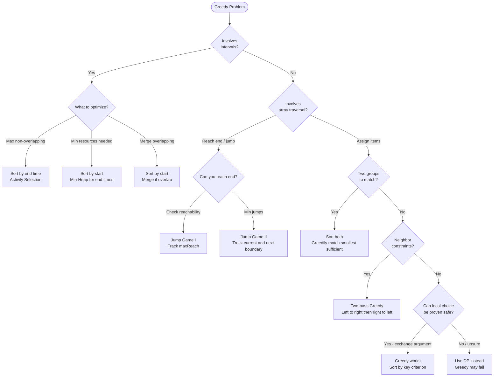

## What is Greedy?

**Analogy:** You're at a buffet and can only carry one plate. You always pick the best-looking dish available right now, without thinking about what comes next. That's greedy — make the locally optimal choice at each step and hope it leads to a globally optimal solution.

**When greedy works:** When a locally optimal choice never needs to be reconsidered. The problem has the **greedy choice property**.

**When greedy fails:** When a local choice blocks a better global solution. Use DP instead.

**The key question:** "Can I prove that always picking the best option now leads to the best overall result?"

---

## Pattern 1: Interval Scheduling / Sorting by Endpoint

**The idea:** Sort intervals by end time. Always pick the interval that ends earliest — it leaves the most room for future intervals.

**Analogy:** You're booking meeting rooms. To fit the most meetings, always schedule the one that ends soonest.

```viz
{
  "type": "table",
  "title": "Activity Selection — Max Non-Overlapping Intervals",
  "description": "Intervals sorted by end time. Greedily pick each interval that starts after the last picked one ends.",
  "speed": 1000,
  "cols": ["", "start", "end", "status"],
  "rows": ["[1,3]", "[2,4]", "[3,5]", "[4,6]", "[5,7]"],
  "cells": [
    [1, 3, "?"],
    [2, 4, "?"],
    [3, 5, "?"],
    [4, 6, "?"],
    [5, 7, "?"]
  ],
  "steps": [
    {
      "cells": [[1,3,"?"],[2,4,"?"],[3,5,"?"],[4,6,"?"],[5,7,"?"]],
      "label": "Sorted by end time. lastEnd=-∞, count=0."
    },
    {
      "cells": [[1,3,"✓ PICK"],[2,4,"?"],[3,5,"?"],[4,6,"?"],[5,7,"?"]],
      "active": [0,2], "highlight": [[0,0],[0,1]],
      "label": "start=1 ≥ lastEnd=-∞ → PICK [1,3]. lastEnd=3. count=1"
    },
    {
      "cells": [[1,3,"✓ PICK"],[2,4,"✗ SKIP"],[3,5,"?"],[4,6,"?"],[5,7,"?"]],
      "active": [1,2], "highlight": [[1,0],[1,1]],
      "label": "start=2 < lastEnd=3 → SKIP [2,4] (overlaps)"
    },
    {
      "cells": [[1,3,"✓ PICK"],[2,4,"✗ SKIP"],[3,5,"✓ PICK"],[4,6,"?"],[5,7,"?"]],
      "active": [2,2], "highlight": [[2,0],[2,1]],
      "label": "start=3 ≥ lastEnd=3 → PICK [3,5]. lastEnd=5. count=2"
    },
    {
      "cells": [[1,3,"✓ PICK"],[2,4,"✗ SKIP"],[3,5,"✓ PICK"],[4,6,"✗ SKIP"],[5,7,"?"]],
      "active": [3,2], "highlight": [[3,0],[3,1]],
      "label": "start=4 < lastEnd=5 → SKIP [4,6] (overlaps)"
    },
    {
      "cells": [[1,3,"✓ PICK"],[2,4,"✗ SKIP"],[3,5,"✓ PICK"],[4,6,"✗ SKIP"],[5,7,"✓ PICK"]],
      "active": [4,2], "highlight": [[4,0],[4,1]],
      "label": "start=5 ≥ lastEnd=5 → PICK [5,7]. lastEnd=7. count=3",
      "note": "Max non-overlapping = 3 intervals ✓. Key: always pick earliest-ending available interval."
    }
  ]
}
```

**When to use:**
- Maximum number of non-overlapping intervals (Activity Selection)
- N meetings in one room
- Minimum platforms needed

> **In an interview:** trigger words are *"maximum non-overlapping / minimum rooms / schedule the most"*. State your sort key (usually end time) and why before coding.
> **Remember:** sort by end time, always take the earliest-ending compatible interval.

---

## Pattern 2: Greedy with Sorting

**The idea:** Sort by some criterion, then greedily assign/match.

**Analogy:** Assigning cookies to children. Sort both children (by greed) and cookies (by size). Give the smallest sufficient cookie to the least greedy child first.

```viz
{
  "title": "Assign Cookies — Sort both, match greedily",
  "description": "children greed=[1,2,3], cookie sizes=[1,1,2]. Sort both. Give smallest sufficient cookie.",
  "array": [1, 1, 2],
  "speed": 1000,
  "steps": [
    { "pointers": { "i": 0, "j": 0 }, "highlight": [0], "label": "Child greed=1, cookie=1. 1>=1 → ASSIGN. child++ cookie++. satisfied=1" },
    { "pointers": { "i": 1, "j": 1 }, "highlight": [1], "label": "Child greed=2, cookie=1. 1<2 → too small, skip cookie. cookie++" },
    { "pointers": { "i": 1, "j": 2 }, "highlight": [2], "label": "Child greed=2, cookie=2. 2>=2 → ASSIGN. satisfied=2" },
    { "pointers": { "i": 2 }, "label": "Child greed=3, no more cookies.", "note": "Max satisfied children = 2 ✓. Greedy: never waste a big cookie on a less greedy child." }
  ]
}
```

**When to use:**
- Assign cookies
- Fractional knapsack (sort by value/weight ratio)
- Minimum coins (sort denominations descending)

> **In an interview:** trigger words are *"match / assign / pair up to maximize (or minimize)"*. Justify the sort key with an exchange argument if pressed.
> **Remember:** sort both sides, then match greedily — smallest that fits, biggest ratio first, etc.

---

## Pattern 3: Jump Game (Reach-Based Greedy)

**The idea:** Track the farthest index you can reach. At each step, update the max reach. If current index exceeds max reach → can't proceed.

```viz
{
  "title": "Jump Game II — Minimum Jumps",
  "description": "nums = [2, 3, 1, 1, 4]. Each value = max jump length. Find min jumps to reach end.",
  "array": [2, 3, 1, 1, 4],
  "speed": 1000,
  "steps": [
    { "pointers": { "i": 0 }, "highlight": [0], "label": "At idx 0, val=2. Can reach up to idx 2. jumps=0, curEnd=0, farthest=2" },
    { "pointers": { "i": 1 }, "highlight": [0,1,2], "label": "Scan [0..curEnd=0]. i=0 → farthest=max(2, 0+2)=2. Reached curEnd → jump! jumps=1, curEnd=2" },
    { "pointers": { "i": 2 }, "highlight": [1,2,3,4], "label": "Scan [1..curEnd=2]. i=1,val=3 → farthest=4. i=2,val=1 → farthest=4. Reached curEnd → jump! jumps=2, curEnd=4", "note": "Reached end (idx 4) with 2 jumps ✓" }
  ]
}
```

**Jump Game I:** Can you reach the end? Track `maxReach`. If `i > maxReach` → false.

**Jump Game II:** Minimum jumps. Track current jump boundary and next jump boundary. When you cross the boundary, increment jumps.

> **In an interview:** trigger words are *"can you reach the end / minimum jumps / minimum taps"* on an array of reach values. Resist the DP urge — the greedy reach is O(n).
> **Remember:** carry the farthest reachable index; bump the jump count when you hit the current boundary.

---

## Pattern 4: Greedy on Strings / Parentheses

**The idea:** Track counts of open/close brackets. Make greedy decisions about when to add/remove.

```viz
{
  "title": "Valid Parenthesis String — Greedy with wildcard '*'",
  "description": "s='(*))'. '*' can be '(', ')' or ''. Track min and max possible open brackets.",
  "array": ["(", "*", ")", ")"],
  "speed": 1000,
  "steps": [
    { "pointers": { "i": 0 }, "highlight": [0], "label": "'(' → min=1, max=1. (both increase)" },
    { "pointers": { "i": 1 }, "highlight": [1], "label": "'*' → min=max(0,1-1)=0, max=1+1=2. (* can be empty or '(' or ')')" },
    { "pointers": { "i": 2 }, "highlight": [2], "label": "')' → min=max(0,0-1)=0, max=2-1=1. (both decrease)" },
    { "pointers": { "i": 3 }, "highlight": [3], "label": "')' → min=max(0,0-1)=0, max=1-1=0.", "note": "max>=0 throughout and min=0 at end → VALID ✓. If max<0 at any point → invalid." }
  ]
}
```

**When to use:**
- Valid parenthesis string (with wildcards)
- Minimum bracket reversals
- Remove k digits (monotonic stack + greedy)

> **In an interview:** trigger words are *"valid parentheses with wildcards / minimum insertions or removals to balance"*. Track a running open count (or a min/max range when '*' is involved).
> **Remember:** balance greedily as you scan; never let the close count exceed the open count.

---

## Pattern 5: Candy / Two-Pass Greedy

**The idea:** Make one left-to-right pass, then one right-to-left pass. Combine results.

**Analogy:** Distributing candy to children in a line based on ratings. First pass: give more than left neighbor if rating is higher. Second pass: give more than right neighbor if rating is higher. Take the max of both passes.

```viz
{
  "title": "Candy Distribution — Two-Pass Greedy",
  "description": "ratings=[1,0,2]. Each child gets ≥1 candy. Higher rating than neighbor → more candy.",
  "array": [1, 0, 2],
  "speed": 1000,
  "steps": [
    { "pointers": {}, "highlight": [0,1,2], "label": "Init: candies=[1,1,1]. Everyone gets at least 1." },
    { "pointers": { "i": 1 }, "highlight": [0,1], "label": "Left→Right pass: ratings[1]=0 < ratings[0]=1 → no change. candies=[1,1,1]" },
    { "pointers": { "i": 2 }, "highlight": [1,2], "label": "Left→Right: ratings[2]=2 > ratings[1]=0 → candies[2]=candies[1]+1=2. candies=[1,1,2]" },
    { "pointers": { "i": 1 }, "highlight": [0,1], "label": "Right→Left pass: ratings[0]=1 > ratings[1]=0 → candies[0]=max(1,candies[1]+1)=2. candies=[2,1,2]" },
    { "pointers": {}, "highlight": [0,1,2], "label": "Final: candies=[2,1,2]. Total=5.", "note": "Total = 5 ✓. Two passes ensure both left and right neighbor constraints satisfied." }
  ]
}
```

**When to use:**
- Candy distribution
- Problems where each element depends on both neighbors

> **In an interview:** the tell is a constraint against **both** neighbors at once — a single pass can't satisfy both. Propose the two-pass fix explicitly.
> **Remember:** sweep left-to-right for the left rule, right-to-left for the right, take the max per element.

---

## Greedy vs DP

| Use Greedy | Use DP |
|------------|--------|
| Local choice is always safe | Local choice might need revision |
| Provably optimal (exchange argument) | Overlapping subproblems |
| Faster (O(n log n) typically) | Slower but correct |
| Fractional knapsack | 0/1 Knapsack |
| Activity selection | Weighted job scheduling |

**Exchange argument:** To prove greedy is correct, show that swapping any greedy choice with a non-greedy one never improves the result.

---

## Quick Reference

| Situation | Pattern |
|-----------|---------|
| Max non-overlapping intervals | Sort by end time |
| Min platforms / resources | Sort + min-heap |
| Assign items to minimize waste | Sort both, match greedily |
| Can you reach the end? | Jump Game (max reach) |
| Min jumps to reach end | Jump Game II (boundary tracking) |
| Distribute with neighbor constraints | Two-pass greedy |

---

## Decision Flowchart



---

## Problem → Pattern Cross-References

The problems list now mirrors the 5 patterns above. The old generic "Greedy" section mixed assign/match, jump, string, and two-pass problems. Now split. Notes:

| Problem | Home pattern | Why (and what else it touches) |
|---------|--------------|-------------------------------|
| Job Sequencing / Min Platforms | Interval Scheduling | Sort by deadline/time, greedily place (min-heap for platforms) |
| Non-overlapping Intervals | Interval Scheduling | Activity-selection: sort by end, count keepers |
| Fractional Knapsack | Greedy with Sorting | Sort by value/weight ratio (contrast 0/1 Knapsack → DP) |
| Lemonade Change | Greedy with Sorting | Greedily give the largest bills first |
| Valid Parenthesis String | Greedy on Strings | Track min/max possible open count |

**Cross-topic home:**

- **Merge Intervals** → home is `array.md` (Sorting-Based). It's the "sort by *start*, merge overlaps" pattern taught in the array concept viz. The greedy topic here is about scheduling by *end time* (activity selection), a different decision rule — so Merge Intervals stays in arrays.

> **The proof obligation:** greedy is only correct with an exchange argument (swapping a greedy choice for any other never improves the result). When you can't make that argument, it's a DP problem — see the Greedy vs DP table above.
