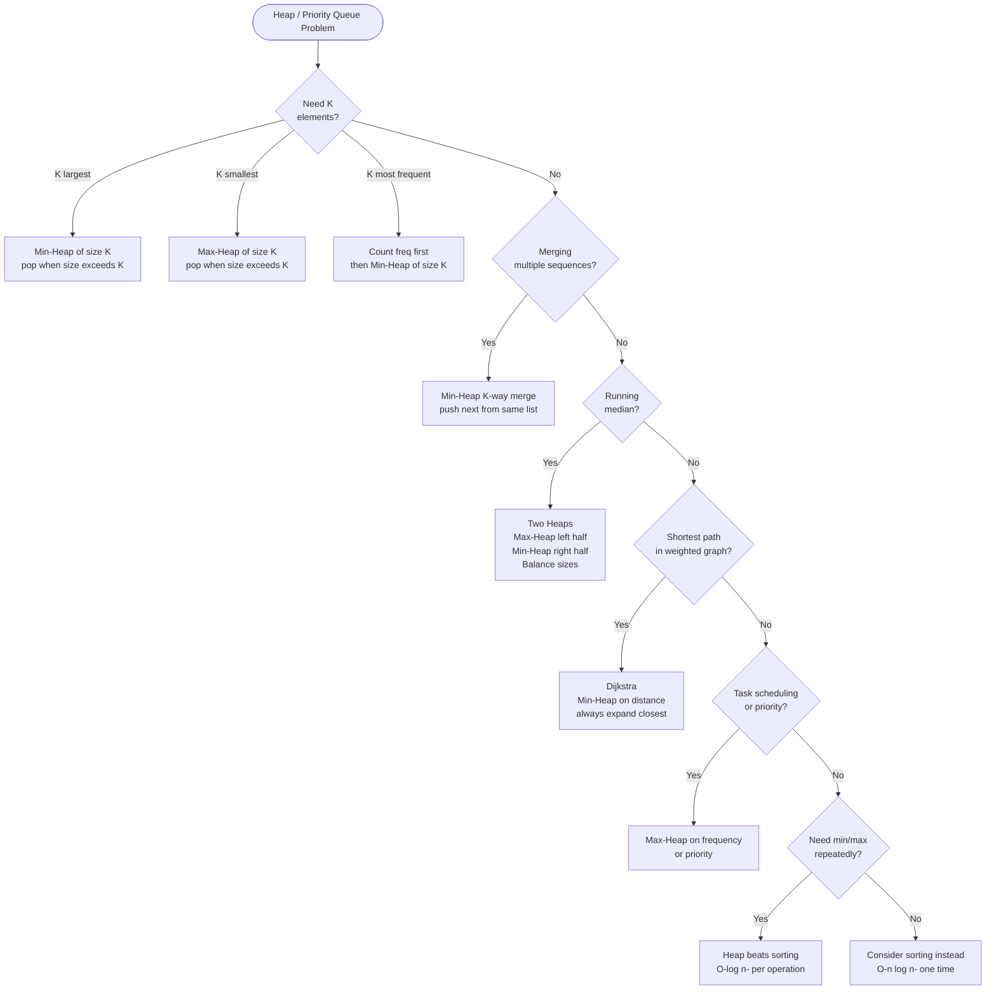

## What is a Heap?

A heap is a **priority queue** — a structure that always gives you the smallest (min-heap) or largest (max-heap) element in O(1), and inserting/removing takes O(log n).

**Analogy:** An emergency room triage system. Patients don't get seen in arrival order — the most critical patient always goes next. That's a min-heap (lowest priority number = most urgent).

**Key property:** The root is always the min (or max). It's a complete binary tree stored as an array.

- Parent of index `i` → `(i-1) / 2`
- Left child → `2*i + 1`
- Right child → `2*i + 2`

---

## Pattern 1: Top K Elements

**The idea:** To find K largest elements, use a **min-heap of size K**. When the heap exceeds K, pop the smallest. What remains are the K largest.

**Analogy:** You're a talent show judge keeping only the top 3 acts. Every time a new act performs, if they're better than your worst kept act, swap them in. Your "keep list" is always size 3.

**Why min-heap for K largest?** Because you want to quickly identify and remove the smallest of your "kept" elements.

**When to use:**
- K largest/smallest elements
- K most frequent elements
- K closest points to origin

**Template:**
```
heap = []
for num in nums:
    heappush(heap, num)
    if len(heap) > k:
        heappop(heap)
return heap  # contains K largest
```

---

## Pattern 2: Merge K Sorted Lists / Arrays

**The idea:** Use a min-heap to always pick the smallest current element across all K lists.

**Analogy:** K sorted queues at a supermarket. You always serve the person with the fewest items across all queues. A min-heap tells you which queue has the next smallest item.

**When to use:**
- Merge K sorted lists
- K-way merge
- Find smallest range covering K lists

---

## Pattern 3: Running Median (Two Heaps)

**The idea:** Maintain two heaps — a max-heap for the lower half and a min-heap for the upper half. The median is always at the tops of these heaps.

**Analogy:** Imagine splitting a sorted list in half. The left half's maximum and the right half's minimum are always adjacent to the median. Two heaps give you O(log n) access to both.

**Balance rule:** The two heaps differ in size by at most 1.

**When to use:**
- Find median from a data stream
- Sliding window median

---

## Pattern 4: Scheduling / Task Problems

**The idea:** Use a max-heap to always process the highest-priority or most-frequent task next.

**When to use:**
- Task scheduler (minimize idle time)
- Connect ropes with minimum cost
- Reorganize string

---

## Pattern 5: Dijkstra's Shortest Path

**The idea:** Use a min-heap to always expand the closest unvisited node.

**Analogy:** You're exploring a city. You always take the shortest road available next. A min-heap tells you which road that is.

**When to use:**
- Shortest path in weighted graph
- Network delay time
- Path with minimum effort

---

## Heap vs Sorting

| Need | Use |
|------|-----|
| All K elements at once | Sort — O(n log n) |
| K elements from a stream | Heap — O(n log k) |
| Repeatedly need min/max | Heap — O(log n) per op |

---

## Quick "When to Use What"

| Situation | Pattern |
|-----------|---------|
| K largest/smallest/frequent | Min or Max Heap of size K |
| Merge K sorted sequences | Min-Heap (K-way merge) |
| Running median | Two Heaps |
| Always process highest priority | Max-Heap |
| Shortest path in weighted graph | Min-Heap (Dijkstra) |

---

## Decision Flowchart


