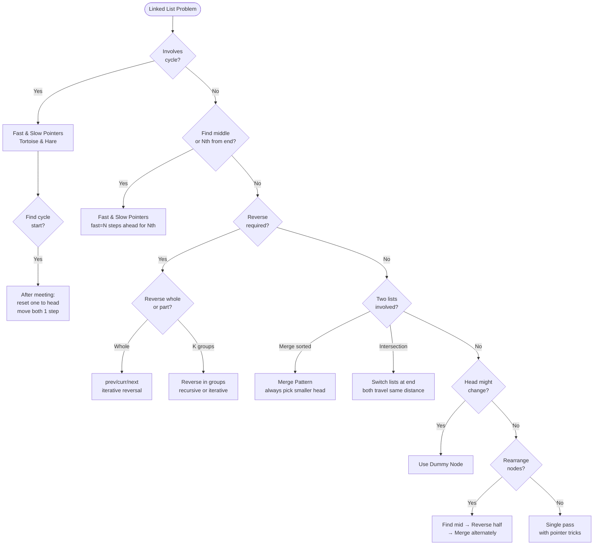

## What is a Linked List?

Think of a **treasure hunt**. Each clue (node) tells you where the next clue is. You can't jump to clue #5 directly — you must follow the chain from the start. That's a linked list: sequential access, but cheap insertion/deletion anywhere.

**Array vs Linked List:**
- Array: random access O(1), insert/delete O(n)
- Linked List: access O(n), insert/delete O(1) if you have the pointer

---

## Pattern 1: Two Pointer (Fast & Slow — Tortoise and Hare)

**The idea:** Use two pointers moving at different speeds. The fast pointer moves 2 steps, slow moves 1.

**Analogy:** Two runners on a circular track. If there's a loop, the fast runner will eventually lap the slow one — they'll meet. If there's no loop, the fast runner reaches the end first.

```viz
{
  "type": "linkedlist",
  "title": "Fast & Slow — Find Middle of Linked List",
  "description": "Nodes: 1→2→3→4→5. Slow moves 1 step, Fast moves 2. When Fast hits end, Slow is at middle.",
  "nodes": [1, 2, 3, 4, 5],
  "speed": 900,
  "steps": [
    { "pointers": { "S": 0, "F": 0 }, "label": "Start: both at head" },
    { "pointers": { "S": 1, "F": 2 }, "label": "S→node2, F→node3" },
    { "pointers": { "S": 2, "F": 4 }, "highlight": [2], "label": "S→node3, F→node5 (end)", "note": "F at end → S is at middle = node 3 ✓" }
  ]
}
```

```viz
{
  "type": "linkedlist",
  "title": "Fast & Slow — Find Nth Node from End (N=2)",
  "description": "Nodes: 1→2→3→4→5. Move Fast N steps ahead first, then move both together.",
  "nodes": [1, 2, 3, 4, 5],
  "speed": 900,
  "steps": [
    { "pointers": { "S": 0, "F": 0 }, "label": "Start: both at head" },
    { "pointers": { "S": 0, "F": 2 }, "highlight": [2], "label": "Move Fast N=2 steps ahead → node 3" },
    { "pointers": { "S": 1, "F": 3 }, "label": "Move both 1 step" },
    { "pointers": { "S": 2, "F": 4 }, "label": "Move both 1 step → S=node3, F=node5 (end)", "note": "F at end → S.next = node4 is 2nd from end ✓" }
  ]
}
```

**When to use:**
- Detect cycle in linked list
- Find start of cycle
- Find middle of linked list
- Find Nth node from end (fast starts N steps ahead)

**Middle of list trick:** When fast reaches end, slow is at the middle.

**Nth from end trick:** Move fast N steps ahead, then move both together. When fast hits null, slow is at the target.

---

## Pattern 2: Reversal

**The idea:** Reverse a linked list by redirecting pointers. Three variables: `prev`, `curr`, `next`.

**Analogy:** You're reversing a one-way street. At each intersection, you flip the sign to point backward, then move forward.

```viz
{
  "type": "linkedlist",
  "title": "Linked List Reversal — prev / curr / next",
  "description": "List: 1→2→3→4→5. At each step: save next, flip curr.next to prev, advance both.",
  "nodes": [1, 2, 3, 4, 5],
  "speed": 1000,
  "steps": [
    { "pointers": { "curr": 0 }, "highlight": [0], "label": "prev=null, curr=1. Flip: 1.next=null" },
    { "pointers": { "curr": 1 }, "highlight": [1], "label": "prev=1, curr=2. Flip: 2.next=1" },
    { "pointers": { "curr": 2 }, "highlight": [2], "label": "prev=2, curr=3. Flip: 3.next=2" },
    { "pointers": { "curr": 3 }, "highlight": [3], "label": "prev=3, curr=4. Flip: 4.next=3" },
    { "pointers": { "curr": 4 }, "highlight": [4], "label": "prev=4, curr=5. Flip: 5.next=4. Done.", "note": "New head=5. List: 5→4→3→2→1 ✓" }
  ]
}
```

**Template:**
```
prev = null
curr = head
while curr:
    next = curr.next
    curr.next = prev
    prev = curr
    curr = next
return prev
```

**When to use:**
- Reverse entire list
- Reverse in groups of K
- Palindrome check (reverse second half, compare)
- Reorder list

---

## Pattern 3: Merge

**The idea:** Merge two sorted lists by comparing heads and linking the smaller one.

**Analogy:** Two sorted queues at a checkout. You always pick the person with fewer items from whichever queue has them next.

```viz
{
  "type": "linkedlist",
  "title": "Merge Two Sorted Lists",
  "description": "List A: [1, 3, 5]  List B: [2, 4, 6]. Always pick the smaller head. Result builds left to right.",
  "nodes": [1, 2, 3, 4, 5, 6],
  "speed": 900,
  "steps": [
    { "highlight": [0], "label": "A=1, B=2. Pick A(1)" },
    { "highlight": [1], "label": "A=3, B=2. Pick B(2)" },
    { "highlight": [2], "label": "A=3, B=4. Pick A(3)" },
    { "highlight": [3], "label": "A=5, B=4. Pick B(4)" },
    { "highlight": [4], "label": "A=5, B=6. Pick A(5)" },
    { "highlight": [5], "label": "B=6. Pick B(6)", "note": "Merged ✓" }
  ]
}
```

**When to use:**
- Merge two sorted lists
- Merge K sorted lists (use a min-heap)
- Sort a linked list (merge sort on LL)

---

## Pattern 4: Dummy Node Trick

**The idea:** Create a fake head node before the real list. This eliminates edge cases when the head itself might be removed or changed.

**Analogy:** Put a placeholder at the front of a queue so you never have to handle "what if the queue is empty" specially.

```viz
{
  "type": "linkedlist",
  "title": "Dummy Node — Remove Nth Node from End (N=2)",
  "description": "List: 1→2→3→4→5. Remove 2nd from end (node 4). Dummy node prevents head-change edge cases.",
  "nodes": [0, 1, 2, 3, 4, 5],
  "speed": 1000,
  "steps": [
    { "pointers": { "i": 0 }, "highlight": [0], "label": "dummy→1→2→3→4→5. fast=slow=dummy" },
    { "pointers": { "i": 0, "F": 2 }, "highlight": [0, 2], "label": "Move fast N=2 steps ahead" },
    { "pointers": { "S": 1, "F": 3 }, "highlight": [1, 3], "label": "Move both 1 step" },
    { "pointers": { "S": 2, "F": 4 }, "highlight": [2, 4], "label": "Move both 1 step" },
    { "pointers": { "S": 3, "F": 5 }, "highlight": [3, 5], "label": "slow=node3, fast=node5 (end)", "note": "slow.next=node4 to remove ✓" }
  ]
}
```

**When to use:**
- Remove Nth node from end
- Delete nodes with a given value
- Any problem where the head might change

---

## Pattern 5: In-place Rearrangement

**The idea:** Rearrange nodes by changing `.next` pointers without creating new nodes.

```viz
{
  "type": "linkedlist",
  "title": "Reorder List — Interleave first and reversed second half",
  "description": "List: 1→2→3→4→5. Steps: find mid, reverse second half, merge alternately.",
  "nodes": [1, 2, 3, 4, 5],
  "speed": 1000,
  "steps": [
    { "pointers": { "S": 2 }, "highlight": [2], "label": "Step 1: Find mid → node3" },
    { "pointers": { "i": 4, "j": 3 }, "highlight": [3, 4], "label": "Step 2: Reverse second half [4,5]→[5,4]" },
    { "pointers": { "i": 0, "j": 4 }, "highlight": [0, 4], "label": "Step 3: Merge. Take 1, then 5" },
    { "pointers": { "i": 1, "j": 3 }, "highlight": [1, 3], "label": "Take 2, then 4" },
    { "pointers": { "i": 2 }, "highlight": [2], "label": "Take 3", "note": "Result: 1→5→2→4→3 ✓" }
  ]
}
```

**When to use:**
- Odd-even linked list
- Reorder list (first + reversed second half interleaved)
- Flatten a multilevel list
- Rotate list by K

---

## Pattern 6: Cycle Detection (Floyd's Algorithm)

**Detect cycle:** Fast and slow meet → cycle exists.

```viz
{
  "type": "linkedlist",
  "title": "Floyd's Cycle Detection — Fast & Slow meet inside cycle",
  "description": "List: 1→2→3→4→5→3 (cycle back to node3). Fast moves 2, slow moves 1.",
  "nodes": [1, 2, 3, 4, 5],
  "cycleBack": 2,
  "speed": 900,
  "steps": [
    { "pointers": { "S": 0, "F": 0 }, "label": "Start: both at node1" },
    { "pointers": { "S": 1, "F": 2 }, "highlight": [1, 2], "label": "S→node2, F→node3" },
    { "pointers": { "S": 2, "F": 4 }, "highlight": [2, 4], "label": "S→node3, F→node5" },
    { "pointers": { "S": 3, "F": 2 }, "highlight": [2, 3], "label": "S→node4, F→node3 (cycle: 5→3)" },
    { "pointers": { "S": 4, "F": 4 }, "highlight": [4], "label": "S=F=node5. MEET! Cycle detected ✓", "note": "Reset one to head, move both 1 step → meet at cycle start" }
  ]
}
```

**Find cycle start:** After meeting, move one pointer to head. Move both one step at a time. They meet at the cycle start.

**Why it works:** The math works out — the distance from head to cycle start equals the distance from meeting point to cycle start.

---

## Pattern 7: Intersection of Two Lists

**The idea:** If two lists intersect, they share a tail. Make both pointers travel the same total distance by switching lists when they hit null.

**Analogy:** Two roads that merge into one. If you walk both roads (switching when you finish one), you'll arrive at the merge point at the same time.

```viz
{
  "type": "linkedlist",
  "title": "Intersection of Two Lists",
  "description": "List A: [1,3,5,7,9] (len=5), List B: [2,7,9] (len=3). They intersect at node 7 (index 3 in A, index 1 in B).",
  "nodes": [1, 3, 5, 7, 9],
  "speed": 1000,
  "steps": [
    { "pointers": { "i": 0, "j": 0 }, "label": "pA at A[0]=1, pB at B[0]=2. Both advance." },
    { "pointers": { "i": 3, "j": 1 }, "highlight": [3], "label": "pA=A[3]=7, pB=B[1]=7. Same node!", "note": "Intersection at node 7 ✓. Key: pA travels lenA+lenB, pB travels lenB+lenA → meet at intersection" }
  ]
}
```

---

## Doubly Linked List (DLL)

Each node has both `next` and `prev` pointers. Useful for:
- LRU Cache (O(1) insert + delete anywhere)
- Browser history (forward/back)
- Remove duplicates efficiently

---

## Quick "When to Use What"

| Situation | Pattern |
|-----------|---------|
| Detect/find cycle | Fast & Slow pointers |
| Find middle, Nth from end | Fast & Slow pointers |
| Reverse list or part of it | Reversal (prev/curr/next) |
| Merge sorted lists | Merge pattern |
| Head might change | Dummy node |
| Interleave, rotate, flatten | In-place rearrangement |
| Two lists meet | Intersection trick |
| O(1) delete anywhere | Doubly Linked List |

---

## Decision Flowchart


