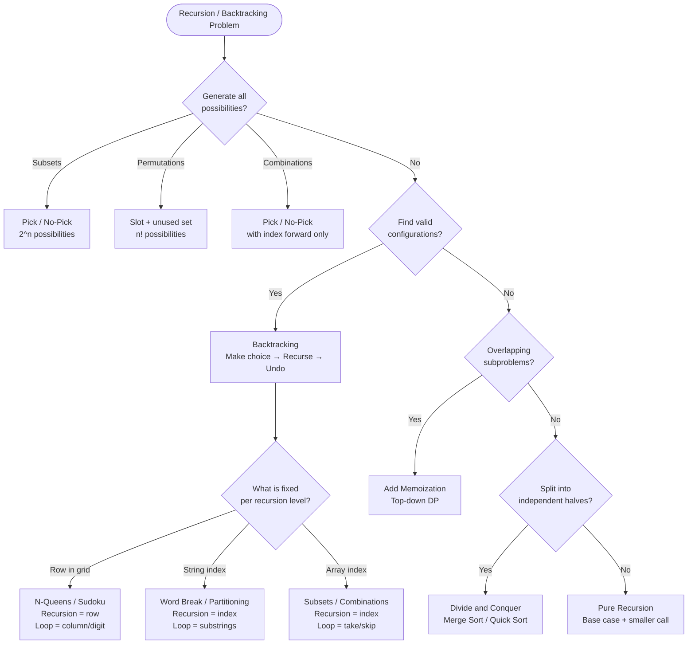

## What is Recursion?

**Analogy:** You're standing in a long corridor of mirrors. Each mirror reflects the next one. Recursion is the same — a function that calls a smaller version of itself until it hits a base case (the last mirror).

**Three parts of every recursive function:**
1. **Base case** — when to stop
2. **Recursive call** — smaller version of the same problem
3. **Processing** — what to do before or after the call

**Before vs After the recursive call:**
- Process **before** the call → top-down (work on current element first)
- Process **after** the call → bottom-up (work after coming back from deepest call)

---

## Pattern 1: Pick / No-Pick (Subsets)

**The idea:** At each element, make a binary choice — include it or skip it. This generates 2^n possibilities.

**Analogy:** Packing a bag. For each item, you either pack it or leave it. Every combination gives a different bag.

```viz
{
  "title": "Pick / No-Pick — Generate All Subsets",
  "description": "arr = [1, 2, 3]. At each index: pick (include) or no-pick (skip). Shows which elements are included.",
  "array": [1, 2, 3],
  "speed": 800,
  "steps": [
    { "pointers": {}, "highlight": [], "label": "Start: [] — empty subset (no-pick all)" },
    { "pointers": { "i": 2 }, "highlight": [2], "label": "Pick 3 only → [3]" },
    { "pointers": { "i": 1 }, "highlight": [1], "label": "Pick 2 only → [2]" },
    { "pointers": { "i": 1, "j": 2 }, "highlight": [1,2], "label": "Pick 2 and 3 → [2,3]" },
    { "pointers": { "i": 0 }, "highlight": [0], "label": "Pick 1 only → [1]" },
    { "pointers": { "i": 0, "j": 2 }, "highlight": [0,2], "label": "Pick 1 and 3 → [1,3]" },
    { "pointers": { "i": 0, "curr": 1 }, "highlight": [0,1], "label": "Pick 1 and 2 → [1,2]" },
    { "pointers": { "i": 0, "curr": 1, "j": 2 }, "highlight": [0,1,2], "label": "Pick all → [1,2,3]", "note": "Total 2³=8 subsets ✓ (including empty set)" }
  ]
}
```

**When to use:** Generate all subsets, subset sum, count subsequences.

---

## Pattern 2: Backtracking

**The idea:** Explore all possibilities, but prune dead ends. Undo your choice (backtrack) before trying the next option.

**Analogy:** Solving a maze. Try a path — dead end? Go back to the last junction and try another direction.

```viz
{
  "title": "Backtracking — Generate All Permutations of [1,2,3]",
  "description": "At each slot, try each unused number. After recursing, undo (backtrack) and try next.",
  "array": [1, 2, 3],
  "speed": 900,
  "steps": [
    { "pointers": { "i": 0 }, "highlight": [0], "label": "Slot 0: try 1. used={1}. Recurse →" },
    { "pointers": { "i": 1 }, "highlight": [0,1], "label": "Slot 1: try 2. used={1,2}. Recurse →" },
    { "pointers": { "i": 2 }, "highlight": [0,1,2], "label": "Slot 2: try 3. Permutation [1,2,3] ✓. Backtrack." },
    { "pointers": { "i": 2 }, "highlight": [0,2,1], "label": "Slot 1: backtrack, try 3. Slot 2: try 2. Permutation [1,3,2] ✓. Backtrack." },
    { "pointers": { "i": 1 }, "highlight": [1,0,2], "label": "Slot 0: backtrack, try 2. Slot 1: try 1. Slot 2: try 3. → [2,1,3] ✓" },
    { "pointers": { "i": 0 }, "highlight": [2,0,1], "label": "Continue: [2,3,1],[3,1,2],[3,2,1]...", "note": "Total 3!=6 permutations ✓. Key: undo choice after recursion returns." }
  ]
}
```

**The key:** You **undo** the choice after the recursive call returns.

**When to use:** Permutations, combinations, N-Queens, Sudoku, word search, palindrome partitioning.

---

## Pattern 3: The Golden Rule of DFS

> **Recursion fixes WHERE you are (position). Loops explore WHAT you can do there (options).**

**Analogy:** Filling seats in a theater row by row. Recursion moves you to the next row. The loop tries each seat in the current row.

```viz
{
  "type": "table",
  "title": "Golden Rule — N-Queens: Recursion=row, Loop=column",
  "description": "4×4 board. Each recursion level = one row. Loop tries each column. Q=queen placed, .=empty, x=attacked.",
  "speed": 1000,
  "cols": ["", "col0", "col1", "col2", "col3"],
  "rows": ["row0", "row1", "row2", "row3"],
  "cells": [
    [".", ".", ".", "."],
    [".", ".", ".", "."],
    [".", ".", ".", "."],
    [".", ".", ".", "."]
  ],
  "steps": [
    {
      "cells": [["Q","x","x","x"],["x","x","x","."],["x",".",".","x"],["x",".",".","x"]],
      "active": [0, 0],
      "label": "Row 0: try col 0. Place Q at (0,0). Recurse to row 1."
    },
    {
      "cells": [["Q","x","x","x"],["x","x","Q","x"],["x","x","x","x"],["x",".",".","x"]],
      "active": [1, 2],
      "highlight": [[0,0]],
      "label": "Row 1: col 0,1 conflict. Try col 2. Place Q at (1,2). Recurse to row 2."
    },
    {
      "cells": [["Q","x","x","x"],["x","x","Q","x"],["x","Q","x","x"],["x","x","x","x"]],
      "active": [2, 1],
      "highlight": [[0,0],[1,2]],
      "label": "Row 2: only col 1 works. Place Q at (2,1). Recurse to row 3."
    },
    {
      "cells": [["Q","x","x","x"],["x","x","Q","x"],["x","Q","x","x"],["x","x","x","Q"]],
      "active": [3, 3],
      "highlight": [[0,0],[1,2],[2,1]],
      "label": "Row 3: only col 3 works. Place Q at (3,3). All 4 queens placed!",
      "note": "Solution: Q at (0,0),(1,2),(2,1),(3,3) ✓. Recursion = row (WHERE). Loop = column (WHAT)."
    }
  ]
}
```

| Problem | Recursion fixes | Loop explores |
|---------|----------------|---------------|
| N-Queens | row | column |
| Sudoku | next empty cell | digits 1-9 |
| Permutations | slot index | unused numbers |
| Subsets | array index | take / skip |

---

## Pattern 4: Permutations

**The idea:** At each slot, try every unused element. Mark used, recurse, then unmark.

**Analogy:** Arranging people in a photo. For the first spot, try each person. After the photo, everyone returns to the pool.

```viz
{
  "title": "Permutations — Swap-based approach",
  "description": "arr=[1,2,3]. At each index, swap with every element from index to end, recurse, then swap back.",
  "array": [1, 2, 3],
  "speed": 1000,
  "steps": [
    { "pointers": { "i": 0 }, "highlight": [0,1,2], "label": "idx=0: swap(0,0)→[1,2,3], recurse. Then swap(0,1)→[2,1,3], recurse. Then swap(0,2)→[3,2,1], recurse." },
    { "pointers": { "i": 1 }, "highlight": [0,1], "label": "idx=1 with [1,2,3]: swap(1,1)→[1,2,3], recurse. swap(1,2)→[1,3,2], recurse." },
    { "pointers": { "i": 2 }, "highlight": [0,1,2], "label": "idx=2: base case, record permutation [1,2,3] ✓" },
    { "pointers": { "i": 2 }, "highlight": [0,2,1], "label": "Backtrack, swap back. Next: [1,3,2] ✓", "note": "All 6 permutations generated ✓. Swap-back = backtrack." }
  ]
}
```

**When to use:** All permutations of array/string. For duplicates: sort first, skip same-value siblings.

---

## Pattern 5: Divide and Conquer

**The idea:** Split into independent halves, solve each, combine.

**Analogy:** Sorting a deck by splitting in half, sorting each half, then merging.

```viz
{
  "title": "Merge Sort — Divide and Conquer",
  "description": "arr=[5,2,4,1,3]. Split in half recursively, sort each half, merge back.",
  "array": [5, 2, 4, 1, 3],
  "speed": 1000,
  "steps": [
    { "pointers": {}, "highlight": [0,1,2,3,4], "label": "Split [5,2,4,1,3] → [5,2] and [4,1,3]" },
    { "pointers": {}, "highlight": [0,1], "label": "Split [5,2] → [5] and [2]. Merge → [2,5]" },
    { "pointers": {}, "highlight": [2,3,4], "label": "Split [4,1,3] → [4] and [1,3]. Merge [1,3] → [1,3]. Merge [4]+[1,3] → [1,3,4]" },
    { "pointers": { "L": 0, "R": 2 }, "highlight": [0,1,2,3,4], "label": "Merge [2,5] and [1,3,4]: compare heads, always pick smaller.", "note": "Result: [1,2,3,4,5] ✓. O(n log n). Divide=O(log n) levels, Conquer=O(n) merge each level." }
  ]
}
```

**When to use:** Merge sort, binary search, count inversions.

---

## Memoization (Recursion + Cache)

When the same subproblem appears multiple times, store the result.

**Analogy:** Calculating Fibonacci. Without memo, fib(3) is recalculated dozens of times. With a notebook, you look it up after computing once.

**Rule:** Overlapping subproblems in recursion → add a cache → that's top-down DP.

---

## Quick Reference

| Situation | Pattern |
|-----------|---------|
| Generate all subsets | Pick / No-Pick |
| Generate all permutations | Slot + unused set |
| Find valid configurations | Backtracking |
| Grid / maze path finding | DFS + Backtracking |
| Overlapping subproblems | Memoization |
| Split and combine | Divide and Conquer |

---

## Decision Flowchart


