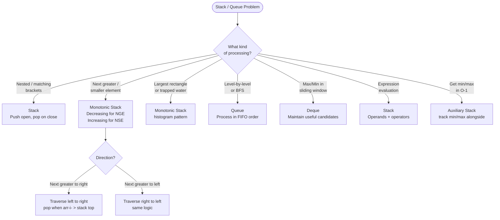

## Stack — Last In, First Out (LIFO)

**Analogy:** A stack of plates. You always add and remove from the top. The last plate you put on is the first one you take off.

**Core operations:** push, pop, peek — all O(1).

---

## Pattern 1: Balanced Parentheses / Nested Structure

**The idea:** Push opening brackets. When you see a closing bracket, pop and check if it matches.

**Analogy:** Every time you open a door, you push it onto a stack. When you close a door, you pop — it must match the last opened door.

```viz
{
  "type": "stack",
  "title": "Balanced Parentheses — Stack push/pop",
  "description": "String: ( [ { } ] ). Push on open, pop and match on close. Watch the stack grow then drain.",
  "speed": 900,
  "steps": [
    { "stack": ["("], "flash": { "type": "push", "value": "(" }, "label": "See '(' → opening bracket, PUSH." },
    { "stack": ["(", "["], "flash": { "type": "push", "value": "[" }, "label": "See '[' → opening bracket, PUSH." },
    { "stack": ["(", "[", "{"], "flash": { "type": "push", "value": "{" }, "label": "See '{' → opening bracket, PUSH." },
    { "stack": ["(", "["], "flash": { "type": "pop", "value": "{" }, "label": "See '}' → closing, POP '{' → matches ✓." },
    { "stack": ["("], "flash": { "type": "pop", "value": "[" }, "label": "See ']' → closing, POP '[' → matches ✓." },
    { "stack": [], "flash": { "type": "pop", "value": "(" }, "label": "See ')' → closing, POP '(' → matches ✓.", "note": "Stack empty at end → valid! ✓" }
  ]
}
```

**When to use:**
- Valid parentheses
- Evaluate expressions
- Decode nested strings

> **In an interview:** trigger words are *"matching / balanced / nested / innermost"*. Anytime the most-recent-unmatched thing must be resolved first, that's LIFO.
> **Remember:** push on open, pop-and-match on close; empty stack at the end = valid.

---

## Pattern 2: Monotonic Stack (Most Important Stack Pattern)

**The idea:** Maintain a stack that is always increasing or always decreasing. When a new element breaks the order, pop elements and process them.

**Analogy:** Imagine people standing in a line by height. A new tall person arrives — everyone shorter in front of them can now "see" the tall person. Pop them and record "next greater element = this tall person."

```viz
{
  "type": "stack",
  "title": "Monotonic Stack — Next Greater Element",
  "description": "arr = [2, 1, 5, 3, 4]. Stack holds values still waiting for a greater element to their right — always decreasing top to bottom.",
  "speed": 1000,
  "steps": [
    { "stack": [2], "flash": { "type": "push", "value": 2 }, "label": "val=2. Stack empty → push. Stack (bottom→top): [2]" },
    { "stack": [2, 1], "flash": { "type": "push", "value": 1 }, "label": "val=1. 1 < top(2) → push. Stack: [2,1]" },
    { "stack": [2], "flash": { "type": "pop", "value": 1 }, "label": "val=5. 5 > top(1) → pop 1, NGE(1)=5." },
    { "stack": [5], "flash": { "type": "pop", "value": 2 }, "label": "5 > new top(2) → pop 2, NGE(2)=5. Push 5. Stack: [5]" },
    { "stack": [5, 3], "flash": { "type": "push", "value": 3 }, "label": "val=3. 3 < top(5) → push. Stack: [5,3]" },
    { "stack": [5], "flash": { "type": "pop", "value": 3 }, "label": "val=4. 4 > top(3) → pop 3, NGE(3)=4." },
    { "stack": [5, 4], "flash": { "type": "push", "value": 4 }, "label": "4 < new top(5) → push. Stack: [5,4]", "note": "Whatever's left in the stack never found a greater element → NGE = -1. Result for [2,1,5,3,4] = [5,5,-1,4,-1] ✓" }
  ]
}
```

**Two types:**
- **Monotonic Decreasing Stack** → find Next Greater Element
- **Monotonic Increasing Stack** → find Next Smaller Element

**When to use:**
- Next Greater / Next Smaller Element
- Stock span problem
- Largest rectangle in histogram
- Trapping rain water
- Sum of subarray minimums

> **In an interview:** trigger words are *"next/previous greater or smaller"*, *"histogram"*, *"span"*. If your brute force is a nested loop scanning left/right, a monotonic stack collapses it to O(n).
> **Remember:** pop while the stack order breaks — the element that pops you is your answer.

---

## Pattern 3: Min Stack / Max Stack

**The idea:** Maintain a second stack that tracks the current minimum/maximum at every state.

**Analogy:** Keep a "scoreboard" alongside the main stack. Every time you push, also update the scoreboard with the new min/max.

```viz
{
  "type": "stack",
  "title": "Min Stack — getMin() in O(1)",
  "description": "Push 5,3,7,2,4 then pop once. Main stack holds real values; minStack's top is always the current minimum.",
  "speed": 900,
  "steps": [
    { "stacks": [{ "label": "main", "values": [5] }, { "label": "minStack", "values": [5] }], "label": "Push 5. Both stacks: [5]. min=5" },
    { "stacks": [{ "label": "main", "values": [5, 3] }, { "label": "minStack", "values": [5, 3] }], "label": "Push 3. 3<5 → minStack pushes 3. min=3" },
    { "stacks": [{ "label": "main", "values": [5, 3, 7] }, { "label": "minStack", "values": [5, 3, 3] }], "label": "Push 7. 7>3 → minStack repeats current min 3. min=3" },
    { "stacks": [{ "label": "main", "values": [5, 3, 7, 2] }, { "label": "minStack", "values": [5, 3, 3, 2] }], "label": "Push 2. 2<3 → minStack pushes 2. min=2" },
    { "stacks": [{ "label": "main", "values": [5, 3, 7, 2, 4] }, { "label": "minStack", "values": [5, 3, 3, 2, 2] }], "label": "Push 4. 4>2 → minStack repeats 2. min=2" },
    { "stacks": [{ "label": "main", "values": [5, 3, 7, 2], "flash": { "type": "pop", "value": 4 } }, { "label": "minStack", "values": [5, 3, 3, 2], "flash": { "type": "pop", "value": 2 } }], "label": "Pop 4 from main. minStack pops its top too (2). New min = minStack.top() = 2.", "note": "getMin() = minStack.top(), always O(1) ✓" }
  ]
}
```

**When to use:**
- Design a stack that supports getMin() in O(1)

> **In an interview:** trigger is *"getMin/getMax in O(1)"* alongside normal push/pop. The interviewer is testing whether you keep min history, not just the current min.
> **Remember:** push the running min alongside each value so pops restore the previous min for free.

---

## Pattern 4: Stack for Expression Evaluation

**The idea:** Use a stack to evaluate postfix expressions or convert between infix/postfix/prefix.

```viz
{
  "type": "stack",
  "title": "Evaluate Reverse Polish Notation (Postfix)",
  "description": "tokens = [2, 3, 4, *, +] = 2 + (3*4) = 14. Numbers push; an operator pops the top two and pushes the result.",
  "speed": 1000,
  "steps": [
    { "stack": [2], "flash": { "type": "push", "value": 2 }, "label": "See 2 → push." },
    { "stack": [2, 3], "flash": { "type": "push", "value": 3 }, "label": "See 3 → push. Stack: [2, 3]" },
    { "stack": [2, 3, 4], "flash": { "type": "push", "value": 4 }, "label": "See 4 → push. Stack: [2, 3, 4]" },
    { "stack": [2, 12], "flash": { "type": "push", "value": 12 }, "label": "See '*' → pop 4 and 3, compute 3*4=12, push. Stack: [2, 12]" },
    { "stack": [14], "flash": { "type": "push", "value": 14 }, "label": "See '+' → pop 12 and 2, compute 2+12=14, push. Stack: [14]", "note": "Result = 14 ✓" }
  ]
}
```

**When to use:**
- Evaluate Reverse Polish Notation
- Expression parsing
- Calculator problems

> **In an interview:** trigger words are *"evaluate expression / RPN / basic calculator / infix-postfix"*. Clarify operator precedence and whether parentheses appear.
> **Remember:** operands push; an operator pops its operands, computes, and pushes the result.

---

## Queue — First In, First Out (FIFO)

**Analogy:** A line at a coffee shop. First person in line gets served first.

**Core operations:** enqueue (add to back), dequeue (remove from front) — O(1).

---

## Pattern 5: BFS with Queue

**The idea:** Process nodes level by level. Add neighbors to the queue, process in order.

```viz
{
  "type": "tree",
  "title": "BFS with Queue — Level Order Tree Traversal",
  "description": "Tree: root=1, children=[2,3], grandchildren=[4,5,6,7]. Queue ensures level-by-level processing.",
  "nodes": [null, 1, 2, 3, 4, 5, 6, 7],
  "speed": 900,
  "steps": [
    {
      "active": 1,
      "label": "Queue=[1]. Process 1 → enqueue children 2, 3. Level 1 done."
    },
    {
      "highlight": [1],
      "active": 2,
      "label": "Queue=[2,3]. Process 2 → enqueue 4,5. Process 3 → enqueue 6,7. Level 2 done."
    },
    {
      "highlight": [1, 2, 3],
      "active": [4, 5, 6, 7],
      "label": "Queue=[4,5,6,7]. Process all — no children. Level 3 done.",
      "note": "BFS order: [1], [2,3], [4,5,6,7] ✓. Shortest path guaranteed in unweighted graphs."
    }
  ]
}
```

**When to use:**
- Level order traversal of tree
- Shortest path in unweighted graph
- Rotten oranges, 0/1 matrix

> **In an interview:** trigger words are *"level by level"*, *"shortest path in an unweighted grid/graph"*, *"minimum steps"*. Process one full level (current queue size) at a time.
> **Remember:** FIFO explores in rings of equal distance — first arrival is the shortest path.

---

## Pattern 6: Deque (Sliding Window Maximum)

**The idea:** Use a double-ended queue to maintain the maximum (or minimum) in a sliding window in O(n).

**Analogy:** A bouncer at a club who only lets in the "coolest" person. As the window slides, old people leave from the front, new people enter from the back — but anyone less cool than the newcomer gets kicked out immediately.

```viz
{
  "type": "queue",
  "title": "Sliding Window Maximum — Monotonic Deque (k=3)",
  "description": "arr = [1, 3, -1, -3, 5, 3], k=3. Deque holds candidate VALUES, front→back decreasing. Front is always the current window's max.",
  "speed": 1000,
  "steps": [
    { "queue": [1], "flash": { "type": "pushBack", "value": 1 }, "label": "val=1. Deque empty → push back. [1]. Window not full yet." },
    { "queue": [3], "flash": { "type": "popBack", "value": 1 }, "label": "val=3. 3 > back(1) → pop back (useless), push 3. [3]. Window not full yet." },
    { "queue": [3, -1], "flash": { "type": "pushBack", "value": -1 }, "label": "val=-1. -1 < back(3) → push back. [3,-1]. Window full! max = front = 3 ✓" },
    { "queue": [3, -1, -3], "flash": { "type": "pushBack", "value": -3 }, "label": "val=-3. -3 < back(-1) → push back. [3,-1,-3]. Front(3) still in window. max=3 ✓" },
    { "queue": [5], "flash": { "type": "pushBack", "value": 5 }, "label": "val=5. 5 > everyone → pop back until empty (3,-1,-3 all popped), push 5. [5]. max=5 ✓" },
    { "queue": [5, 3], "flash": { "type": "pushBack", "value": 3 }, "label": "val=3. 3 < back(5) → push back. [5,3]. max = front = 5 ✓", "note": "Result: [3, 3, 5, 5] ✓. The front is always the max because the deque stays decreasing." }
  ]
}
```

**When to use:**
- Sliding window maximum/minimum
- Any "best element in current window" problem

> **In an interview:** trigger words are *"maximum/minimum of every window of size k"*. A heap gives O(n log k); the monotonic deque gets it to O(n) — mention both.
> **Remember:** the deque keeps only useful candidates in decreasing order; the front is the window's max.

---

## Quick "When to Use What"

| Situation | Pattern |
|-----------|---------|
| Nested structure, matching brackets | Stack |
| Next greater/smaller element | Monotonic Stack |
| Largest rectangle, trapping water | Monotonic Stack |
| Get min/max in O(1) | Min/Max Stack |
| Expression evaluation | Stack |
| Level-by-level processing, BFS | Queue |
| Max/min in sliding window | Deque |

---

## Decision Flowchart



---

## Problem → Pattern Cross-References

The problems list mirrors the patterns above. Each problem has one home. Notes on the connections and cross-topic moves:

| Problem | Home pattern | Why (and what else it touches) |
|---------|--------------|-------------------------------|
| Remove k Digits / Asteroid Collision | Balanced/Nested | Stack-of-decisions, pop when the new item invalidates the top |
| Car Fleet | Monotonic Stack | Sort by position, then a monotonic sweep of arrival times |
| Sum of Subarray Minimums / Ranges | Monotonic Stack | Contribution technique using previous/next smaller |
| Maximal Rectangle | Monotonic Stack | Reduces each row to a histogram (Largest Rectangle) |
| The Celebrity Problem | Stack/Queue Design | Stack-elimination of candidates in O(n) |

**Cross-topic homes (mentioned here, listed elsewhere):**

- **Sliding Window Maximum** → home is *Deque* in this file (monotonic deque, O(n)). Removed from `array.md`.
- **Trapping Rain Water** → home is *Two Pointer* in `array.md`. It's also a classic monotonic-stack problem — worth solving both ways, but it's listed once.
- **Generate Parentheses** → home is *Backtracking* in `recursion.md`, not a stack problem despite the brackets.
- **LRU / LFU Cache** → moved to `linkedList.md` (Design — HashMap + DLL), since the DLL is the core structure.

> **The big idea:** the *Monotonic Stack* is the highest-leverage pattern in this topic. Next greater/smaller, histogram, stock span, and subarray-min contributions are all the same "pop while the stack order breaks" move.
