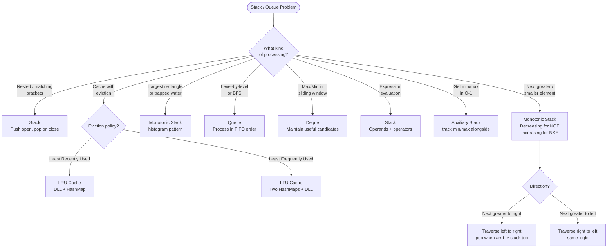

## Stack — Last In, First Out (LIFO)

**Analogy:** A stack of plates. You always add and remove from the top. The last plate you put on is the first one you take off.

**Core operations:** push, pop, peek — all O(1).

---

## Pattern 1: Balanced Parentheses / Nested Structure

**The idea:** Push opening brackets. When you see a closing bracket, pop and check if it matches.

**Analogy:** Every time you open a door, you push it onto a stack. When you close a door, you pop — it must match the last opened door. If it doesn't, something is wrong.

**When to use:**
- Valid parentheses
- Evaluate expressions
- Decode nested strings

---

## Pattern 2: Monotonic Stack (Most Important Stack Pattern)

**The idea:** Maintain a stack that is always increasing or always decreasing. When a new element breaks the order, pop elements and process them.

**Analogy:** Imagine people standing in a line by height. A new tall person arrives — everyone shorter in front of them can now "see" the tall person. Pop them and record "next greater element = this tall person."

**Two types:**
- **Monotonic Decreasing Stack** → find Next Greater Element
- **Monotonic Increasing Stack** → find Next Smaller Element

**Template (Next Greater Element):**
```
stack = []
result = [-1] * n
for i in range(n):
    while stack and arr[stack[-1]] < arr[i]:
        result[stack.pop()] = arr[i]
    stack.append(i)
```

**When to use:**
- Next Greater / Next Smaller Element
- Stock span problem
- Largest rectangle in histogram
- Trapping rain water
- Sum of subarray minimums

---

## Pattern 3: Min Stack / Max Stack

**The idea:** Maintain a second stack that tracks the current minimum/maximum at every state.

**Analogy:** Keep a "scoreboard" alongside the main stack. Every time you push, also update the scoreboard with the new min/max.

**When to use:**
- Design a stack that supports getMin() in O(1)

---

## Pattern 4: Stack for Expression Evaluation

**The idea:** Use a stack to evaluate postfix expressions or convert between infix/postfix/prefix.

**Infix → Postfix rule:** Operators go on the stack; higher precedence operators pop lower ones first.

**When to use:**
- Evaluate Reverse Polish Notation
- Expression parsing
- Calculator problems

---

## Queue — First In, First Out (FIFO)

**Analogy:** A line at a coffee shop. First person in line gets served first.

**Core operations:** enqueue (add to back), dequeue (remove from front) — O(1).

---

## Pattern 5: BFS with Queue

**The idea:** Process nodes level by level. Add neighbors to the queue, process in order.

**Analogy:** Ripples in a pond. The first ripple spreads outward evenly — that's BFS. The queue ensures you process all nodes at distance 1 before distance 2.

**When to use:**
- Level order traversal of tree
- Shortest path in unweighted graph
- Rotten oranges, 0/1 matrix

---

## Pattern 6: Deque (Sliding Window Maximum)

**The idea:** Use a double-ended queue to maintain the maximum (or minimum) in a sliding window in O(n).

**Analogy:** A bouncer at a club who only lets in the "coolest" person. As the window slides, old people leave from the front, new people enter from the back — but anyone less cool than the newcomer gets kicked out immediately.

**Template:**
```
deque = []   # stores indices
for i in range(n):
    # remove elements outside window
    while deque and deque[0] < i - k + 1:
        deque.popleft()
    # remove smaller elements from back
    while deque and arr[deque[-1]] < arr[i]:
        deque.pop()
    deque.append(i)
    if i >= k - 1:
        result.append(arr[deque[0]])
```

**When to use:**
- Sliding window maximum/minimum
- Any "best element in current window" problem

---

## Pattern 7: LRU Cache (Queue + HashMap)

**The idea:** Combine a doubly linked list (for O(1) remove/insert) with a hashmap (for O(1) lookup).

**Analogy:** Your browser's recently visited tabs. The most recently used tab is at the front. When you run out of space, the least recently used tab gets closed.

**When to use:**
- LRU Cache design
- LFU Cache design

---

## Quick "When to Use What"

| Situation | Pattern |
|-----------|---------|
| Nested structure, matching brackets | Stack |
| Next greater/smaller element | Monotonic Stack |
| Largest rectangle, trapping water | Monotonic Stack |
| Get min/max in O(1) | Min/Max Stack |
| Expression evaluation | Stack |
| Level-by-level processing, BFS | Queue |
| Max/min in sliding window | Deque |
| O(1) get/put with eviction | LRU Cache |

---

## Decision Flowchart


