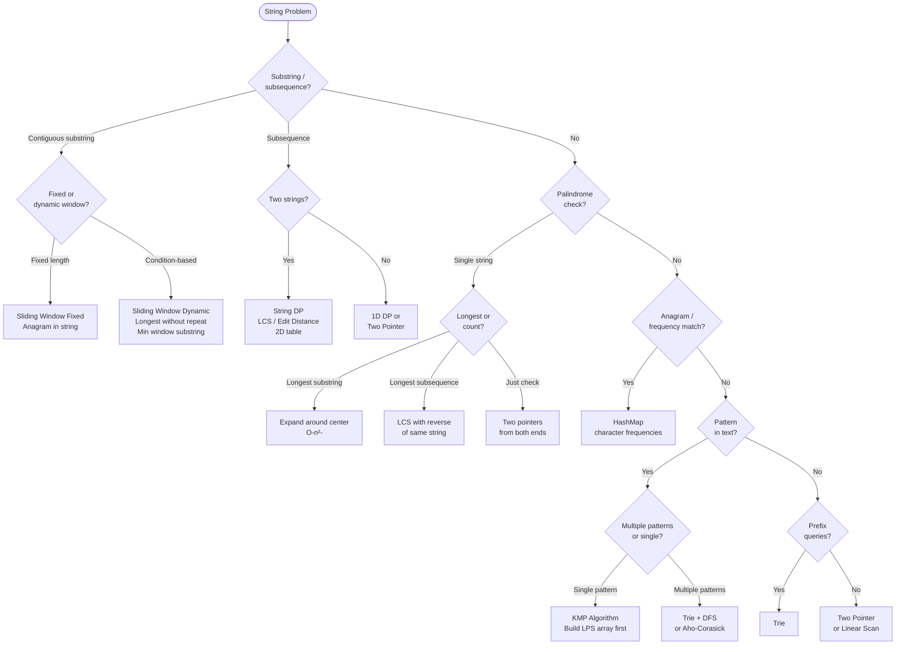

## Strings in DSA

**Analogy:** A string is like a necklace of beads. Each bead is a character. You can look at any bead directly (O(1) access), but inserting or removing a bead in the middle requires rethreading (O(n)).

**Key insight:** Most string problems are array problems in disguise. The same patterns apply — two pointers, sliding window, hashing, DP.

---

## Pattern 1: Two Pointer on Strings

**The idea:** Use left and right pointers moving toward each other.

**When to use:**
- Palindrome check (compare characters from both ends)
- Reverse a string in-place
- Valid Palindrome (skip non-alphanumeric)

**Analogy:** Reading a word forward and backward simultaneously. If all characters match → palindrome.

---

## Pattern 2: Sliding Window on Strings

**The idea:** Maintain a window of characters, expand/shrink based on conditions.

**When to use:**
- Longest substring without repeating characters
- Minimum window substring
- Permutation in string (fixed window = length of pattern)
- Longest substring with at most K distinct characters

**Key tool:** Use a frequency map (hashmap) to track character counts in the window.

---

## Pattern 3: Hashing for Anagrams / Frequency

**The idea:** Two strings are anagrams if they have the same character frequencies.

**Analogy:** Two bags of Scrabble tiles. They're anagrams if both bags contain exactly the same tiles.

**When to use:**
- Valid anagram
- Group anagrams (use sorted string or frequency tuple as key)
- Find all anagrams in a string (sliding window + frequency map)
- Isomorphic strings (map characters from s to t and back)

---

## Pattern 4: String Matching (KMP / Rabin-Karp / Z-Function)

**The idea:** Find a pattern inside a text efficiently — O(n + m) instead of O(n*m).

**KMP (Knuth-Morris-Pratt):**
- Build a "failure function" (LPS array) for the pattern
- LPS[i] = length of longest proper prefix of pattern[0..i] that is also a suffix
- Use LPS to skip redundant comparisons

**Analogy:** You're searching for "ABCABC" in a text. When a mismatch happens at position 6, KMP knows the first 3 characters already matched (because "ABC" is both a prefix and suffix of "ABCABC"). It jumps back only 3 positions instead of starting over.

**Rabin-Karp:** Use rolling hash to compare pattern with each window in O(1). Good for multiple pattern search.

**Z-Function:** Z[i] = length of longest substring starting at i that matches a prefix of the string. Useful for pattern matching.

**When to use:**
- Find pattern in text (KMP)
- Shortest palindrome (KMP on s + "#" + reverse(s))
- Longest happy prefix

---

## Pattern 5: Palindrome Techniques

**Expand Around Center:**
- For each character (and gap between characters), expand outward while characters match
- O(n²) time, O(1) space
- Use for: Longest palindromic substring, count palindromic substrings

**DP approach:**
- `dp[i][j] = true` if `s[i..j]` is palindrome
- `dp[i][j] = (s[i] == s[j]) && dp[i+1][j-1]`

**Manacher's Algorithm:** O(n) palindrome finding — advanced.

---

## Pattern 6: String DP

**When to use:**
- Edit distance (insert/delete/replace to convert s1 to s2)
- Longest Common Subsequence
- Wildcard matching / Regex matching
- Distinct subsequences

**Key insight:** Most string DP uses a 2D table where `dp[i][j]` represents the answer for `s1[0..i]` and `s2[0..j]`.

---

## Pattern 7: Prefix / Suffix Tricks

**Longest Common Prefix:** Sort the array. Compare only first and last strings — their common prefix is the answer for all.

**Analogy:** If the shortest and tallest person in a group both fit through a door, everyone fits.

**When to use:**
- Longest common prefix
- Group strings by prefix
- Trie (for prefix queries at scale)

---

## Common String Operations Complexity

| Operation | Complexity |
|-----------|------------|
| Access character | O(1) |
| Substring | O(k) where k = length |
| Concatenation | O(n) — use StringBuilder |
| Comparison | O(min(n,m)) |
| Sort characters | O(n log n) |

---

## Quick Reference

| Situation | Pattern |
|-----------|---------|
| Palindrome check | Two pointers from ends |
| Longest substring with condition | Sliding window |
| Anagram / frequency matching | HashMap |
| Find pattern in text | KMP / Rabin-Karp |
| Longest palindromic substring | Expand around center |
| Convert one string to another | String DP (Edit Distance) |
| Prefix queries at scale | Trie |

---

## Decision Flowchart

