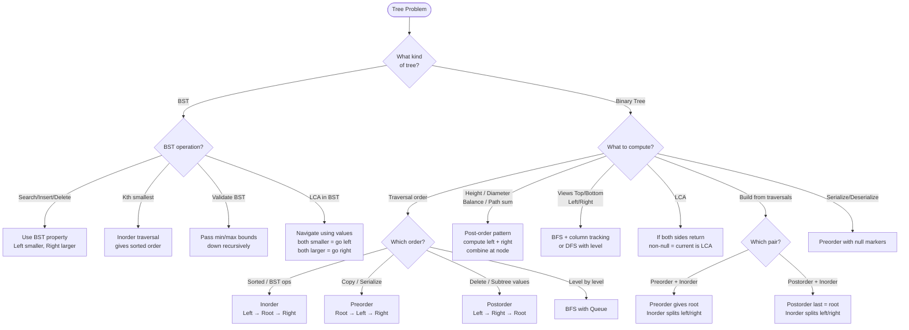

## What is a Tree?

**Analogy:** A family tree. One ancestor at the top (root), children below, and so on. Each person (node) knows their children but not their siblings directly.

**Key definitions:**
- **Binary Tree** — each node has at most 2 children
- **Full Binary Tree** — every node has 0 or 2 children (never 1)
- **Complete Binary Tree** — all levels filled except possibly the last, filled left to right
- **Perfect Binary Tree** — all leaves at same level, every internal node has 2 children
- **BST** — left subtree values < node < right subtree values

**Node indexing (1-indexed root):**
- Left child = `2 * i`, Right child = `2 * i + 1`, Parent = `i / 2`

---

## Pattern 1: Tree Traversals

**DFS Traversals — think of when you "visit" the node:**
- **Preorder (Root → Left → Right):** Visit node first. Good for copying/serializing a tree.
- **Inorder (Left → Root → Right):** Visits BST nodes in sorted order.
- **Postorder (Left → Right → Root):** Visit node last. Good for deletion, computing subtree values.

```viz
{
  "type": "tree",
  "title": "Inorder Traversal — Left → Root → Right (BST gives sorted order)",
  "description": "BST: root=4, left subtree=[1,2,3], right subtree=[5,6,7]. Inorder visits nodes in sorted order.",
  "nodes": [null, 4, 2, 6, 1, 3, 5, 7],
  "speed": 800,
  "steps": [
    { "active": 4, "label": "Go left all the way → visit node 1 (leftmost leaf)" },
    { "active": 2, "highlight": [4], "label": "Back to parent → visit node 2" },
    { "active": 5, "highlight": [4, 2], "label": "Right child of 2 → visit node 3" },
    { "active": 1, "highlight": [4, 2, 5], "label": "Back to root → visit node 4" },
    { "active": 6, "highlight": [4, 2, 5, 1], "label": "Left of right subtree → visit node 5" },
    { "active": 3, "highlight": [4, 2, 5, 1, 6], "label": "Right subtree root → visit node 6" },
    { "active": 7, "highlight": [4, 2, 5, 1, 6, 3], "label": "Rightmost leaf → visit node 7", "note": "Inorder result: [1,2,3,4,5,6,7] — sorted! ✓" }
  ]
}
```

**BFS / Level Order:** Use a queue. Process all nodes at depth 1, then depth 2, etc.

**Morris Traversal:** Inorder/Preorder in O(1) space by temporarily modifying tree pointers.

---

## Pattern 2: Tree Properties (Height, Diameter, Balance)

**The idea:** Most tree property problems follow the same pattern — compute something for left subtree, compute for right subtree, combine at current node.

**Analogy:** You're measuring the height of a tree. You can't measure from the top — you measure each branch from the bottom up and combine.

```viz
{
  "type": "tree",
  "title": "Tree Height — Post-order bottom-up computation",
  "description": "Tree: root=1, left=2(leaves:4,5), right=3(leaf:6). Height = 1 + max(left,right).",
  "nodes": [null, 1, 2, 3, 4, 5, 6],
  "speed": 1000,
  "steps": [
    { "active": 4, "labels": { "4": "h=0" }, "label": "Node 4 (leaf): height = 0" },
    { "active": 5, "labels": { "4": "h=0", "5": "h=0" }, "label": "Node 5 (leaf): height = 0" },
    { "active": 6, "labels": { "4": "h=0", "5": "h=0", "6": "h=0" }, "label": "Node 6 (leaf): height = 0" },
    { "active": 2, "highlight": [4, 5], "labels": { "4": "h=0", "5": "h=0", "6": "h=0", "2": "h=1" }, "label": "Node 2: height = 1 + max(0,0) = 1" },
    { "active": 3, "highlight": [6], "labels": { "4": "h=0", "5": "h=0", "6": "h=0", "2": "h=1", "3": "h=1" }, "label": "Node 3: height = 1 + max(0,-1) = 1" },
    { "active": 1, "highlight": [2, 3], "labels": { "4": "h=0", "5": "h=0", "6": "h=0", "2": "h=1", "3": "h=1", "1": "h=2" }, "label": "Root 1: height = 1 + max(1,1) = 2", "note": "Tree height = 2 ✓. Same post-order pattern works for diameter, balance check, path sum." }
  ]
}
```

**Template (post-order thinking):**
```
def solve(node):
    if not node: return base_value
    left = solve(node.left)
    right = solve(node.right)
    return combine(left, right, node)
```

**When to use:**
- Height of tree, Diameter, Check if balanced
- Maximum path sum, Count nodes

---

## Pattern 3: Views (Top, Bottom, Left, Right)

**The idea:** Use BFS with column/level tracking, or DFS with level tracking.

- **Left/Right View:** BFS level order — take first/last node of each level
- **Top/Bottom View:** BFS with column index — top view takes first node per column, bottom view takes last
- **Vertical Order:** Group nodes by column index

**Analogy:** You're photographing a tree from different angles. Each angle reveals different nodes.

---

## Pattern 4: Lowest Common Ancestor (LCA)

**The idea:** The LCA of two nodes p and q is the deepest node that has both as descendants.

**Analogy:** Two cousins tracing their family tree. The LCA is the most recent common ancestor.

```viz
{
  "type": "tree",
  "title": "LCA — Find deepest node that is ancestor of both p and q",
  "description": "Tree: root=3, left=5(children:6,2), right=1(children:0,8). Find LCA(p=5, q=1).",
  "nodes": [null, 3, 5, 1, 6, 2, 0, 8],
  "speed": 1000,
  "steps": [
    { "active": 4, "highlight": [2, 3], "label": "At node 6: not p(5) or q(1) → return null" },
    { "active": 5, "highlight": [2, 3], "label": "At node 2: not p or q → return null" },
    { "active": 2, "highlight": [2, 3], "label": "At node 5: IS p → return node5 (don't recurse deeper)" },
    { "active": 6, "highlight": [2, 3], "label": "At node 0: not p or q → return null" },
    { "active": 7, "highlight": [2, 3], "label": "At node 8: not p or q → return null" },
    { "active": 3, "highlight": [2, 3], "label": "At node 1: IS q → return node1" },
    { "active": 1, "highlight": [2, 3], "label": "At root 3: left=node5 (non-null), right=node1 (non-null) → BOTH non-null = LCA!", "note": "LCA(5,1) = node 3 ✓" }
  ]
}
```

**Algorithm:**
- If current node is null, p, or q → return current node
- Recurse left and right
- If both sides return non-null → current node is LCA

**When to use:**
- LCA in binary tree
- LCA in BST (simpler — use BST property to navigate)
- Distance between two nodes

---

## Pattern 5: BST Operations

**BST property:** Inorder traversal gives sorted order. Use this constantly.

```viz
{
  "type": "tree",
  "title": "BST Search — Navigate using left < node < right",
  "description": "BST: root=8, left subtree=[3,1,6], right subtree=[10,14]. Search for target=6.",
  "nodes": [null, 8, 3, 10, 1, 6, null, 14],
  "speed": 1000,
  "steps": [
    { "active": 1, "label": "At root=8. target=6 < 8 → go LEFT", "edge": [1, 2] },
    { "active": 2, "highlight": [1], "label": "At node=3. target=6 > 3 → go RIGHT", "edge": [2, 5] },
    { "active": 5, "highlight": [1, 2], "label": "At node=6. target=6 == 6 → FOUND ✓", "note": "O(log n) average. Each step eliminates half the tree." }
  ]
}
```

**Search:** Go left if target < node, right if target > node. O(log n) average.

**Delete:** Three cases:
1. Leaf node → just remove
2. One child → replace with child
3. Two children → replace with inorder successor (smallest in right subtree)

**When to use BST patterns:**
- Kth smallest/largest → inorder traversal
- Floor/Ceil → navigate using BST property
- Two Sum in BST → inorder gives sorted array, then two pointers

---

## Pattern 6: Tree Construction

**Key rules:**
- Preorder + Inorder → unique tree (preorder gives root, inorder splits left/right)
- Postorder + Inorder → unique tree (postorder gives root from end)

```viz
{
  "type": "tree",
  "title": "Build Tree from Preorder + Inorder",
  "description": "preorder=[3,9,20,15,7], inorder=[9,3,15,20,7]. Preorder[0]=root, find in inorder to split left/right.",
  "nodes": [null, 3, 9, 20, null, null, 15, 7],
  "speed": 1100,
  "steps": [
    { "active": 1, "label": "preorder[0]=3 → root=3. Find 3 in inorder=[9,3,15,20,7] at idx=1" },
    { "active": 2, "highlight": [1], "label": "Left of idx=1 in inorder: [9] → left subtree has 1 node. preorder[1]=9 → left child=9" },
    { "active": 3, "highlight": [1, 2], "label": "Right of idx=1 in inorder: [15,20,7] → right subtree. preorder[2]=20 → right child=20" },
    { "active": 6, "highlight": [1, 2, 3], "label": "For node 20: inorder=[15,20,7], preorder[3]=15 → left child=15" },
    { "active": 7, "highlight": [1, 2, 3, 6], "label": "preorder[4]=7 → right child of 20 = 7", "note": "Tree built: 3(9, 20(15,7)) ✓" }
  ]
}
```

**When to use:**
- Build tree from preorder+inorder or postorder+inorder traversals

---

## Pattern 7: Tree DP

**The idea:** Compute a value at each node using values from its children. Classic post-order pattern.

```viz
{
  "type": "tree",
  "title": "Tree DP — Maximum Path Sum",
  "description": "Tree: root=-10, left=9, right=20(children:15,7). Max path sum through any node.",
  "nodes": [null, -10, 9, 20, null, null, 15, 7],
  "speed": 1000,
  "steps": [
    { "active": 6, "labels": { "6": "15" }, "label": "Node 15 (leaf): maxGain=15" },
    { "active": 7, "labels": { "6": "15", "7": "7" }, "label": "Node 7 (leaf): maxGain=7" },
    { "active": 3, "highlight": [6, 7], "labels": { "6": "15", "7": "7", "3": "42" }, "label": "Node 20: left=15, right=7. Path through 20 = 15+20+7=42. Update globalMax=42. Return 20+max(15,7)=35" },
    { "active": 2, "labels": { "6": "15", "7": "7", "3": "42", "2": "9" }, "label": "Node 9 (leaf): maxGain=9" },
    { "active": 1, "highlight": [2, 3], "labels": { "6": "15", "7": "7", "3": "42", "2": "9", "1": "25" }, "label": "Root -10: left=9, right=35. Path=-10+max(9,35)=25 < 42. globalMax stays 42", "note": "Max path sum = 42 (15→20→7) ✓" }
  ]
}
```

**When to use:**
- Maximum path sum (track max path through each node)
- Diameter of tree
- Largest BST in binary tree

---

## Pattern 8: Serialize / Deserialize

**The idea:** Convert tree to string (preorder with null markers), reconstruct from string.

```viz
{
  "type": "tree",
  "title": "Serialize Tree — Preorder with null markers",
  "description": "Tree: root=1, left=2, right=3(children:4,5). Serialize: visit node, then recurse left, right.",
  "nodes": [null, 1, 2, 3, null, null, 4, 5],
  "speed": 1000,
  "steps": [
    { "active": 1, "label": "Visit root=1. Output: '1'" },
    { "active": 2, "highlight": [1], "label": "Visit left=2. Output: '1,2'" },
    { "active": 2, "highlight": [1], "labels": { "2": "∅,∅" }, "label": "Node 2 has no children → output nulls. Output: '1,2,null,null'" },
    { "active": 3, "highlight": [1, 2], "label": "Visit right=3. Output: '1,2,null,null,3'" },
    { "active": 6, "highlight": [1, 2, 3], "label": "Visit 3's left=4. Output: '...3,4,null,null'" },
    { "active": 7, "highlight": [1, 2, 3, 6], "label": "Visit 3's right=5. Output: '...5,null,null'", "note": "Full: '1,2,null,null,3,4,null,null,5,null,null'. Deserialize by consuming tokens in same order ✓" }
  ]
}
```

**When to use:** Store/transmit a tree, clone a tree.

---

## Quick Reference

| Situation | Pattern |
|-----------|---------|
| Visit all nodes | DFS (pre/in/post) or BFS |
| Sorted order from BST | Inorder traversal |
| Height, diameter, balance | Post-order + combine |
| Level-by-level processing | BFS with queue |
| Views (top/bottom/left/right) | BFS + column tracking |
| Deepest common ancestor | LCA algorithm |
| Build tree from traversals | Preorder/Postorder + Inorder |
| Optimize over subtrees | Tree DP |

---

## Decision Flowchart


