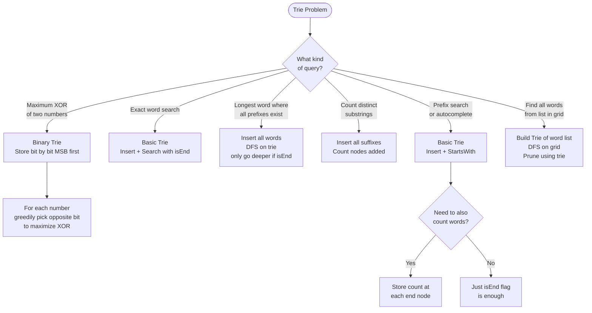

## What is a Trie?

**Analogy:** A trie is like an autocomplete system on your phone. As you type "ca", it shows "cat", "car", "cake". Each letter you type narrows down the tree. The trie stores words by their shared prefixes — "cat" and "car" share the "ca" branch.

**Structure:** Each node represents one character. The path from root to a node spells out a prefix. A node marked as "end" means a complete word ends there.

**Why use a Trie over a HashMap?**
- HashMap stores full words — no prefix sharing
- Trie shares prefixes — efficient for prefix queries
- Trie supports "starts with" in O(L) where L = word length

**Time complexity:** Insert, Search, StartsWith — all O(L) where L = length of word.

**Space:** O(total characters across all words) — shared prefixes save space.

---

## Pattern 1: Basic Trie (Insert / Search / StartsWith)

**The idea:** Each node has up to 26 children (for lowercase letters) and an `isEnd` flag.

```
class TrieNode:
    def __init__(self):
        self.children = {}
        self.isEnd = False

def insert(word):
    node = root
    for ch in word:
        if ch not in node.children:
            node.children[ch] = TrieNode()
        node = node.children[ch]
    node.isEnd = True

def search(word):
    node = root
    for ch in word:
        if ch not in node.children: return False
        node = node.children[ch]
    return node.isEnd

def startsWith(prefix):
    node = root
    for ch in prefix:
        if ch not in node.children: return False
        node = node.children[ch]
    return True
```

**When to use:**
- Autocomplete / word suggestions
- Spell checker
- Longest word with all prefixes valid
- Count distinct substrings

---

## Pattern 2: Trie for XOR Problems

**The idea:** Store numbers in a binary trie (bit by bit, from MSB to LSB). To maximize XOR with a number, greedily go to the opposite bit at each level.

**Analogy:** You're trying to be as different as possible from a given number. At each bit, if the number has a 0, you want a 1 (and vice versa). The trie lets you greedily pick the most different path.

**Template (Max XOR):**
```
# Insert number bit by bit (from bit 31 to bit 0)
# To find max XOR with x:
node = root
xor = 0
for i in range(31, -1, -1):
    bit = (x >> i) & 1
    want = 1 - bit          # we want the opposite bit
    if want in node.children:
        xor |= (1 << i)
        node = node.children[want]
    else:
        node = node.children[bit]
return xor
```

**When to use:**
- Maximum XOR of two numbers in an array
- Maximum XOR with an element from array (with queries)

---

## Pattern 3: Trie for String Matching

**The idea:** Build a trie of patterns, then search text against it. More efficient than checking each pattern separately.

**When to use:**
- Word search II (find all words from a list in a grid)
- Multi-pattern matching

---

## When to Use a Trie

| Situation | Why Trie |
|-----------|----------|
| Prefix search / autocomplete | O(L) prefix lookup |
| Longest word with all prefixes | DFS on trie |
| Count distinct substrings | Insert all suffixes |
| Maximum XOR of pairs | Binary trie, greedy bit choice |
| Word search in grid with word list | Trie + DFS/backtracking |

---

## Trie vs HashMap

| Operation | HashMap | Trie |
|-----------|---------|------|
| Exact word search | O(L) | O(L) |
| Prefix search | O(n*L) scan | O(L) |
| All words with prefix | O(n*L) scan | O(L + results) |
| Space | O(n*L) | O(n*L) but shared prefixes |

---

## Decision Flowchart


